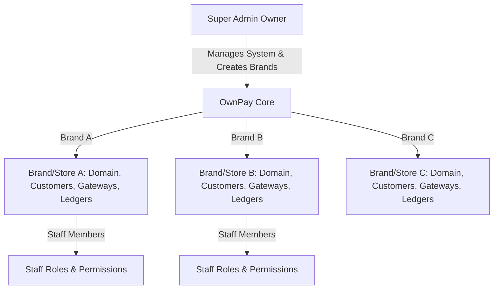

# OwnPay — Enterprise Payment Gateway Architecture

This document provides a comprehensive technical overview of the **OwnPay** architectural design, key execution pipelines, core systems, and development patterns.

---

## 1. System Vision & Business Model

OwnPay is a self-hosted, enterprise-grade **single-owner, multi-brand (store)** payment orchestrator. It is explicitly **not a multi-tenant SaaS platform**.



* **One Owner Control**: A single super-administrator controls the entire platform. No self-registration forms exist; the administrator manually creates brands and invites staff members.
* **Multi-Brand Partitioning**: Each brand (merchant store, represented in the `op_merchants` table) has isolated domains, gateway accounts, customers, ledger ledgers, and configurations.
* **Database Isolation Strategy**: Data separation is maintained within a single MySQL database schema using the `merchant_id` foreign key column on every scoped entity.
* **Staff RBAC**: Brands have assigned staff members with granular permissions mapped through `op_roles` and `op_role_permissions`.

---

## 2. Kernel Boot & Execution Pipeline

The entire application runs through a single entry point (`public/index.php`) that initializes the `Kernel` class.

```
public/index.php ──> Kernel::boot() ──> Middleware Stack ──> Route Matching ──> Controller Dispatch
```

### The 10-Step Boot Cycle
1. **Load Environment**: Read `.env` variables using `vlucas/phpdotenv`.
2. **Build Container**: Load `config/services.php` to initialize the PSR-11 `Container`.
3. **Configure Timezone**: Set timezone and core PHP execution rules dynamically.
4. **Load Middlewares**: Build the middleware stack definitions from `config/middleware.php`.
5. **Boot Plugins**: Scan active gateways, themes, and addons via `PluginLoader::boot()`.
6. **Trigger `system.boot` Event**: Fire hooks for plugin boot processes.
7. **Register Routing Table**: Compile routes from `config/routes/web.php` and `config/routes/api.php`.
8. **Match Request**: Compare request headers, domains, and paths against dynamic routing table.
9. **Dispatch Pipeline**: Execute request through mapped middleware group and dispatch targeted Controller.
10. **Shutdown**: Fire `system.shutdown` event hooks and emit HTTP Response payload.

---

## 3. Dependency Injection (DI) Container

OwnPay implements a lightweight PSR-11 compliant Dependency Injection container located at `src/Container.php`.

* **Service Definition**: Core components, business services, and database connections are explicitly bound in `config/services.php`.
* **Reflection Auto-wiring**: When a class is resolved but not explicitly registered in `config/services.php`, the Container inspects class constructors using reflection to recursively resolve and inject dependencies.
* **Resolving Lifecycle**: Supports both persistent shared Singletons (e.g. database connections, configurations) and Transient bindings (re-instantiated on every query).

---

## 4. Key Systems & Patterns

### 4.1. Repository Pattern & Tenant Scoping
Data layer interaction is managed via dedicated repositories inside `src/Repository/` extending `BaseRepository`. Brand data isolation is enforced at the database query level using the `TenantScope` trait.

```php
// Query strictly isolated within Active Brand context (Safe)
$invoices = $this->invoiceRepo->forTenant($activeBrandId)->paginateScoped($page, $perPage);

// Unscoped query for super-administrative global viewpoints
$allInvoices = $this->invoiceRepo->forAllTenants()->paginate();
```

#### TenantScope API
* `forTenant(int $mid)`: Scopes subsequent queries strictly by `merchant_id = :mid`.
* `forAllTenants()`: Bypasses tenant limits for global superadmin pages.
* `paginateScoped()`, `findScoped()`, `createScoped()`, `updateScoped()`, `deleteScoped()`: Atomic, safe tenant queries.

### 4.2. Double-Entry Ledger Bookkeeping Engine
To maintain bulletproof financial audit readiness, OwnPay utilizes a double-entry ledger database schema (`op_ledger_accounts`, `op_ledger_transactions`, `op_ledger_entries`).

* **Journal Balance Constraint**: Every ledger entry posts balanced debits (DR) and credits (CR).
* **Isolation (C-01 Fix)**: Ledger accounts are strictly bound to a brand/merchant context using `LedgerRepository::findOrCreateAccount($name, $type, $currency, $merchantId)`.
* **Account Directionality (H-01 Fix)**: Balances adjust strictly according to standard GAAP accounting rules:
  * **Asset / Expense**: Debits increase (+), Credits decrease (-).
  * **Liability / Equity / Revenue**: Credits increase (+), Debits decrease (-).

### 4.3. Universal Plugin System & Sandbox Security
Plugins (Gateways, Addons, and Themes) reside in `modules/` and dynamically register callbacks via the `EventManager` hook loop.

```
Plugin Discovery ──> Manifest Check ──> Static Code Audit ──> Sandbox Execution
```

* **Dynamic Discovery**: Scanned via `manifest.json` files containing metadata, entrypoint endpoints, and configuration schemas.
* **Static Code Audit Scanner**: Prevents unauthorized OS access, checking files for blocklisted dangerous operations (e.g. `exec`, `shell_exec`, `passthru`, `eval`, `system`).
* **Gateway Permitted Runtime Hooks (C-13 Fix)**: The scanner explicitly permits standard runtime operations like `fwrite` (writing to standard logs/streams), `ini_set` (setting payload sizes), `header` (for payment portal redirects), and `setcookie` to ensure full plugin capability without compromising core security.

---

## 5. Security & Request Lifecycle Guardrails

### 5.1. CSRF Verification Engine (C-14 Fix)
Cross-Site Request Forgery is blocked on all non-API mutation endpoints by `CsrfMiddleware`.
* **Unified Helper**: CSRF tokens are dynamically retrieved and validated using `\OwnPay\Security\SecurityHelpers::csrfToken()`.
* **Storage Consistency**: Standardizes validation on the database and session key `_csrf_token` (with leading underscore).
* **Dynamic Injection**: Injected in dynamic checkout views (like payment links) to prevent dead forms and standard 403 authorization failures on payment processing submissions.

### 5.2. Companion Device Pairing & JWT Auth
Android mobile devices pair with OwnPay to dynamically verify and match incoming gateway/bank SMS notifications.
* **Companion Pairing (C-10 Fix)**: Devices pair securely by exchanging credentials, verifying dynamic OTPs, and saving secure access logs in `op_paired_devices`. Device UUIDs are handled as strict string types.
* **Issuer Consistency (C-03 Fix)**: JWT tokens issued to devices are checked against issuer values resolving directly from `config/services.php` to prevent authentication failure.
* **Active Revocation Verification (H-04)**: `JwtAuthMiddleware` validates the token status against the active database state, denying access instantly if a device is deactivated or revoked.

---

## 6. Database Schema Design & Performance

### 6.1. Stored Generated Indexing Columns
To bypass JSON extraction performance tax on hot pathways, the core payment records implement MySQL Stored Generated columns:

```sql
ALTER TABLE `op_transactions`
  ADD COLUMN `invoice_id` BIGINT UNSIGNED GENERATED ALWAYS AS (CAST(JSON_UNQUOTE(JSON_EXTRACT(`metadata`, '$.invoice_id')) AS UNSIGNED)) STORED,
  ADD COLUMN `payment_link_id` BIGINT UNSIGNED GENERATED ALWAYS AS (CAST(JSON_UNQUOTE(JSON_EXTRACT(`metadata`, '$.payment_link_id')) AS UNSIGNED)) STORED;
```

* **Index Acceleration**: Corresponding indices `idx_invoice_id` and `idx_payment_link_id` accelerate transaction lookup routines without dynamic JSON processing at query execution time.

### 6.2. Brand-Scoped Overrides
`op_system_settings` implements nullable `merchant_id` with unique constraint `uk_group_key_merchant` on `(group_name, key_name, merchant_id)`. NULL values serve as global system fallbacks, while non-NULL keys act as brand-scoped overrides.

---

## 7. Developer Rules & Defensive Coding

1. **Strict Type Declaration**: Every new PHP file must declare `declare(strict_types=1);` as the first statement in the script. Ensure no UTF-8 Byte Order Marks (BOM) precede this statement.
2. **Tenant Scoping Execution**: Never execute database queries on scoped repositories without explicitly defining the brand context using `$repo->forTenant($merchantId)` first.
3. **No Direct Session CSRF Checks**: Never look up CSRF tokens via `$_SESSION['csrf_token']` manually. Always use the central utility helper: `\OwnPay\Security\SecurityHelpers::csrfToken()`.
4. **Database Enum Alignment (H-11 Fix)**: When configuring merchant statuses in forms, ensure values match `enum('active','suspended','pending')` exactly. Avoid invalid values like `"inactive"`.
5. **Gateway URL Asset Prepends**: Always prepend absolute URL prefixes (e.g. `/storage/`) when displaying user-uploaded media like logos and QR codes on checkout pages to avoid relative 404 resource errors.
