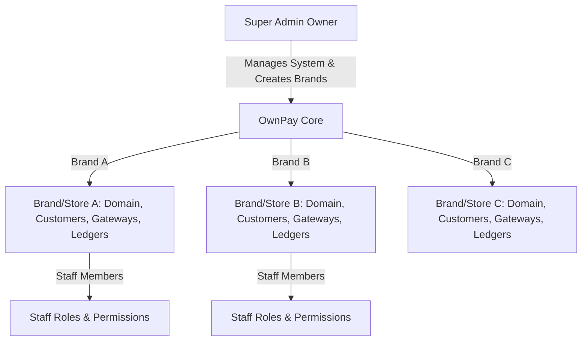

# OwnPay — Enterprise Payment Gateway Architecture

This document provides a comprehensive technical overview of the **OwnPay** architectural design, key execution pipelines, core systems, and development patterns.

---

## 1. System Vision & Business Model

OwnPay is a self-hosted, enterprise-grade **single-owner, multi-brand (store)** payment orchestrator. It is explicitly **not a multi-tenant SaaS platform**. For historical context on the migration from a multi-tenant SaaS model and the details of the single-owner multi-brand layout, see [Business Model Document](docs/v2/model/business_model.md).



* **One Owner Control**: A single super-administrator controls the entire platform. No self-registration forms exist; the administrator manually creates brands and invites staff members.
* **Multi-Brand Partitioning**: Each brand (merchant store, represented in the `op_merchants` table) has isolated domains, gateway accounts, customers, ledger ledgers, and configurations.
* **Database Isolation Strategy**: Data separation is maintained within a single MySQL database schema using the `merchant_id` foreign key column on every scoped entity.
* **Staff RBAC**: Brands have assigned staff members with granular permissions mapped through `op_roles` and `op_role_permissions`.

---

## 2. Kernel Boot & Execution Pipeline

The entire application runs through a single entry point (`public/index.php`) that initializes the `Kernel` class.

```
public/index.php ──> Kernel::boot() ──> Middleware Stack ──> Route Matching ──> Controller Dispatch
```

### The 10-Step Boot Cycle
1. **Load Environment**: Read `.env` variables using `vlucas/phpdotenv`.
2. **Build Container**: Load `config/services.php` to initialize the PSR-11 `Container`.
3. **Configure Timezone**: Set timezone and core PHP execution rules dynamically.
4. **Boot Plugins**: Scan active gateways, themes, and addons via `PluginLoader::boot()`. Plugins boot **before** the middleware pipeline is loaded (AUD-G1 fix) so they can inject custom middleware through the `system.middleware.pipeline` filter.
5. **Load Middlewares**: Build the middleware stack definitions from `config/middleware.php`, then apply the `system.middleware.pipeline` filter (security-critical admin middleware is re-asserted afterward and cannot be removed by a plugin).
6. **Trigger `system.boot` Event**: Fire hooks for plugin boot processes.
7. **Register Routing Table**: Compile routes from `config/routes/web.php` and `config/routes/api.php`.
8. **Match Request**: Compare request headers, domains, and paths against dynamic routing table.
9. **Dispatch Pipeline**: Execute request through mapped middleware group and dispatch targeted Controller.
10. **Shutdown**: Fire `system.shutdown` event hooks and emit HTTP Response payload.

### Last-Resort Error Pages (`ErrorPageRenderer`)
Fallback error pages (production 500, database-outage 503, maintenance 503, APP_DEBUG
panel) live in `src/View/ErrorPageRenderer.php` as dependency-free inline HTML. The Kernel
instantiates this class lazily and **never resolves it from the container**, so error pages
still render when Twig, the database, or the container itself is broken. Normal-path errors
always try their Twig templates (`error/404.twig`, `error/500.twig`, `error/503.twig`)
first; the inline pages are the fallback of the fallback. Do not add service dependencies
to `ErrorPageRenderer` — it must stay self-contained or outage handling cascades.

### Maintenance Mode Whitelist (Single Source of Truth)
Maintenance mode is enforced at two layers (a Kernel pre-routing gate and
`MaintenanceMiddleware` in the `global` group). Both layers MUST consult
`MaintenanceMiddleware::PASSTHROUGH_PREFIXES` / `isPassthroughPath()` — never inline a
second whitelist. The passthrough set (`/admin`, `/login`, `/webhook`, `/cron`,
`/checkout`) keeps gateway callbacks processing (AUD-12: otherwise payments are lost) and
lets the operator sign in to disable maintenance. Matching is segment-aware: `/login`
matches `/login` and `/login/...`, never `/loginfoo`. New-payment entry pages (`/invoice`,
`/pay`) are intentionally NOT whitelisted — maintenance should block new payment starts.

---

## 3. Dependency Injection (DI) Container

OwnPay implements a lightweight PSR-11 compliant Dependency Injection container located at `src/Container.php`.

* **Service Definition**: Core components, business services, and database connections are explicitly bound in `config/services.php`.
* **Reflection Auto-wiring**: When a class is resolved but not explicitly registered in `config/services.php`, the Container inspects class constructors using reflection to recursively resolve and inject dependencies.
* **Resolving Lifecycle**: Supports both persistent shared Singletons (e.g. database connections, configurations) and Transient bindings (re-instantiated on every query).

---

## 4. Key Systems & Patterns

### 4.1. Repository Pattern & Tenant Scoping
Data layer interaction is managed via dedicated repositories inside `src/Repository/` extending `BaseRepository`. Brand data isolation is enforced at the database query level using the `TenantScope` trait.

```php
// Query strictly isolated within Active Brand context (Safe)
$invoices = $this->invoiceRepo->forTenant($activeBrandId)->paginateScoped($page, $perPage);

// Unscoped query for super-administrative global viewpoints
$allInvoices = $this->invoiceRepo->forAllTenants()->paginate();
```

#### TenantScope API
* `forTenant(int $mid)`: Scopes subsequent queries strictly by `merchant_id = :mid`.
* `forAllTenants()`: Bypasses tenant limits for global superadmin pages.
* `paginateScoped()`, `findScoped()`, `createScoped()`, `updateScoped()`, `deleteScoped()`: Atomic, safe tenant queries.

### 4.2. Double-Entry Ledger Bookkeeping Engine
To maintain bulletproof financial audit readiness, OwnPay utilizes a double-entry ledger database schema (`op_ledger_accounts`, `op_ledger_transactions`, `op_ledger_entries`).

* **Journal Balance Constraint**: Every ledger entry posts balanced debits (DR) and credits (CR).
* **Isolation (C-01 Fix)**: Ledger accounts are strictly bound to a brand/merchant context using `LedgerRepository::findOrCreateAccount($name, $type, $currency, $merchantId)`.
* **Account Directionality (H-01 Fix)**: Balances adjust strictly according to standard GAAP accounting rules:
  * **Asset / Expense**: Debits increase (+), Credits decrease (-).
  * **Liability / Equity / Revenue**: Credits increase (+), Debits decrease (-).

### 4.3. Universal Plugin System (WordPress-style full trust)
Plugins (Gateways, Addons, and Themes) reside in `modules/` and register callbacks via the `EventManager` hook loop. For build guides see [Plugin Developer Guide](docs/v2/plugins/developer-guide.md) and [Hooks Reference](docs/v2/plugins/hooks-reference.md).

```
Discover ──> Manifest Validate ──> Footgun Scan ──> PSR-4 Register ──> register() ──> boot()
```

* **Trust model**: Plugin upload is restricted to the platform owner (`PluginController::upload` → `requireGlobalView`). Installed plugins therefore run with **full application trust** — the same model as WordPress: through the PSR-11 container a plugin can reach any core service (Database, `RefundService`, etc.). The real security boundary is **owner-only upload**, not in-process isolation. Do not install plugins you do not trust.
* **Dynamic discovery**: `PluginLoader::discover()` scans `modules/{gateways,themes,addons}/*/manifest.json`; `PluginManifest::validate()` enforces the slug regex, plain-filename entrypoint, type whitelist, and traversal-free migrations.
* **Footgun scanner (NOT a sandbox)**: `PluginLoader::loadPlugin()` token-scans every plugin PHP file and blocks only the two highest-risk primitives — dynamic code evaluation (`eval`) and direct OS-command execution (`exec`, `shell_exec`, `system`, `passthru`, `popen`, `proc_open`, … — see `PluginSandbox::isDangerousFunction()`). Ordinary PHP (reflection, callbacks such as `array_map`/`call_user_func`, file I/O, dynamic calls, `include`/`require`) is permitted. The guard is bypassable by construction; it catches accidents and obvious abuse, it does not isolate untrusted code.
* **Multi-file plugins**: `PluginLoader` registers a PSR-4 autoloader mapping each plugin's manifest `namespace` to its directory (`{NS}\Sub\Foo` → `<pluginDir>/Sub/Foo.php`), so plugins can ship many classes. Resolution is realpath-contained to the plugin directory.
* **Declarative manifest wiring**: `routes` are registered by the Router — an optional 4th element selects the middleware group (defaults to `api-public`, so a plugin can declare an authenticated route); `cron` entries (`{name, schedule, class}`) are scheduled by the `CronJobRunner` factory under a `plugin:{slug}:{name}` key; `admin_menu` items (`{label, url}`) are bridged to the `admin.menu.register` hook as escaped, internal-only links. All respect per-brand activation through the `EventManager` owner stack.
* **Dynamic logo copying**: icons declared in `manifest.json` are copied into the public webroot by `PluginManager::resolveIconPath()`, which rejects non-image extensions (anti `shell.php`-drop).

### 4.4. White-Label Custom Domain Pipeline

OwnPay is a sovereign white-labeled fintech engine. The end-customer must **never** see the master domain. For full architectural specifications and detailed request flows, refer to the [White-Label Custom Domain Pipeline Document](docs/v2/model/white-label-domain-pipeline.md).

```
Request → DomainMiddleware → Resolve HTTP_HOST against op_domains → Inject merchant_id
       → DomainUrlService → Build checkout/callback URLs under brand's custom domain
       → BrandThemeService → Load per-brand visual identity (logo, colors, CSS/JS)
```

**Architecture:**
* `DomainMiddleware` (`src/Middleware/DomainMiddleware.php`): Runs in the `global` middleware group on every request. Resolves `HTTP_HOST` against `op_domains` table. Injects `merchant_id`, `custom_domain`, `domain_type` into request attributes. Blocks `/admin/*` on custom domains (returns 404). Uses `APP_DOMAIN` env var (with `APP_URL` host fallback) to identify the master domain.
* `DomainUrlService` (`src/Service/Domain/DomainUrlService.php`): Central URL resolver for all customer-facing and gateway-facing URLs. Priority: `GATEWAY_CALLBACK_URL` env > brand custom domain > `APP_URL` > request host > `https://localhost`. Provides `buildCheckoutUrl()`, `buildCallbackUrl()`, `buildLegacyCallbackUrl()`.
* `APP_DOMAIN` env var: Bare hostname (e.g. `ownpay.test`). NOT a URL. Required for DomainMiddleware to identify master domain vs custom domains.

**Rules:**
* Never hardcode `APP_URL` or `ownpay.test` for checkout or callback URLs.
* Always use `DomainUrlService` methods for customer-facing or gateway-facing URL construction.
* Admin panel is only accessible on the master `APP_DOMAIN` — blocked with 404 on custom domains.

### 4.5. Gateway Currency Declarations & Auto-Conversion

`GatewayAdapterInterface` defines `supportedCurrencies(): array`. Gateways declare which ISO 4217 currency codes they accept. Empty array = any currency (default via `GatewayDefaults` trait).

```
Checkout Pay Flow:
  Intent currency (e.g. USD) → GatewayBridge.getSupportedCurrencies('bkash-api') → ['BDT']
  → CurrencyService.convert('100.00', 'USD', 'BDT') using op_exchange_rates → '12050.00'
  → Update op_transactions.metadata with audit trail
  → GatewayApiService.initiatePayment(amount: '12050.00', currency: 'BDT')
```

* **Exchange rates** are stored in `op_exchange_rates` with `base_currency` and `target_currency` (UNIQUE pair).
* **Conversion** uses `CurrencyService::convert()` which pivots through the system base currency.
* **Audit trail**: Original amount, currency, exchange rate, and converted values are persisted in `op_transactions.metadata` JSON.

### 4.6. Brand Theme Engine

`BrandThemeService` (`src/Service/Brand/BrandThemeService.php`) resolves per-brand visual customization.

**Resolution priority (per field):** Brand-scoped `op_system_settings` (theme group, merchant_id scoped) > `op_merchants.settings` JSON column > global `op_system_settings`.

**Returns:** `name`, `logo`, `favicon`, `color`, `accent_color`, `support_email`, `custom_css`, `custom_js`, `footer_text`, `show_powered_by`.

**Admin Sidebar Logo & Favicon Integration:**
* In `AdminPageTrait::renderAdminPage()`, the layouts automatically override `settings_logo`, `site_favicon`, and `site_title` using the active brand's custom values contextually resolved from `BrandThemeService::getBrandTheme()` when contextually scoped.
* Public-facing authentication gates (Login, Reset Password, 2FA Verification) and the public Landing/Marketing page also dynamically render these customized logos and favicons instead of fallback static assets.

**Brand-wise visual customization:**
* Multi-brand owners customize assets on a per-brand edit form in `/admin/brands`, validating and uploading brand logos and favicons directly under `/public/assets/uploads/brands/`. Other choices (colors, custom css/js, footer details) are stored as JSON under the `op_merchants.settings` column.

**Template integration** (`templates/checkout/checkout.twig`):
* CSS variables: `--teal`, `--teal-deep`, `--teal-glow` set from `brand.color` / `brand.accent_color`
* Custom CSS block: `<style>{{ brand.custom_css|raw }}</style>`
* Custom JS block: `<script>{{ brand.custom_js|raw }}</script>`
* Visual triggers: CSS/JS injected raw, theme hook triggers fire on head and footer: `{{ hook('checkout.head') }}` and `{{ hook('checkout.footer') }}`

### 4.7. Fee Rules Specificity Resolution
To calculate transactional commissions dynamically under the single-owner/multi-brand structure, OwnPay utilizes a brand-scoped fee rules engine (`op_fee_rules`, `FeeRuleRepository::resolveActiveRule()`).
* **Isolation Scope**: `resolveActiveRule(int $merchantId, string $gatewaySlug, string $currency)` scopes rules by the supplied `$merchantId` plus a global (`merchant_id IS NULL`) fallback — `WHERE (merchant_id = :merchant_id OR merchant_id IS NULL)`. It does not call the `TenantScope` trait methods (the trait is used by the repository's generic CRUD, not by this hand-written resolver).
* **Currency is an exact match, not a specificity tier**: `op_fee_rules.currency` is `CHAR(3) NOT NULL`, and the resolver always filters `AND currency = :currency`. There is no currency-agnostic ("any currency") rule — every candidate must match the transaction currency exactly.
* **Resolution Priority**: Among rules matching the exact currency, the most specific active rule wins, resolved in descending order of (brand × gateway) specificity:
  1. Specific Brand + Specific Gateway (e.g. brand 5 + `bkash-api`)
  2. Specific Brand + Any Gateway (`gateway_slug IS NULL`)
  3. Global Brand (`merchant_id IS NULL`) + Specific Gateway
  4. Global Brand + Any Gateway
  Ties break by newest rule (`id DESC`).
* **Schema Integrity**: The `op_fee_rules` table includes a foreign key constraint referencing `op_merchants(id)` ON DELETE CASCADE.

### 4.8. Unified Configuration & Settings Management
To eliminate legacy SQLite fallbacks and architectural redundancies, environment options and key-value pairings are unified under `op_system_settings`.
* **Deprecation of `op_env`**: The legacy SQLite `op_env` fallback and all associated schema definitions have been completely eradicated.
* **Persistent Configuration**: Operations within `EnvironmentService` (e.g. `get()`, `set()`, `delete()`) route through the unified `op_system_settings` database table under the `runtime` group using `SettingsRepository`. `get()` additionally falls back to real OS environment variables (`getenv()`/`$_ENV`/`$_SERVER`) when the database has no stored value — there is no competing key-value store.
* **Dynamic Settings Bootstrapping**: Static methods within `EnvironmentService` automatically resolve the `SettingsRepository` singleton dynamically if the framework container has not been booted (crucial for PHPUnit initialization).

### 4.9. Transactional Email Notifications (Event-Driven, Per-Brand)
Admin notification emails are driven entirely by the event system, with sender identity and preferences resolved through the same brand→All-Brands→default cascade as every other setting.
* **Listeners**: `EmailNotificationService` is registered (in `config/services.php`, inside the `system.boot` hook at priority 20 — after `PaymentCompletionListener`) on `payment.transaction.completed` and `refund.created`. It reads the brand's preferences and dispatches via `CommunicationService::sendEmail()`.
* **Preference cascade**: The on/off toggles (`email_on_payment` / `email_on_refund`), recipient (`admin_notification_email`) and sender (`mail_from_email` / `mail_from_name`) all live in `op_system_settings` group `general` and resolve via `SettingsRepository::getScoped()` (brand override → All-Brands default → none). Sender defaulting is centralised in `sendEmail()` so every email caller inherits the brand's "From" identity. The admin UI exposes a brand-scoped **Notifications** tab whose blank/“Inherit” inputs map to `getScopedOverride()` / `deleteSettingScoped()` (null = inherit).
* **Failure isolation**: Every handler is fully wrapped in `try/catch` and only logs on error; combined with `EventManager`'s per-listener exception isolation, an email failure can never disrupt payment completion. Bodies render from `templates/email/*.twig` via `FragmentRenderer`.

### 4.10. Manual Gateways — Platform Templates + Per-Brand Accounts (money-critical)
Manual (offline) gateways follow a plugin-like "define once, configure per brand" model so a customer's funds always reach the paying brand's own account.
* **Template vs account**: The **type** (slug, name, logo, colours, input-field schema, currency, limits, SMS rules) is a platform-owned `op_manual_gateways` row (`merchant_id = BrandContext::getPlatformId()`), created **only** from the All Brands view. Each brand may add its **own account** — a row with the *same slug* under its own `merchant_id` carrying the brand's `instructions` (the number/account the customer pays to), QR and optional logo. `UNIQUE(merchant_id, slug)` lets the template and per-brand accounts coexist.
* **Money routing (the choke point)**: Checkout (`CheckoutController::show`, `PaymentIntentCheckoutController::show`) resolves the offered gateways via `ManualGatewayRepository::listActiveForCheckout($brandId, $platformId)` — one query over `merchant_id IN (brand, platform)` collapsed to one row per slug where the **brand row always wins** and the platform template is the **fallback**. So a configured brand routes to its own account; an unconfigured brand falls back to the platform's default account. This method deliberately bypasses `TenantScope` to read both owners at once.
* **Governance**: `GatewayController::createManual` is guarded by `AdminPageTrait::requireGlobalView()` (All-Brands-only; closes the brand direct-URL) and writes via `BrandContext::getWriteMerchantId()` (platform id in global view). `editManual`/`toggle`/`delete` use `getWriteMerchantId()` as the owner, so All Brands manages templates and a brand only ever touches its own rows. Brands configure their account through `configureAccount(slug)` (`/admin/gateways/configure/{slug}`), which upserts a brand-owned row, copying the template's type fields on first save. No schema change — the model reuses the existing table plus the `is_platform` owner row from §4.11.

### 4.11. All-Brands Platform Scope & Data Ownership
The single-owner, multi-brand model has a reserved **platform-owner** record that represents the global
"All Brands" scope, so All-Brands-level data and configuration have a concrete owner.
* **The platform row**: one `op_merchants` row with `is_platform = 1` (slug `__platform__`, seeded by
  migration `013_add_platform_owner.sql`). It is excluded from `BrandContext::getAllBrands()` and the
  brand switcher, and is never a selectable/active brand. Resolve it via `BrandContext::getPlatformId()`
  (lazy; the id differs per database — never hard-code it).
* **Read scoping**: a brand view is hard-scoped to its own `merchant_id` via `TenantScope::forTenant()`;
  the All-Brands view uses `forAllTenants()` (unscoped) and so reads every brand's rows plus the
  platform-owned rows. Brand-owned data is readable by that brand and by All Brands; platform-owned data
  is readable only by All Brands.
* **Write routing**: `BrandContext::getWriteMerchantId()` returns the platform id in the All-Brands view
  and the active brand id otherwise. Code that creates All-Brands-owned records (admin-generated API keys,
  manual-gateway templates) uses this rather than `getActiveBrandId()` (which is 0 in the All-Brands view).
* **Config cascade**: `SettingsRepository::getScoped(group, key, merchantId)` resolves brand override →
  All-Brands (global) default → code default; a brand override applies only to that brand.
* **Staff access**: switching into the All-Brands view requires the `brands.access_all` permission (or
  `is_superadmin`), enforced in `BrandController::switchBrand`.
* **Inbound webhook/IPN**: a dedicated `/admin/gateway-webhooks` page documents the per-brand vs All-Brands
  callback URL (brand custom domain when present, else the platform domain).

---

## 5. Security & Request Lifecycle Guardrails

### 5.1. CSRF Verification Engine (C-14 Fix)
Cross-Site Request Forgery is blocked on all non-API mutation endpoints by `CsrfMiddleware`.
* **Unified Helper**: CSRF tokens are dynamically retrieved and validated using `\OwnPay\Security\SecurityHelpers::csrfToken()`.
* **Storage Consistency**: Standardizes validation on the database and session key `_csrf_token` (with leading underscore).
* **Dynamic Injection**: Injected in dynamic checkout views (like payment links) to prevent dead forms and standard 403 authorization failures on payment processing submissions.

### 5.2. Companion Device Pairing & JWT Auth
Android mobile devices pair with OwnPay to dynamically verify and match incoming gateway/bank SMS notifications.
* **Companion Pairing (C-10 Fix)**: Devices pair securely by exchanging credentials, verifying dynamic OTPs, and saving secure access logs in `op_paired_devices`. Device UUIDs are handled as strict string types.
* **Issuer Consistency (C-03 Fix)**: JWT tokens issued to devices are checked against issuer values resolving directly from `config/services.php` to prevent authentication failure.
* **Active Revocation Verification (H-04)**: `JwtAuthMiddleware` validates the token status against the active database state, denying access instantly if a device is deactivated or revoked.
* **Centralized JWT Secret Resolution**: `DevicePairingService` resolves JWT secrets hierarchically (device-specific stored secret -> global environment secret -> testing fallback) across pair, refresh, and validation pipelines.
* **Stateless Token Rotation & JTI Blacklisting**: Generates unique JTI-infused stateless refresh tokens and enforces secure rotation. Replay attacks are blocked by blacklisting used refresh token identifiers in the `op_cache` database table.

### 5.3. White-Label Domain Security
* **Admin Route Blocking**: `DomainMiddleware` returns HTTP 404 for `/admin/*` paths on custom domains.
* **DNS Verification**: Custom domains require `dns_verified = 1` in `op_domains` before serving content (returns 503 otherwise).
* **Tenant Isolation**: `DomainMiddleware` injects the correct `merchant_id` from `op_domains`, and `TenantScope` enforces data isolation downstream.

### 5.4. Checkout CSP Sourcing (Active Gateways Only)
`SecurityHeadersMiddleware` builds the checkout Content-Security-Policy from the `csp`
field of gateway manifests — but **only for gateways with an active configuration**
(resolved via `BrandContext` + `GatewayConfigRepository::listActive()`, falling back to all
active configs when no brand context exists). It MUST NOT scan every manifest under
`modules/gateways/`: with 100+ bundled gateways the merged header exceeded mod_fcgid's
8KB response-header limit, hard-killing the FastCGI worker ("Premature end of script
headers") and returning bare Apache 500s on every `/checkout`, `/invoice`, and `/pay`
page. A failsafe drops gateway sources (with a warning log) if the CSP value would exceed
7,500 bytes. Plugins can still add origins at runtime via the `checkout.csp.sources` filter.

### 5.5. Gateway Callback Lease (`callback_processing`)
Checkout status pages claim redirect callbacks with an atomic
`status: processing -> callback_processing` UPDATE to prevent concurrent double-capture.
The claim is a **lease, not a one-way transition**: when the callback handler reaches no
terminal state (soft failure or exception), the controller MUST release the lease with a
guarded status-only UPDATE (`... SET status='processing' WHERE status='callback_processing'`)
so later retries or webhooks can still complete the payment. The guard ensures a completion
that landed inside `handleCallback()` is never clobbered. Both `CheckoutController` and
`PaymentIntentCheckoutController` implement this pattern; `WebhookInboundProcessor` accepts
`callback_processing` transactions as completable.

### 5.6. Self-Service Password Reset (token-based)
Admin/staff can reset their own password via emailed link. The flow is OWASP-aligned:
* **Tokens** are 256-bit random values; only their SHA-256 hash is persisted (`op_password_resets`),
  so a database read never yields a usable link. Tokens are single-use (`used_at`) and expire after
  1 hour (`expires_at`); all freshness checks use the DB clock. A new request and a successful reset
  both invalidate the user's other outstanding tokens.
* **No account enumeration:** `AuthController::forgotSubmit` returns an identical "if an account exists,
  a link was sent" response whether or not the email matches, and `PasswordResetService::requestReset`
  is fully exception-wrapped so a mail failure cannot leak existence via an error page.
* **Orchestration:** `PasswordResetService` (requestReset / tokenIsValid / resetPassword) emails the
  branded `email/password_reset.twig` through the unified `CommunicationService` (brand-aware From +
  `DomainUrlService` base URL), and sets the new password with the same Argon2id hash as login.
* **Surface:** `GET|POST /reset-password` (web-auth group), rate-limited under the login bucket and
  CSRF-protected; new-password policy mirrors staff creation (min 8 + confirmation match).

---

## 6. Database Schema Design & Performance

### 6.1. Stored Generated Indexing Columns
To bypass JSON extraction performance tax on hot pathways, the core payment records implement MySQL Stored Generated columns:

```sql
ALTER TABLE `op_transactions`
  ADD COLUMN `invoice_id` BIGINT UNSIGNED GENERATED ALWAYS AS (CAST(JSON_UNQUOTE(JSON_EXTRACT(`metadata`, '$.invoice_id')) AS UNSIGNED)) STORED,
  ADD COLUMN `payment_link_id` BIGINT UNSIGNED GENERATED ALWAYS AS (CAST(JSON_UNQUOTE(JSON_EXTRACT(`metadata`, '$.payment_link_id')) AS UNSIGNED)) STORED;
```

* **Index Acceleration**: Corresponding indices `idx_invoice_id` and `idx_payment_link_id` accelerate transaction lookup routines without dynamic JSON processing at query execution time.

### 6.2. Brand-Scoped Overrides
`op_system_settings` implements nullable `merchant_id` with unique constraint `uk_group_key_merchant` on `(group_name, key_name, merchant_id)`. NULL values serve as global system fallbacks, while non-NULL keys act as brand-scoped overrides.

`SettingsRepository` memoizes resolved keys and group maps per request (settings are read
dozens of times while rendering one page). Every write/delete on the repository invalidates
the affected group automatically. After **out-of-band** writes (raw SQL, installer imports),
call `SettingsRepository::flushCache()` — `EnvironmentService::clearCache()` does this for
its repository instance.

### 6.3. Exchange Rates for Currency Conversion
`op_exchange_rates` stores manual exchange rates with `base_currency CHAR(3)`, `target_currency CHAR(3)`, `rate DECIMAL(18,8)`, `source VARCHAR(50) DEFAULT 'manual'`. UNIQUE constraint on `(base_currency, target_currency)`. Used by `CurrencyService::convert()` at checkout time for automatic gateway currency conversion.

### 6.4. Purged Modules & Schemas (Settlement Payouts)
The Settlement payout system has been completely decommissioned and its associated database tables have been dropped:
* **Dropped Tables**: `op_settlements` and `op_settlement_items` have been purged from `schema.sql`.
* **Code Elimination**: `SettlementService`, `SettlementRepository` and administrative route bindings have been removed entirely. Reconciliation computations are decoupled from settlement records.

---

## 7. Developer Rules & Defensive Coding

1. **Strict Type Declaration**: Every new PHP file must declare `declare(strict_types=1);` as the first statement in the script. Ensure no UTF-8 Byte Order Marks (BOM) precede this statement.
2. **Tenant Scoping Execution**: Never execute database queries on scoped repositories without explicitly defining the brand context using `$repo->forTenant($merchantId)` first.
3. **No Direct Session CSRF Checks**: Never look up CSRF tokens via `$_SESSION['csrf_token']` manually. Always use the central utility helper: `\OwnPay\Security\SecurityHelpers::csrfToken()`.
4. **Database Enum Alignment (H-11 Fix)**: When configuring merchant statuses in forms, ensure values match `enum('active','suspended','pending')` exactly. Avoid invalid values like `"inactive"`.
5. **Gateway URL Asset Prepends**: Always prepend absolute URL prefixes (e.g. `/storage/`) when displaying user-uploaded media like logos and QR codes on checkout pages to avoid relative 404 resource errors.
6. **DomainUrlService Mandatory**: NEVER use `$_ENV['APP_URL']` or hardcode domain names for checkout or callback URLs. ALWAYS use `DomainUrlService::buildCheckoutUrl()` or `buildCallbackUrl()` to ensure white-label custom domain compliance.
7. **APP_DOMAIN Env Var**: Must be set in `.env` as a bare hostname (e.g. `ownpay.test`). Used by `DomainMiddleware` to identify the master domain. Without it, admin routes may be exposed on custom domains.
8. **Gateway supportedCurrencies()**: All gateway adapters MUST implement `supportedCurrencies(): array`. Use `GatewayDefaults` trait for the empty (any currency) default. BDT-only gateways (bKash, Nagad) must explicitly return `['BDT']`.
9. **Currency Conversion Metadata Integrity**: Do NOT overwrite `original_amount`, `original_currency`, `exchange_rate`, `converted_amount`, `converted_currency` keys in `op_transactions.metadata` — these are the audit trail for automatic currency conversion.
10. **BrandThemeService for loadBrand()**: Checkout controllers must resolve brand data via `BrandThemeService::getBrandTheme()` (with `$this->c->has()` fallback). Direct `$this->merchants->find()` bypasses brand-scoped theme settings and breaks per-brand custom CSS/JS under custom domains.
11. **Eradication of Settlements**: Do not attempt to query or bind `op_settlements` or `op_settlement_items`. They do not exist. Decouple all ledger reconciliations by assuming standard payouts are handled offline or out-of-band.
12. **Settings Registry Integration**: NEVER query or write to a table named `op_env`. Use the `EnvironmentService` (e.g. `EnvironmentService::get()`) or resolve `SettingsRepository` from the container, which persists configuration under `op_system_settings` (group: `runtime`).
13. **Safe Clipboard Copying**: In administrative portals, all copy-to-clipboard buttons and scripts MUST utilize the global helper `window.opCopyText(text, button, successCallback)` to guarantee compatibility in both secure HTTPS contexts and non-secure HTTP local development setups.
14. **Dynamic Gateway Logo Copying**: API gateway adapters and plugins MUST declare their icon path inside `manifest.json`. During dashboard rendering, these icons are dynamically copied to the public directory using the `PluginManager::resolveIconPath()` method so they display correctly regardless of their configuration or activation state.
15. **Route Parameter Regex Constraints**: Dynamic path parameters must strictly match `[a-zA-Z0-9_\-\.]` to prevent route-based injection (e.g. avoiding `@` and `+` symbols), with the sole exception of `{identifier}` (used for customer email or phone lookup) which is permitted to match `@`, `+`, and `%`.

---

## 8. API Specifications

OwnPay exposes three main API layers (Merchant, Mobile, and Admin). API schema definitions and integration guides are located in the following documentation files:
* [API Integration Guide](docs/v2/api/README.md) — Authentication patterns, cURL/PHP examples, and webhook verification code.
* [OpenAPI v3 Specification](docs/v2/api/openapi.yaml) — Formal REST schema definition file (can be imported into readme.io, Swagger, or Postman).
* [Mobile Companion Architecture](docs/v2/mobile_app/plan.md) — Technical overview of the companion app and pairing security.
* [Flutter App Implementation Plan](docs/v2/mobile_app/flutter_plan.md) — Frontend architecture, local Hive schema, and offline sync state machine.
* [Mobile Execution Checklist](docs/v2/mobile_app/todo.md) — Full feature checklist and current backend completion status.
