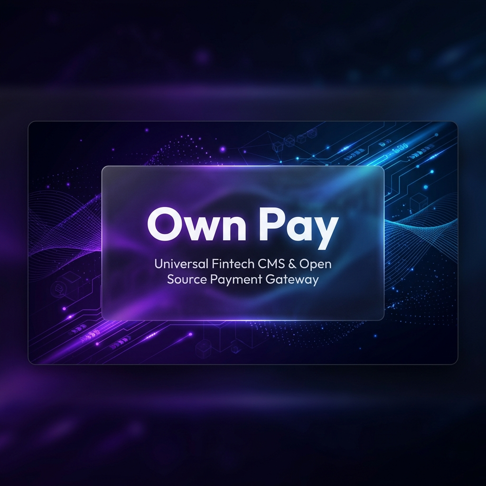
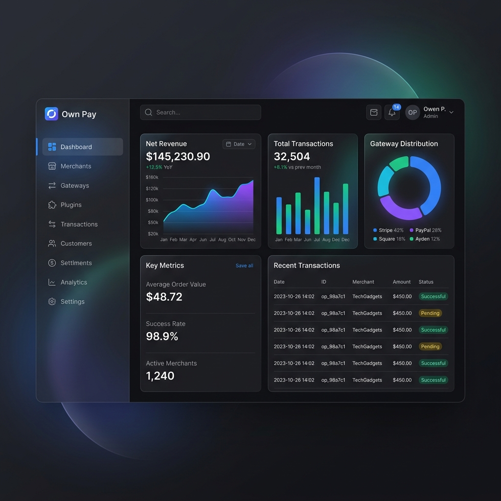
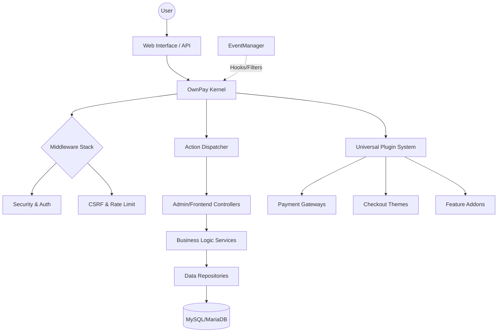

# OwnPay



<div align="center">

[](LICENSE)
[](https://www.php.net/)
[](https://tailwindcss.com/)
[](https://github.com/own-pay/ownpay/stargazers)

**The Open-Source Alternative to Stripe Connect. A Universal Fintech CMS & SaaS Platform.**

[Explore Docs](https://docs.ownpay.org) • [Live Demo](https://demo.ownpay.org) • [Report Bug](https://github.com/own-pay/ownpay/issues) • [Request Feature](https://github.com/own-pay/ownpay/issues)

</div>

---

## 🚀 The Vision

OwnPay is not just a payment gateway; it is a **Universal Fintech Operating System**. Designed for developers, SaaS founders, and enterprises, it provides a self-hosted, highly secure, and infinitely extensible platform to orchestrate payments, manage merchants, and automate financial workflows.

### Why OwnPay?
- **Universal Plugin System**: Every extension—whether it's a payment gateway, a checkout theme, or a feature addon—implements a single, unified interface.
- **Enterprise-Grade Security**: Built-in PII masking, AES-256-GCM field encryption, and nonce-based Content Security Policy.
- **Limitless Extensibility**: Over 80+ hook points inspired by modern event-driven architectures.
- **Developer First**: PSR-4 compliant, strict types, and a lightweight PSR-11 dependency injection container.

---

## 💎 Premium Experience

OwnPay is designed to WOW. We believe fintech should be as beautiful as it is functional.

<table>
  <tr>
    <td align="center">
      
    </td>
    <td align="center">
      
    </td>
  </tr>
</table>

---

## ✨ Million Dollar Features

- **🏦 Multi-Gateway Orchestration**
  Natively supports Stripe, SSLCommerz, bKash, Nagad, Rocket, and UPay. Effortlessly add manual gateways with custom form fields.
- **🔌 Universal Hook System**
  WordPress-style `addAction` and `addFilter` API. Modify any behavior without touching the core.
- **📱 Device Pairing & SMS Automation**
  Pair Android devices for real-time transaction matching via SMS parsing. Perfect for regional payment methods.
- **🎨 Theming Engine**
  Fully customizable checkout experiences. Switch between "Glassmorphism," "Modern Dark," or "Classic Light" with one click.
- **🛡️ Compliance & Security**
  - **PCI DSS Ready**: Argon2ID hashing and secure session management.
  - **Audit Logs**: Comprehensive tracking of every administrative action.
  - **Rate Limiting**: Intelligent sliding-window rate limiting for APIs and Login.
- **📊 Business Intelligence**
  Built-in analytics for revenue, conversion rates, and merchant performance.

---

## 🛠️ Built with Modern Tech

- **Backend**: PHP 8.2+, Symfony Components, Doctrine (Migrations), PSR-11 DI.
- **Frontend**: Tailwind CSS 3.4, Flowbite UI, Alpine.js, Twig Templating.
- **Database**: MySQL 8.0+ / MariaDB 10.6+ with JSON schema validation.
- **Security**: AES-256-GCM Encryption, HMAC Webhook Verification.

---

## 🏗️ Architecture

OwnPay follows a clean, decoupled architecture designed for high performance and reliability.



---

## 🚦 Getting Started

### Quick Install
```bash
# Clone the repository
git clone https://github.com/own-pay/ownpay.git

# Install dependencies
composer install --no-dev --optimize-autoloader
npm install && npm run build

# Setup Environment
cp .env.example .env
# Edit .env with your database credentials

# Run Installer
# Navigate to your-domain.com/install
```

---

## 🗺️ Roadmap

- [ ] **Phase 1**: Core Stabilization & V2 Migration (Current)
- [ ] **Phase 2**: Marketplace for Community Plugins
- [ ] **Phase 3**: Native iOS/Android SDKs
- [ ] **Phase 4**: AI-Powered Fraud Detection
- [ ] **Phase 5**: Multi-Currency Cross-Border Settlement

---

## 🤝 Contributing

We love contributors! Whether you're fixing a bug or suggesting a feature, please check out our [Contributing Guidelines](CONTRIBUTING.md).

1. Fork the Project
2. Create your Feature Branch (`git checkout -b feature/AmazingFeature`)
3. Commit your Changes (`git commit -m 'Add some AmazingFeature'`)
4. Push to the Branch (`git push origin feature/AmazingFeature`)
5. Open a Pull Request

---

## 📄 License

Distributed under the **AGPL-3.0-or-later License**. See `LICENSE` for more information.

<div align="center">
  <p>Built with ❤️ by the OwnPay Community</p>
  <a href="https://github.com/own-pay/ownpay">
    
  </a>
</div>
