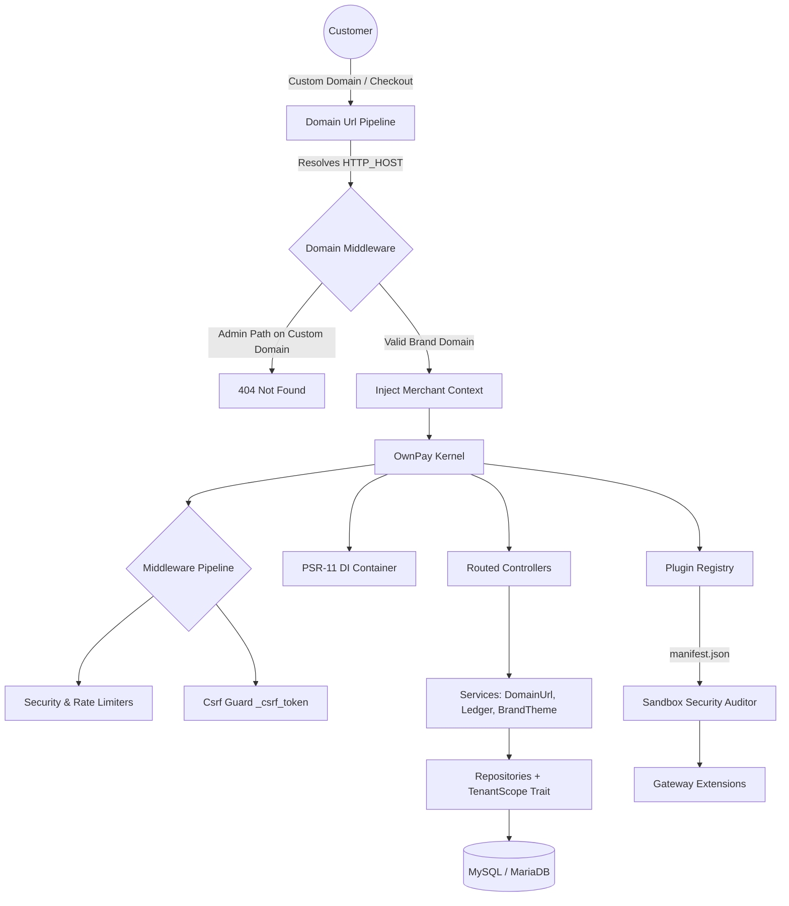

# OwnPay — Sovereign Payment Gateway Infrastructure


<div align="center">

[](LICENSE)
[](https://www.php.net/)
[](https://www.mysql.com/)
[](https://tailwindcss.com/)
[](https://github.com/own-pay/OwnPay/stargazers)

**The Enterprise-Grade, Self-Hosted Alternative to Stripe Connect.**  
*Built by the Community, for the Community.*

🌐 [Website](https://ownpay.org) • 📚 [API Reference](https://docs.ownpay.org) • 📖 [Learn Platform](https://learn.ownpay.org) • 📝 [Blog](https://blog.ownpay.org) • 💬 [Discussions](https://github.com/own-pay/OwnPay/discussions)

</div>

---

## ⚡ Quick Navigation
* [🚀 The Vision](#-the-vision)
* [⚡ Live Interactive Demo](#-live-interactive-demo)
* [💎 Key Channels & Resources](#-key-channels--resources)
* [🔌 Developer Guides](#-developer-guides)
* [🛠️ Key Features](#-key-features)
* [🏗️ Tech Stack & System Architecture](#%EF%B8%8F-tech-stack--system-architecture)
* [🚦 Getting Started](#-getting-started)
* [🤝 Contributing & Branch Rules](#-contributing--branch-rules)
* [❓ Frequently Asked Questions (FAQ)](#-frequently-asked-questions-faq)
* [🛡️ Security & PCI Compliance](#%EF%B8%8F-security--pci-compliance)
* [⚖️ License](#%EF%B8%8F-license)
* [💎 Project Credits & Sponsors](#-project-credits--sponsors)

---

## 🚀 The Vision

OwnPay is an enterprise-grade, self-hosted **single-owner, multi-brand (store)** payment orchestrator. It is explicitly **not a multi-tenant SaaS platform**—rather, it is designed for a single sovereign operator to spin up, manage, and brand multiple stores/businesses (such as merchant checkouts, subsidiaries, or digital brands) under completely isolated white-labeled custom domains from a single secure central administrative panel.

OwnPay is a proud fork of **PipraPay**, continuing its legacy under the vision of complete self-hosted payment sovereignty.

---

## ⚡ Live Interactive Demo

Experience OwnPay in action without setting up a local environment. Explore the SuperAdmin dashboard, create stores, test transaction entries, and play with payment routes.

*   🌐 **Demo Panel**: [demo.ownpay.org](https://demo.ownpay.org)
*   👤 **Default Username**: `admin`
*   🔑 **Default Password**: `admin12345`

> [!NOTE]
> Database resets occur automatically every 2 hours on the live demo environment to ensure a clean sandbox experience.

---

## 💎 Key Channels & Resources

To stay connected with the OwnPay ecosystem, utilize our official channels:

*   🌐 **Official Website**: [ownpay.org](https://ownpay.org) — Announcements, release notes, and general information.
*   📚 **API Documentation**: [docs.ownpay.org](https://docs.ownpay.org) — Full REST endpoint specifications and developer integration guidelines.
*   📖 **Learn & Guides**: [learn.ownpay.org](https://learn.ownpay.org) — Setup tutorials, hosting guides, and configuration docs.
*   📝 **Blog**: [blog.ownpay.org](https://blog.ownpay.org) — Technical writeups, fintech trends, and ecosystem updates.
*   👥 **Facebook Page**: [OwnPay Facebook Page](https://www.facebook.com/ownpay.org) — Official updates and news.
*   💬 **Facebook Community Group**: [OwnPay Community Group](https://www.facebook.com/groups/ownpay.org) — Discuss with other developers and operators.
*   📱 **Companion Android App**: [Google Play Store](https://play.google.com/store/apps/details?id=com.ownpay.console) — Mobile app for secure companion pairing and real-time transaction processing.
*   🔌 **Official Gateway Plugin Repo**: [OwnPay Gateway Plugin Repository](https://github.com/own-pay/OwnPay-Gateway-Plugin) — The home of core gateway integrations.
*   📮 **General Inquiry & Support**: [ping@ownpay.org](mailto:ping@ownpay.org) — Direct email contact for enterprise support or security audits.

---

## 🔌 Developer Guides

Are you looking to build your own payment gateways or create responsive custom checkout themes? Follow our dedicated guides:

*   🔌 **[Plugin Developer Guide](https://learn.ownpay.org/plugin-developer-guide)**: Learn how to hook into checkout cycles using the `EventManager`, build manifests, and develop secure transaction plugins inside the sandboxed environment.
*   🎨 **[Theme Developer Guide](https://learn.ownpay.org/theme-developer-guide)**: Learn how to customize user-facing checkout forms, design templates with Tailwind and Twig, and build white-labeled invoice interfaces.

---

## 🛠️ Key Features

*   🏦 **Multi-Gateway Orchestration**: Out-of-the-box support for Stripe, SSLCommerz, bKash, Nagad, Rocket, and UPay. Operators can easily declare custom manual gateways with customizable form inputs and QR codes.
*   🛡️ **White-Labeled Custom Domain Pipeline**: Customers see only the brand's configured custom domain (`op_domains`) throughout checkouts, invoice portals, callbacks, and status views. Master admin panel remains locked strictly under the `APP_DOMAIN` (returning 404 on custom hosts).
*   📱 **Companion Device SMS Automation**: Securely pair Android companion devices using JWT tokens, rotating JTIs, and OTP verification to dynamically parse SMS notifications and reconcile MFS (Mobile Financial Services) transactions in real-time.
*   🔌 **Universal Plugin Sandbox**: Gateways, themes, and addons implement a strict manifest-based discovery (`manifest.json`) and run in a static code-analyzed execution sandbox preventing unauthorized system commands while permitting secure runtime operations (`fwrite`, `header`, `setcookie`).
*   📈 **Double-Entry Bookkeeping Engine**: A bulletproof GAAP-compliant financial ledger system (`op_ledger_accounts`) scopes all entries strictly by brand to guarantee mathematical auditability with automatic exchange rate conversion (`op_exchange_rates`) at checkout.
*   🎨 **Per-Brand Theme Customization**: Custom CSS/JS blocks, logos, colors, and headers are resolved dynamically from brand system overrides and injected seamlessly into checkout routes.

---

## 🛠️ Tech Stack & System Architecture

### Tech Stack
*   **Backend Engine**: PHP 8.2+ (Strict Types enforced), Symfony Components, Doctrine Migrations.
*   **PSR-11 DI Container**: Custom-designed, lightweight dependency injection container with automatic constructor auto-wiring.
*   **Database Schema**: MySQL 8.x / MariaDB 10.6+ utilizing Stored Generated Columns (`invoice_id`, `payment_link_id`) over JSON payloads for index acceleration.
*   **Frontend Templating**: Twig 3.14 templates utilizing Flowbite and Alpine.js with zero inline CSS/JS rules for Content Security Policy compliance.
*   **Security & Encryption**: AES-256-GCM field encryption, Argon2id password hashing, and sliding-window rate limiters.

### System Architecture



For a comprehensive breakdown of the internal design, dependencies, and boot pipeline, please refer to the root [ARCHITECTURE.md](ARCHITECTURE.md) document.

---

## 🚦 Getting Started

### Prerequisites
*   PHP 8.2 or 8.3 with `pdo`, `bcmath`, `json`, `curl`, and `gd` extensions enabled.
*   MySQL 8.0+ or MariaDB 10.6+.
*   Composer v2.x.
*   A server or local environment (e.g., Laragon on Windows, Valet on macOS, Docker).

### Quick Install

1.  **Clone the Repository**:
    ```bash
    git clone https://github.com/own-pay/OwnPay.git
    cd OwnPay
    ```

2.  **Install Dependencies**:
    ```bash
    composer install --no-dev --optimize-autoloader
    npm install && npm run build
    ```

3.  **Setup Environment Config**:
    ```bash
    cp .env.example .env
    ```
    Open `.env` and fill in your DB credentials and `APP_DOMAIN` (e.g., `APP_DOMAIN=ownpay.test`).

4.  **Run the Setup Wizard**:
    Open your browser and navigate to `https://your-domain.test/install`. The 4-step wizard will test your environment, import `database/schema.sql`, create the SuperAdmin account, and initialize cryptographic keys (`APP_KEY`, `ENCRYPTION_KEY`, `HMAC_KEY`, `JWT_SECRET`).

---

## 🤝 Contributing & Branch Rules

We welcome contributions from the community! Please review the [CONTRIBUTING.md](CONTRIBUTING.md) guide before working on the codebase.

> [!IMPORTANT]
> **Branch Rule**:
> To submit code changes, you must open a Pull Request targeting the **`dev` branch**. Pull requests targeting the `main` branch directly **will be automatically closed and rejected**.

---

## ❓ Frequently Asked Questions (FAQ)

### Q1: Is OwnPay a SaaS platform or multi-tenant system?
No. OwnPay is a **self-hosted, single-owner, multi-brand (store) payment orchestrator**. Only one administrator (the superadmin owner) manages the entire system. You can create multiple brands/stores (representing different websites, physical stores, or digital projects) from the admin panel, but they are all controlled under one sovereign central instance. There is no open customer self-registration.

### Q2: How does the Mobile Companion App SMS automation work?
The OwnPay Android app pairs securely with the server using a rotating, JWT-based handshake. Once paired, the app listens to incoming SMS messages from configured Mobile Financial Services (MFS) accounts (such as bKash, Nagad, Rocket). It safely forwards the transactional SMS payloads to the backend API, where a heuristic parsing engine extracts the transaction ID, amount, and sender phone number, instantly reconciling and settling the corresponding payment intent.

### Q3: Is OwnPay PCI-DSS compliant?
Because OwnPay routes payment transactions to secure third-party gateway endpoints (like Stripe Checkout, SSLCommerz, bKash APIs) or handles manual bank transfers, it **does not store or process raw credit card PANs (Primary Account Numbers)** on your server. Sensitive API credentials and system keys are secured using AES-256-GCM encryption. Running OwnPay drastically limits your server's PCI scope to SAQ-A or SAQ A-EP compliance requirements.

### Q4: How are checkout domains white-labeled?
OwnPay includes a dynamic `DomainMiddleware` that intercepts requests and resolves `HTTP_HOST` against your configured brand domains (`op_domains`). During checkouts and callbacks, all URLs are compiled via `DomainUrlService` to utilize the brand's custom domain rather than exposing the master domain. Admin panel routes (`/admin/*`) are blocked on custom domains and return a `404 Not Found` response.

---

## 🛡️ Security & PCI Compliance

If you discover a security vulnerability within OwnPay, please **DO NOT** open a public issue. Instead, report it privately following our [Security Policy](SECURITY.md) via email to [ping@ownpay.org](mailto:ping@ownpay.org).

---

## ⚖️ License

Distributed under the **GNU Affero General Public License v3.0 (AGPL-3.0)**. See the [LICENSE](LICENSE) file for the full license text.

---

## 💎 Project Credits & Sponsors

OwnPay exists thanks to the efforts of its community and sponsors:

### 🚀 Domain & Hosting Sponsor
<a href="https://flexohost.com/" target="_blank">
  
</a>

*Special thanks to **[FlexoHost](https://flexohost.com/)** for providing domain and testing hosting resources to help maintain and deploy the OwnPay staging systems.*

### 👥 Key Contributors
*   **Fattain Naime** ([iamnaime.info.bd](https://iamnaime.info.bd)) — *Project Maintainer & Lead Developer*. Founder at [Builder Hall](https://github.com/builder-hall) & GigLovin. (Find him on [Facebook](https://facebook.com/fattain.naime)).
*   **Abdullah Bin Ziad** — Suggested the name **OwnPay**, reflecting the vision of self-hosted payment sovereignty.
*   **Hamidullah Ismail** — Conceived the white-labeled custom domain multi-branding architecture and assisted with community support channels.
*   *Tribute is given to **PipraPay**, the original codebase from which OwnPay was refactored.*

*And thanks to everyone who helped test, report bugs, and refine our double-entry accounting features!*
