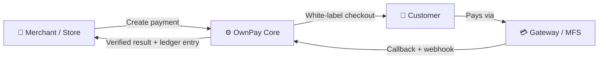

<div align="center">

<picture>
  <source media="(prefers-color-scheme: dark)"  srcset="https://github.com/own-pay/.github/raw/main/profile/assets/ownpay-with-bg.png">
  <source media="(prefers-color-scheme: light)" srcset="https://github.com/own-pay/.github/raw/main/profile/assets/logo-png.png">
  
</picture>

### Your Gateway. Your Server. Your Rules.

**The self-hosted, open-source payment gateway automation platform.**

[](https://ownpay.org)

<br />

[](https://github.com/own-pay/OwnPay/releases/latest)
[](LICENSE)
[](https://php.net)
[](CONTRIBUTING.md)

[](https://github.com/own-pay/OwnPay/stargazers)&nbsp;
[](https://github.com/own-pay/OwnPay/network/members)&nbsp;
[](https://github.com/own-pay/OwnPay/issues)&nbsp;
[](https://github.com/own-pay/OwnPay/commits)

<br />

[**🌐 Website**](https://ownpay.org) &nbsp;·&nbsp; [**📖 Docs**](https://docs.ownpay.org) &nbsp;·&nbsp; [**🎓 Learn**](https://learn.ownpay.org) &nbsp;·&nbsp; [**🧩 Plugins**](https://plugin.ownpay.org) &nbsp;·&nbsp; [**📰 Blog**](https://blog.ownpay.org) &nbsp;·&nbsp; [**▶️ Demo**](https://demo.ownpay.org)

<br />

[](https://github.com/own-pay/OwnPay/releases/latest)&nbsp;&nbsp;
[](#-deploy-to-your-server)&nbsp;&nbsp;
[](https://github.com/own-pay/OwnPay)

</div>

<br />

<div align="center">

[](https://namepart.com) &nbsp; <a href="https://namepart.com"></a> &nbsp; **[Namepart](https://namepart.com)** — Powering open-source fintech infrastructure. &nbsp; <sub>[Become a Sponsor →](https://ownpay.org/donate)</sub>

</div>

<br />

> [!NOTE]
> **OwnPay is in Public Beta (v0.1.0).** It's stable, hardened (PHPStan level 9 + automated test suite), and ready to self-host today. We're gathering real-world feedback on the road to `1.0` — [tell us what you find](https://github.com/own-pay/OwnPay/issues).

---

## 📑 Table of Contents

- [What is OwnPay?](#what-is-ownpay)
- [Why OwnPay?](#why-ownpay)
- [Features](#features)
- [How It Works](#how-it-works)
- [Deploy to Your Server](#deploy-to-your-server)
- [Run Locally / Contribute](#run-locally-contribute)
- [Tech Stack](#tech-stack)
- [Documentation & Ecosystem](#documentation-ecosystem)
- [FAQ](#faq)
- [Roadmap](#roadmap)
- [Sponsors](#sponsors)
- [Contributors](#contributors)
- [Community & Support](#community-support)
- [Security](#security)
- [License](#license)

---

## <a id="what-is-ownpay"></a>💎 What is OwnPay?

**OwnPay** is an enterprise-grade, self-hosted payment gateway automation platform. It is built for developers, entrepreneurs, and businesses who want absolute sovereignty over their payment infrastructure, customer data, and transaction flows without paying middleman fees or relying on third-party SaaS platforms.

With native support for over 120+ payment gateways, a secure double-entry ledger database, white-labeled multi-brand management, and a sandboxed plugin engine, OwnPay gives you the power of a commercial payment gateway on your own private server.

---

## <a id="why-ownpay"></a>💎 Why OwnPay?

Most payment platforms make you a tenant on *their* infrastructure — your data, your customers, and your money flow through a third party you don't control. **OwnPay flips that.** You run it on your own server, own every record, and answer to no middleman.

> **Your payment gateway. Your server. Your data. Your rules — forever.**

<table>
<tr>
<td align="center" width="33%">

### 🛡️
**Complete Ownership**

Your financial infrastructure lives on your server. No middlemen, no third-party access, no vendor lock-in. Ever.

</td>
<td align="center" width="33%">

### ⚡
**Built for Builders**

A clean custom core, a sandboxed plugin system, and a full REST API — engineered for developers who demand control.

</td>
<td align="center" width="33%">

### 🌍
**Open & Community-Driven**

AGPL-3.0 licensed and free forever. Transparent, auditable, and shaped by the community that runs it.

</td>
</tr>
</table>

---

## <a id="features"></a>✨ Features

<table>
<tr>
<td width="50%" valign="top">

#### 💳 Payments & Checkout
- **120+ payment gateway integrations** (plugin-based)
- Manual & API gateways + express checkout
- Hosted checkout, payment links, invoices & payment intents
- Refunds with atomic, balance-validated reversals
- Multi-currency with automatic conversion

#### 🏢 Multi-Brand by Design
- One owner, many brands (stores) — fully isolated
- Per-brand domains, gateways, customers & ledgers
- White-label custom-domain checkout
- Per-brand theming — logo, colors, custom CSS/JS

</td>
<td width="50%" valign="top">

#### 🔐 Security & Accounting
- Double-entry ledger engine (bcmath precision)
- AES-256-GCM PII encryption · Argon2id passwords
- CSRF, strict CSP, rate limiting, SSRF guards
- Staff RBAC — granular roles & permissions

#### 🧩 Platform & Operations
- Sandboxed plugin/addon system + domain hook engine
- Mobile companion app — device pairing, JWT, SMS verification
- Full i18n — admin panel **and** customer checkout
- REST API (merchant / mobile / admin) + webhooks
- Signed, atomic, rollback-safe self-update engine

</td>
</tr>
</table>

<div align="center"><sub>Browse the full gateway & add-on catalog at <a href="https://plugin.ownpay.org">plugin.ownpay.org</a>.</sub></div>

---

## <a id="how-it-works"></a>⚡ How It Works



OwnPay sits on **your** server between your store and the world's payment providers. It renders a branded checkout, routes the payment through the gateway the customer chose, verifies the result (checksum + signature + webhook), books a double-entry ledger record, and notifies your store — all without a third party ever touching your data.

> Want the deep dive? Read the **[Architecture Guide →](docs/ARCHITECTURE.md)**

---

## <a id="deploy-to-your-server"></a>🚀 Deploy to Your Server

OwnPay ships as a **self-contained release archive** — the same zip works on **shared hosting, a VPS, or a dedicated server**, and doubles as the installer. No build step required.

> **Requirements:** PHP **8.3+** (`bcmath`, `json`, `mbstring`, `openssl`, `pdo_mysql`, `curl`) · MySQL 8 / MariaDB 10.4+ · HTTPS strongly recommended.

<details open>
<summary><b>🌐 Shared Hosting (cPanel / DirectAdmin — no SSH needed)</b></summary>
<br />

1. **Download** the latest [`ownpay-x.y.z.zip`](https://github.com/own-pay/OwnPay/releases/latest) release.
2. In your hosting **File Manager**, upload and extract it into your site directory.
3. Create a **MySQL database** + user and note the credentials.
4. Point your domain's **document root to the `public/` folder** (or extract so `public/` maps to your web root).
5. Visit your domain — the **`/install` wizard** checks requirements, writes `.env`, imports the schema, and creates your admin account.

That's it. Dependencies (`vendor/`) are bundled in the release, so Composer is **not** required on the server.

</details>

<details>
<summary><b>🖥️ VPS / Dedicated Server (Nginx or Apache + PHP-FPM)</b></summary>
<br />

```bash
# 1. Get the release (or git clone for source installs)
cd /var/www
curl -L -o ownpay.zip https://github.com/own-pay/OwnPay/releases/latest/download/ownpay.zip
unzip ownpay.zip -d ownpay && cd ownpay

# 2. (Source installs only — release zips already bundle vendor/)
# composer install --no-dev --optimize-autoloader

# 3. Make runtime dirs writable by the web server
chown -R www-data:www-data storage public/assets/uploads
```

Point your web server's root at **`public/`** and route all requests to `public/index.php`. An Apache `.htaccess` is included; an `nginx.conf.example` ships in the repo root. Then open your domain and complete the **`/install`** wizard.

</details>

<div align="center"><sub>📖 Full production deployment, hardening & scaling docs → <a href="https://docs.ownpay.org">docs.ownpay.org</a></sub></div>

---

## <a id="run-locally-contribute"></a>🧑‍💻 Run Locally / Contribute

Testing OwnPay or contributing? Get a local instance running in **~2 minutes** on Windows, macOS, or Linux:

```bash
git clone https://github.com/own-pay/OwnPay.git
cd OwnPay
composer install
mysql -u root -p -e "CREATE DATABASE ownpay CHARACTER SET utf8mb4 COLLATE utf8mb4_unicode_ci;"
php -S localhost:8000 -t public      # then open http://localhost:8000 → /install wizard
```

> 🛠️ **Full local guide** (Laragon · Herd · native · tunnels · troubleshooting): **[docs/LOCAL_SETUP.md](docs/LOCAL_SETUP.md)**
> 🤝 **Ready to contribute?** Start with **[CONTRIBUTING.md](CONTRIBUTING.md)** — coding standards, workflow & PR process.

Run the same checks CI does before opening a PR:

```bash
composer test       # PHPUnit
composer analyse    # PHPStan (level 9)
composer lint       # Twig + JS + CSS
```

---

## <a id="tech-stack"></a>🏗️ Tech Stack

<div align="center">


</div>

<br />

<table>
<tr>
<td width="50%" valign="top">

**⚙️ Backend**

| Component | Technology |
|:---|:---|
| Language | PHP 8.3+ &nbsp;·&nbsp; Strict Types |
| Database | MySQL 8.x / MariaDB 10.4+ |
| Package Manager | Composer v2 |
| Migrations | Custom SQL migrations |
| DI Container | PSR-11 &nbsp;·&nbsp; Custom &nbsp;·&nbsp; Auto-wiring |
| API | REST (JSON) &nbsp;·&nbsp; Webhook callbacks |

</td>
<td width="50%" valign="top">

**🔐 Security & Quality**

| Feature | Details |
|:---|:---|
| Field Encryption | AES-256-GCM |
| Password Hashing | Argon2id |
| Templating | Twig 3.x &nbsp;·&nbsp; Server-rendered |
| Frontend | Vanilla CSS + JS &nbsp;·&nbsp; No build step |
| Static Analysis | PHPStan Level 9 |
| Deployment | Shared &nbsp;·&nbsp; VPS &nbsp;·&nbsp; Dedicated |

</td>
</tr>
</table>

<div align="center"><sub>No heavyweight framework — a small, readable, first-party core. Why? See the <a href="#-faq">FAQ</a>.</sub></div>

---

## <a id="documentation-ecosystem"></a>📚 Documentation & Ecosystem

| Resource | Where | What you'll find |
|:---|:---|:---|
| 🌐 **Website** | [ownpay.org](https://ownpay.org) | Product overview & download |
| 📖 **Developer Docs / API** | [docs.ownpay.org](https://docs.ownpay.org) | REST API reference |
| 🎓 **Learn / Guides** | [learn.ownpay.org](https://learn.ownpay.org) | Step-by-step tutorials, how-tos, deployment & integration |
| 🧩 **Plugins** | [plugin.ownpay.org](https://plugin.ownpay.org) | Gateway & plugins catalog |
| 📰 **Blog & Updates** | [blog.ownpay.org](https://blog.ownpay.org) | Releases, changelog & announcements |
| ▶️ **Live Demo** | [demo.ownpay.org](https://demo.ownpay.org) | Try it without installing |

**In this repository:** [Architecture](docs/ARCHITECTURE.md) · [Local Setup](docs/LOCAL_SETUP.md) · [Translations](docs/TRANSLATIONS.md) · [Contributing](CONTRIBUTING.md) · [Roadmap](ROADMAP.md) · [Security](SECURITY.md) · [Support](SUPPORT.md) · [Governance](GOVERNANCE.md) · [Code of Conduct](CODE_OF_CONDUCT.md)

---

## <a id="faq"></a>❓ FAQ

<details>
<summary><b>What's the current project status?</b></summary>
<br />

OwnPay is available as **Public Beta v0.1.0** — feature-complete, security-hardened, and ready to self-host. We're collecting real-world feedback on the path to a `1.0` stable release. Grab the [latest release](https://github.com/own-pay/OwnPay/releases/latest) to get started.

</details>

<details>
<summary><b>What does "Public Beta" mean for production use?</b></summary>
<br />

It's stable and usable today. For production, pin to a tagged release, test in staging first, keep backups, and follow the hardening notes in the [docs](https://docs.ownpay.org). OwnPay handles real money — correctness and security are the top priorities on the road to 1.0, and your [issue reports](https://github.com/own-pay/OwnPay/issues) directly shape it.

</details>

<details>
<summary><b>Why a custom framework instead of Laravel or Symfony?</b></summary>
<br />

OwnPay is built around requirements off-the-shelf frameworks don't solve cleanly — multi-brand domain isolation, a sandboxed plugin execution model, and a domain-specific hook engine. A full framework would mean fighting its conventions rather than leveraging them. The custom core gives us full control of the boot pipeline, zero dead code, and a security surface we own end-to-end.

</details>

<details>
<summary><b>Can I run it on cheap shared hosting?</b></summary>
<br />

Yes. The release archive bundles all dependencies, so no SSH or Composer is needed on the server — upload, point your domain at <code>public/</code>, and run the installer. You just need PHP 8.3+ and a MySQL/MariaDB database.

</details>

<details>
<summary><b>How do I add a new payment gateway?</b></summary>
<br />

Gateways are plugins. Add a directory under <code>modules/gateways/&lt;slug&gt;/</code> with a <code>manifest.json</code> and an adapter implementing <code>GatewayAdapterInterface</code>. See the gateway guide on <a href="https://plugin.ownpay.org">plugin.ownpay.org</a> and the architecture overview in <a href="docs/ARCHITECTURE.md">docs/ARCHITECTURE.md</a>.

</details>

<details>
<summary><b>Do you accept sponsors and donations?</b></summary>
<br />

Yes — and they keep the project alive. Sponsorships fund infrastructure, developer time, and security tooling. Visit <a href="https://ownpay.org/donate">ownpay.org/donate</a> or email <a href="mailto:ping@ownpay.org">ping@ownpay.org</a>.

</details>

---

## <a id="roadmap"></a>🗺️ Roadmap

OwnPay is shipping toward a stable **1.0**. Highlights on the horizon: a public live demo, an expanded plugin marketplace, mobile companion app GA, and deeper deployment tooling.

➡️ **See the full [ROADMAP.md](ROADMAP.md)** for what's planned, in progress, and shipped.

---

## <a id="sponsors"></a>💛 Sponsors

*OwnPay is made possible by the generous support of our sponsors.*

<div align="center">

<br />

**⚡ Elite Sponsor**

<br />

<a href="https://namepart.com"></a>

<br /><br />

**🤝 Community Sponsors**

<br />

<p align="center">
  <a href="https://hostever.com"></a> &nbsp;&nbsp;&nbsp;&nbsp;
  <a href="https://www.flexohost.com"></a> &nbsp;&nbsp;&nbsp;&nbsp;
  <a href="https://hostazy.com.bd"></a> &nbsp;&nbsp;&nbsp;&nbsp;
  <a href="https://banglahoster.net"></a> &nbsp;&nbsp;&nbsp;&nbsp;
  <a href="https://hostsite24.com"></a> &nbsp;&nbsp;&nbsp;&nbsp;
  <a href="https://www.rayanhoster.com"></a>
</p>

<sub>Want your logo here? &nbsp;→&nbsp; <a href="https://ownpay.org/donate"><b>Become a Sponsor</b></a></sub>

</div>

---

## <a id="contributors"></a>👥 Contributors

<div align="center">

### Core Team & Key Roles

| Contributor | Role | Profile / Website |
| :--- | :--- | :--- |
| **Fattain Naime** | Lead Developer & Maintainer | [iamnaime.info.bd](https://iamnaime.info.bd) |
| **Tahira Akter Hira** | Logo & Brand Design | [LinkedIn](https://www.linkedin.com/in/tahera-akter-180223259) |
| **M Azmain Israq** | UI/UX Designer | [azmain.pp.ua](https://azmain.pp.ua) |
| **Hamidullah Ismail** | Features and Reviewer  | [Facebook](https://www.facebook.com/hamidulla.me) |

### Code Contributors

<a href="https://github.com/own-pay/OwnPay/graphs/contributors">
  
</a>

<br /><br />
<sub>Contributions of every kind are welcome — see <a href="CONTRIBUTING.md">CONTRIBUTING.md</a>.</sub>

</div>

---

## <a id="community-support"></a>💬 Community & Support

<div align="center">

[](https://ownpay.org)&nbsp;
[](https://docs.ownpay.org)&nbsp;
[](https://learn.ownpay.org)&nbsp;
[](https://blog.ownpay.org)

[](https://www.facebook.com/ownpay.org)&nbsp;
[](https://www.facebook.com/groups/ownpay.org)&nbsp;
[](mailto:ping@ownpay.org)&nbsp;
[](https://ownpay.org/donate)

</div>

<div align="center"><sub>Need help? Read <a href="SUPPORT.md">SUPPORT.md</a> for the best place to ask. Please don't use the issue tracker for support questions.</sub></div>

---

## 📈 Star History

<div align="center">

<a href="https://star-history.com/#own-pay/OwnPay&Date">
  <picture>
    <source media="(prefers-color-scheme: dark)"  srcset="https://api.star-history.com/svg?repos=own-pay/OwnPay&type=Date&theme=dark">
    <source media="(prefers-color-scheme: light)" srcset="https://api.star-history.com/svg?repos=own-pay/OwnPay&type=Date">
    
  </picture>
</a>

<br />

> **⭐ Star OwnPay to follow the road to 1.0 — and be notified of every release.**

</div>

---

## <a id="security"></a>🛡️ Security

Security is foundational to OwnPay. If you discover a vulnerability, **please do not open a public issue.**

Report it privately to **[security@ownpay.org](mailto:security@ownpay.org)** — full policy in **[SECURITY.md](SECURITY.md)**. We're grateful to everyone who helps keep the community safe.

---

## <a id="license"></a>⚖️ License

OwnPay is distributed under the **[GNU Affero General Public License v3.0 (AGPL-3.0)](LICENSE)**.
The core platform is, and will always remain, free and open source.

---

<div align="center">

<sub>
<a href="https://ownpay.org">ownpay.org</a> &nbsp;·&nbsp;
<a href="https://docs.ownpay.org">docs</a> &nbsp;·&nbsp;
<a href="https://learn.ownpay.org">learn</a> &nbsp;·&nbsp;
<a href="https://plugin.ownpay.org">plugins</a> &nbsp;·&nbsp;
<a href="https://blog.ownpay.org">blog</a> &nbsp;·&nbsp;
<a href="https://demo.ownpay.org">demo</a> &nbsp;·&nbsp;
<a href="mailto:ping@ownpay.org">ping@ownpay.org</a>
</sub>

<br /><br />

<sub><b>Built by the community, for the community. ❤️</b></sub>

<br />

<sub>
<code>#OwnPay</code> &nbsp; <code>#OpenSource</code> &nbsp; <code>#SelfHosted</code> &nbsp; <code>#PaymentGateway</code> &nbsp; <code>#Fintech</code> &nbsp; <code>#DataSovereignty</code>
</sub>

</div>
