<picture>
  <source media="(prefers-color-scheme: dark)"  srcset="https://github.com/own-pay/.github/raw/main/profile/assets/ownpay-white-logo.svg">
  <source media="(prefers-color-scheme: light)" srcset="https://github.com/own-pay/.github/raw/main/profile/assets/ownpay-dark-logo.svg">
  
</picture>

  

 

&nbsp;
&nbsp;
&nbsp;
&nbsp;
&nbsp;

 

*The premier self-hosted, open-source payment gateway automation platform.* 
*Professional &nbsp;·&nbsp; Secure &nbsp;·&nbsp; Developer-First.*

 

---

 &nbsp;  &nbsp; **[Namepart](https://namepart.com)** — Powering open-source fintech infrastructure. &nbsp; [Become a Sponsor →](https://ownpay.org/donate)

---

## 💎 What is OwnPay?

> **OwnPay** is a self-hosted payment gateway automation platform — built for developers, entrepreneurs, and businesses who refuse to hand their financial infrastructure to a third party.
>
> **Your payment gateway. Your server. Your data. Your rules — forever.**

 

<table>
<tr>
<td align="center" width="33%">

**🛡️ Complete Ownership**

Your financial infrastructure stays on your server. No middlemen. No third-party access. Ever.

</td>
<td align="center" width="33%">

**⚡ Built for Builders**

Engineered for developers and businesses who demand professional-grade payment infrastructure.

</td>
<td align="center" width="33%">

**🌍 Community-Driven**

AGPL-3.0 licensed. Open source forever. Shaped by the community, for the community.

</td>
</tr>
</table>

---

## ⚡ How OwnPay Works

---

## ▶️ Live Demo

> **The OwnPay live demo is coming soon.** 
> Experience the full platform firsthand before the official public release.

 

---

## 🏗️ Tech Stack

 

<table>
<tr>
<td width="50%" valign="top">

**⚙️ Backend**

| Component | Technology |
|:---|:---|
| Language | PHP 8.2+ &nbsp;·&nbsp; Strict Types |
| Database | MySQL 8.x / MariaDB 10.6+ |
| Package Mgr | Composer v2 |
| Migrations | Doctrine Migrations |
| DI Container | PSR-11 &nbsp;·&nbsp; Custom &nbsp;·&nbsp; Auto-wiring |
| REST API | JSON &nbsp;·&nbsp; Webhook Callbacks |

</td>
<td width="50%" valign="top">

**🔐 Security & Quality**

| Feature | Details |
|:---|:---|
| Field Encryption | AES-256-GCM |
| Password Hashing | Argon2id |
| Templating | Twig 3.14 &nbsp;·&nbsp; Flowbite &nbsp;·&nbsp; Alpine.js |
| CSS Framework | Tailwind CSS 3.4 |
| Static Analysis | PHPStan Level 9 |
| Deployment | Shared &nbsp;·&nbsp; VPS &nbsp;·&nbsp; Dedicated |

</td>
</tr>
</table>

---

## ❓ Frequently Asked Questions

<b>What is the current project status?</b>

 

OwnPay has completed its core development phase. The platform is currently undergoing **bug fixing and final validation** before the **Public Beta v0.1.0** release.

<b>When will OwnPay officially release?</b>

 

The **Public Beta v0.1.0** release is coming soon. We do not commit to a specific date — the release will happen when the quality bar is met, not when a calendar says so. Star the repository to get notified the instant it drops.

<b>Why is the release taking longer than expected?</b>

 

Because we refuse to release something that isn't secure. OwnPay handles real financial transactions — a rushed release with unresolved vulnerabilities would be a disservice to the community. The additional time is invested in thorough security hardening, bug fixing, and edge case validation. **Quality over speed. Always.**

<b>Why was a custom framework built instead of using Laravel or Symfony?</b>

 

OwnPay was architected around very specific requirements that off-the-shelf frameworks don't solve cleanly — primarily around multi-brand domain isolation, a sandboxed plugin execution model, and a domain-specific hook engine. Using a full framework would mean fighting against its conventions rather than leveraging them. The custom foundation gives us full control over the boot pipeline, zero dead code, and a security surface that we own completely. It's more work upfront, and the right call long-term.

<b>Do you accept sponsors?</b>

 

Yes. OwnPay welcomes sponsors who align with the open-source mission. If you're interested in supporting the project and gaining visibility in the community, visit **[ownpay.org/donate](https://ownpay.org/donate)** or reach out at **[ping@ownpay.org](mailto:ping@ownpay.org)**.

<b>Do you accept donations?</b>

 

Yes. Every contribution, however small, helps keep the project moving. Donations go directly toward infrastructure costs, developer time, and security tooling.

<b>Is OwnPay production-ready?</b>

 

The platform is approaching its **Public Beta v0.1.0** release. For production deployments, we recommend waiting for the official beta tag, which will include installation documentation, migration tooling, and a full security disclosure report. Star the repository to get notified.

---

## 🔗 Quick Links

**🌐 Platform**

&nbsp;
&nbsp;
&nbsp;

 

**🤝 Community**

&nbsp;
&nbsp;
&nbsp;

---

## 📈 Star History

<a href="https://star-history.com/#own-pay/OwnPay&Date">
  <picture>
    <source media="(prefers-color-scheme: dark)"  srcset="https://api.star-history.com/svg?repos=own-pay/OwnPay&type=Date&theme=dark">
    <source media="(prefers-color-scheme: light)" srcset="https://api.star-history.com/svg?repos=own-pay/OwnPay&type=Date">
    
  </picture>
</a>

  

> **⭐ Star OwnPay now — be the first to know when Public Beta v0.1.0 drops.**

 

&nbsp;&nbsp;

---

## 💛 Sponsors

*OwnPay is made possible by the generous support of our sponsors.*

**🤝 Community Sponsors**

 

<table>
<tr>
<td align="center" width="33%">
  <a href="https://hostever.com">
<picture>
  <source media="(prefers-color-scheme: dark)"  srcset="https://ownpay.org/assets/img/sponsors/hostever-logo-black-white.svg">
  <source media="(prefers-color-scheme: light)" srcset="https://ownpay.org/assets/img/sponsors/hostever-logo.svg">
  
</picture>
   </a>
       
    <a href="https://hostever.com">
        
          <b>Hostever</b>
        
  </a>
</td>
<td align="center" width="33%"> <a href="https://www.flexohost.com"><b>FlexoHost</b></a>
</td>
<td align="center" width="33%"> <a href="https://hostazy.com.bd"><b>Hostazy</b></a></td>
</tr>
<tr>
<td align="center" width="33%"> <a href="https://banglahoster.net"><b>Bangla Hoster</b></a></td>
<td align="center" width="33%"> <a href="https://hostsite24.com"><b>HostSire24</b></a></td>
<td align="center" width="33%"> <a href="https://rayanhoster.com"><b>Rayan Hoster</b></a></td>
</tr>
</table>

Interested in sponsoring? &nbsp;→&nbsp; <a href="https://ownpay.org/donate">ownpay.org/donate</a>

---

## 👥 Contributors

<table>
<tr>
<td align="center" width="50%"> 🔧 <b>Lead Developer &amp; Main Maintainer</b> <a href="https://iamnaime.info.bd">🌐 iamnaime.info.bd</a></td>
<td align="center" width="50%"> 🎨 <b>Logo &amp; Brand Design</b> <a href="https://www.linkedin.com/in/tahera-akter-180223259">💼 LinkedIn</a></td>
</tr>
</table>

Want to contribute? Check <a href="CONTRIBUTING.md">CONTRIBUTING.md</a> — contributions open with Public Beta.

---

## 🛡️ Security

If you discover a security vulnerability, **do not open a public issue.** 
Report privately: **[security@ownpay.org](mailto:security@ownpay.org)** — see [SECURITY.md](SECURITY.md) for the full disclosure policy.

---

## ⚖️ License

Distributed under the **[GNU Affero General Public License v3.0 (AGPL-3.0)](LICENSE)**.
The core platform is, and will always remain, free and open source.

---

<a href="https://ownpay.org">ownpay.org</a>
&nbsp;·&nbsp;
<a href="https://docs.ownpay.org">docs.ownpay.org</a>
&nbsp;·&nbsp;
<a href="https://demo.ownpay.org">demo.ownpay.org</a>
&nbsp;·&nbsp;
<a href="mailto:ping@ownpay.org">ping@ownpay.org</a>

  

<b>Built by the Community, for the Community. 🌍</b>

 

<code>#OwnPay</code> &nbsp;
<code>#OpenSourcePaymentGateway</code> &nbsp;
<code>#SelfHosted</code> &nbsp;
<code>#DataSovereignty</code> &nbsp;
<code>#Fintech</code> &nbsp;
<code>#OpenSource</code>

