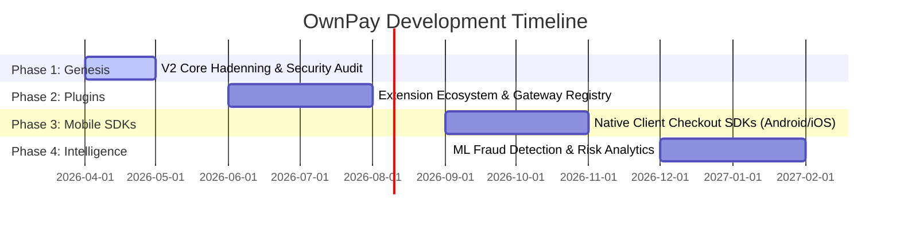

# OwnPay Product Roadmap

This document outlines the high-level roadmap and future plans for **OwnPay**, the sovereign enterprise payment gateway orchestrator. Our goal is to empower individuals and businesses with complete payment infrastructure sovereignty.

---

## 🗺️ Release Timeline & Phases

---

### 🟢 Phase 1: Genesis & Hadenning (Current)
*Focus: Stabilizing the core white-labeled payment engine, database performance, and mobile pairing security.*

*   [x] **V2 Migration & Refactoring**: Overhaul PipraPay codebase into modern PSR-4 namespace patterns, strictly-typed PHP 8.2 classes.
*   [x] **Double-Entry Bookkeeping**: Implementation of GAAP-compliant ledger transactions scoped strictly by brand to guarantee mathematical auditing.
*   [x] **White-Label Domain Pipeline**: Resolution of customer-facing checkouts and gateway callback URLs strictly under custom domains (`op_domains`).
*   [x] **Android Companion Pairing**: Secure companion app JWT authentication with stateless refresh token rotation and JTI blacklisting.
*   [x] **CSP Header Compliance**: Implementation of dynamic Content Security Policy (CSP) header generator parsing domains from gateway manifests.
*   [ ] **Comprehensive Test Coverage**: Expand automated testing suites to verify ledger balance queries, JWT expiration flows, and DNS validation.

---

### 🟡 Phase 2: Extension Ecosystem (Q3 2026)
*Focus: Enabling developer extensibility and simplifying the integration of international payment methods.*

*   **Community Plugin Directory**: Release an official, web-accessible repository for community-submitted payment gateways, checkout themes, and webhook listeners.
*   **One-Click Module Installation**: Admin panel integration allowing operators to securely download, scan, and activate plugins from the directory.
*   **Sandbox Security Hardening**: Improve the `PluginSandbox` scanner to dynamically mock PHP file access and safely sandboxing third-party integrations.
*   **SDK Generators**: Provide templates and base classes for developers to quickly build and package gateways using standard adapters.

---

### 🔵 Phase 3: Native Mobile SDKs (Q4 2026)
*Focus: Providing developers with official, pre-built frontend SDKs to process checkouts within mobile applications.*

*   **Android Checkout SDK**: Native Kotlin library to initiate and complete checkouts, handling MFS tokenization and redirect pipelines smoothly.
*   **iOS Checkout SDK**: Native Swift library with pre-built UI components matching premium brand aesthetics.
*   **Flutter & React Native Bridges**: Official cross-platform wrappers for rapid deployment across multi-platform client apps.
*   **Offline Mode Reconciliation**: Smart client-side queueing that logs intent parameters and syncs transaction states once network connections resume.

---

### 🟣 Phase 4: Fraud Detection & Analytics (Q1 2027)
*Focus: Visualizing transaction flows and protecting stores from velocity attacks and chargeback disputes.*

*   **Real-time Analytics Dashboard**: Premium interactive charts detailing revenue metrics, refund rates, conversion velocities, and ledger statuses.
*   **Heuristic Risk Engine**: Identify suspicious payment patterns (IP hopping, rapid checkout attempts, card test signatures) and alert admins.
*   **Dynamic Dispute Management**: Visual hub inside the admin panel to track chargeback deadlines, log proof metadata, and automate gateway responses.
*   **MFS Device Heartbeat Alerting**: Advanced push notifications via companion app notifying administrators when an SMS-forwarding device loses connection or battery.

---
*Built by the Community, for the Community.*
