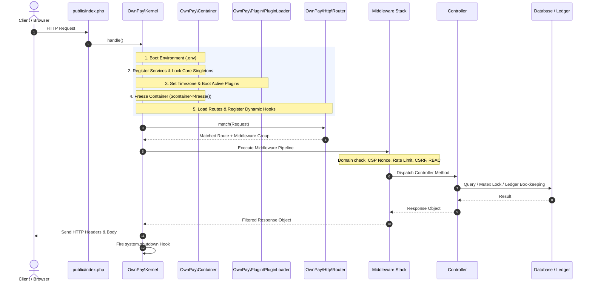
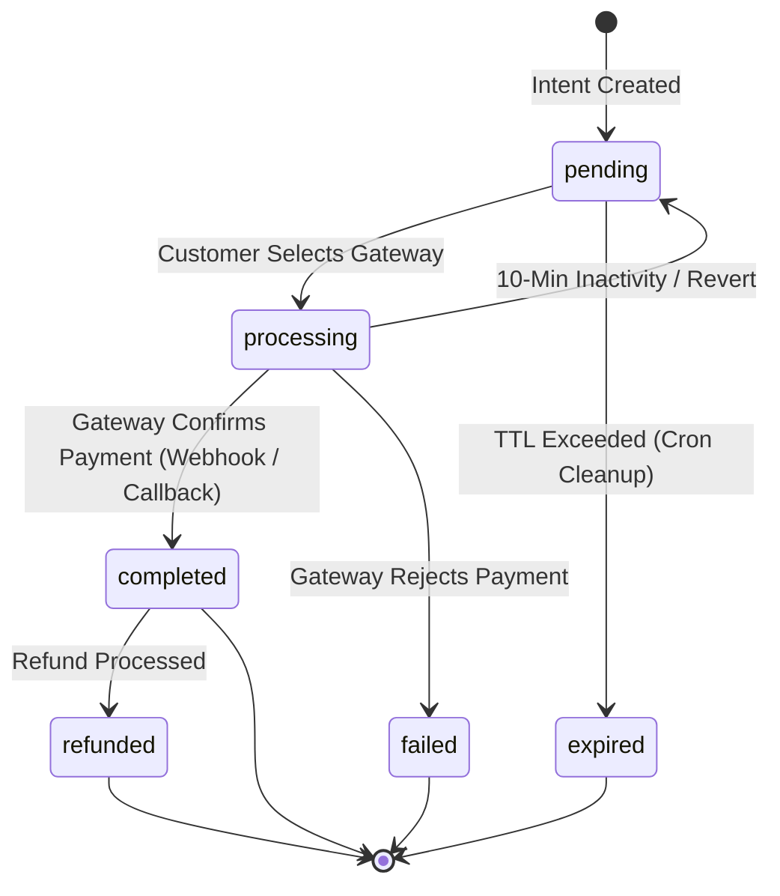

# OwnPay - Enterprise Payment Architecture & Developer Guide

> **The Sovereign, Single-Owner, Multi-Brand Payment Orchestrator for Modern PHP 8.3+**

Welcome to the **OwnPay** Architecture Guide. This document is written to give any developer - whether a junior engineer or a seasoned architect - an instant, crystal-clear mental model of how OwnPay is designed, why it was built this way, and how to start building or contributing immediately.

---

## 💡 The Core Philosophy: "No Unfamiliar Frameworks"

If you open the OwnPay codebase, you will not find thousands of vendor files or obscure framework magic. OwnPay does **not** use Laravel, Symfony, or Yii.

### Why?
1. **Total Determinism & Extreme Speed**: Sub-millisecond boot times, zero hidden magic, and absolute control over memory, transactions, and security headers.
2. **Zero Framework Lock-in**: No breaking major-version framework upgrades every 12 months.
3. **If you know modern PHP, you already know 100% of OwnPay**:
   - **Autoloading**: Standard PSR-4 (`OwnPay\` -> `src/`).
   - **Dependency Injection**: Standard PSR-11 Container (`src/Container.php`) with autowiring.
   - **HTTP Layer**: Standard `Request` and `Response` value objects (`src/Http/`).
   - **Database**: Standard PDO prepared statements with strict parameter binding (`src/Core/Database.php`).
   - **Templates**: Modern Twig 3+ (`templates/`).
   - **Typing**: Strict types (`declare(strict_types=1)`) everywhere, validated at PHPStan Level 9.

You do not need to read a 500-page framework manual to contribute. Everything you need is standard, clean, readable PHP.

---

## 🗺️ Visual Code Index & Directory Map

```
ownpay/
├── config/                      # Declarative application configuration
│   ├── app.php                  # Application environment, base URLs, timezones
│   ├── database.php             # PDO connection parameters and driver flags
│   ├── hooks.php                # System events, actions, and filter declarations
│   ├── middleware.php           # Global and route-group middleware pipelines
│   ├── services.php             # PSR-11 container bindings and singletons
│   └── routes/                  # Route definitions
│       ├── web.php              # Web routes (Admin, Checkout, Invoices, Auth)
│       └── api.php              # REST APIs (v1, mobile companion, webhooks)
│
├── database/                    # Relational schema and migrations
│   ├── schema.sql               # Canonical DDL (strict MySQL 8 / MariaDB 10.4+)
│   ├── seeds.sql                # Default initial data (roles, currencies, permissions)
│   └── migrations/              # Incremental SQL migration scripts
│
├── modules/                     # Sandboxed plugin ecosystem (Gateways, Addons, Themes)
│   ├── gateways/                # Payment gateway adapters (123+ providers)
│   ├── addons/                  # Feature extensions and integrations
│   └── themes/                  # Custom checkout and storefront themes
│
├── public/                      # Web root (the ONLY public folder)
│   ├── index.php                # Single front-controller entry point
│   └── assets/                  # Public static assets (CSS, JS, Fonts, Icons)
│
├── src/                         # PSR-4 Application core (OwnPay\ namespace)
│   ├── Container.php            # PSR-11 DI container with autowiring & immutability
│   ├── Kernel.php               # Central orchestrator: boot sequence and request dispatch
│   ├── Controller/              # Request handlers (Admin, Api, Checkout, Webhook)
│   ├── Core/                    # Database, UuidGenerator, RouteHelper, and sanitizers
│   ├── Event/                   # EventManager (WordPress-style action and filter hooks)
│   ├── Gateway/                 # GatewayAdapterInterface and gateway bridges
│   ├── Http/                    # Request, Response, and Router engine
│   ├── Middleware/              # HTTP middleware pipeline (Auth, CSRF, CSP, Tenant)
│   ├── Plugin/                  # PluginLoader, PluginSandbox, and Manifest parsers
│   ├── Repository/              # Database data access layer with TenantScope trait
│   ├── Security/                # AES-256-GCM FieldEncryptor, Authenticator, CSP Nonce
│   ├── Service/                 # Business logic organized by domain
│   │   ├── Auth/                # Authentication, JWT, TOTP, and Password Reset
│   │   ├── Brand/               # Multi-brand context resolution and theme loading
│   │   ├── Domain/              # White-label custom domain resolution (DomainUrlService)
│   │   ├── Notification/        # WebhookDispatcher and Mobile notifications
│   │   ├── Payment/             # LedgerService, PaymentIntentService, InvoiceService
│   │   └── Sms/                 # Autonomous SMS parsing and matching engines
│   ├── Support/                 # Helpers (BCMath money calculation, DateHelper)
│   ├── Update/                  # Self-update engine, signature verification, and backups
│   └── View/                    # TwigFactory, ActiveThemeResolver, ErrorPageRenderer
│
├── templates/                   # Twig 3.26 auto-escaped view templates
│   ├── admin/                   # Admin control panel templates and partials
│   ├── checkout/                # High-conversion, mobile-responsive checkout UI
│   ├── email/                   # Transactional HTML email templates
│   └── error/                   # Accessible HTTP error templates (404, 500, 503)
│
└── tests/                       # Automated test suite
    ├── Unit/                    # Fast, isolated unit tests
    ├── Integration/             # End-to-end database and HTTP flow tests
    ├── Security/                # Penetration and security remediation verification
    └── frontend/                # Vitest DOM, accessibility, and JavaScript tests
```

---

## 🔄 The 10-Step Boot Cycle & Execution Timeline

Every single HTTP request enters through `public/index.php` and executes in a strictly deterministic 10-step lifecycle:



### Detailed Boot Breakdown:
1. **Load Environment**: Initializes `Dotenv` from project root.
2. **Register DI Services**: Loads `config/services.php` into the PSR-11 `Container`.
3. **Lock Critical Services**: `Database`, `EventManager`, `AdminSession`, `FieldEncryptor`, `SettingsRepository`, and `PluginRegistry` are individually locked to prevent runtime replacement.
4. **Boot Plugins**: `PluginLoader::boot()` discovers and activates enabled gateways, addons, and themes.
5. **Freeze Container**: `$container->freeze()` seals the container permanently for the rest of the request, making service definitions completely immutable.
6. **Load Middleware Pipeline**: Loads `config/middleware.php` and applies the `system.middleware.pipeline` filter.
7. **Register Routes**: Compiles routing trees from `config/routes/web.php`, `config/routes/api.php`, and plugin manifests.
8. **Match Route**: Matches URL and HTTP method against registered patterns; extracts named path parameters.
9. **Execute Middleware & Controller**: Runs global and group-specific middleware, then calls `Controller->method(Request)`.
10. **Shutdown**: Emits the HTTP response, closes output buffers, and fires the `system.shutdown` event.

---

## 🏛️ Deep-Dive into Core Subsystems

---

### 1. Sovereign Multi-Brand Model & Platform Scope
**WHAT**: OwnPay is a single-owner, multi-brand platform (NOT a multi-tenant SaaS). One super-administrator controls the entire server, but can create unlimited independent brands/stores.

**WHY**: Businesses with multiple stores (e.g., Clothing Store, Tech Store, Digital Goods) need separate logos, domains, payment gateways, and accounting ledgers without the overhead of running 10 separate server installations.

**HOW**:
- **Tenant Scoping**: All brand data in MySQL contains a `merchant_id` column.
- **`TenantScope` Trait**: Repositories use `$repo->forTenant($merchantId)` which returns an isolated clone.
- **The Platform Scope (`is_platform = 1`)**: A special system record in `op_merchants` represents the global "All Brands" scope (`__platform__`). It owns global configurations, master API keys, and platform fee ledger accounts.
- **Read Scoping**: Brand view reads ONLY rows matching its `merchant_id`. The "All Brands" view reads across all brands.
- **Write Scoping**: Always resolved via `BrandContext::getWriteMerchantId()`, writing to the active brand or to the platform owner in All-Brands mode.

```mermaid
graph TD
    Owner[Super Administrator] -->|Controls| Platform[Platform Context: is_platform = 1]
    Platform -->|Owns| Brand1[Brand A: merchant_id = 1<br/>pay.store-a.com]
    Platform -->|Owns| Brand2[Brand B: merchant_id = 2<br/>checkout.store-b.com]
    Platform -->|Owns| Brand3[Brand C: merchant_id = 3<br/>pay.store-c.com]

    Brand1 -->|Isolated| Data1[Gateways, Customers, Ledgers, Invoices]
    Brand2 -->|Isolated| Data2[Gateways, Customers, Ledgers, Invoices]
    Brand3 -->|Isolated| Data3[Gateways, Customers, Ledgers, Invoices]
```



---

### 2. Double-Entry Financial Ledger (GAAP Compliant)
**WHAT**: Every financial movement (charge, fee, refund, payout) is recorded in a triple-table double-entry accounting ledger (`op_ledger_accounts`, `op_ledger_transactions`, `op_ledger_entries`).

**WHY**: Single-column balance counters (`UPDATE users SET balance = balance + 10`) lead to phantom money, race conditions, and unverifiable audits. Double-entry bookkeeping guarantees mathematical certainty: every debit MUST have an equal credit.

**HOW**:
- **Balance Invariant**: Sum of debits === sum of credits at 4-decimal precision using BCMath (`bccomp()`).
- **GAAP Directionality**:
  - **Asset / Expense**: Debit increases (+), Credit decreases (-).
  - **Liability / Equity / Revenue**: Credit increases (+), Debit decreases (-).
- **Idempotency Mutex**: `SELECT ... FOR UPDATE` guard on `(merchant_id, reference_type, reference_id, description)` prevents double-posting during webhook retries.
- **TOCTOU Resilience**: Concurrent first-time account creation catches MySQL 1062 duplicate-key errors and re-selects the existing row without failing the transaction.

```mermaid
graph LR
    subgraph Payment of $100 (Platform Fee: $2, Merchant Payout: $98)
        Cash["[Asset] CASH Account<br/>Debit: +$100.00"]
        Payable["[Liability] MERCHANT_PAYABLE<br/>Credit: +$98.00"]
        Revenue["[Revenue] PLATFORM_FEE_REVENUE<br/>Credit: +$2.00"]
    end
    Cash -->|Balanced Equation| Payable
    Cash -->|Balanced Equation| Revenue
```

---

### 3. White-Label Custom Domain Pipeline
**WHAT**: Allows each brand to operate under its own custom domain (e.g. `pay.brand.com`) while sharing a single application instance.

**WHY**: Customers never see `ownpay.test` or a generic gateway domain. The entire checkout experience belongs 100% to the brand.

**HOW**:
- **`DomainMiddleware`**: Intercepts every HTTP request, strips ports, lowercases hostnames, and checks against active, DNS-verified domains in `op_domains`.
- **Admin Isolation**: Requests starting with `/admin` or `/admin/*` on a custom brand domain are immediately rejected with a **404 Not Found** response. Admin panels are strictly accessible only on the master `APP_DOMAIN`.
- **`DomainUrlService`**: Centralized URL builder that constructs all checkout links, status URLs, and gateway webhook callbacks using the brand's verified custom domain.

---

### 4. Gateway Adapter Architecture & Plugin Sandbox
**WHAT**: Modular gateway plugins living in `modules/gateways/{slug}/` implementing `GatewayAdapterInterface`.

**WHY**: Allows adding, updating, or removing any of the 123+ payment providers (Stripe, bKash, PayPal, Razorpay, etc.) without altering core platform code.

**HOW**:
- **`GatewayAdapterInterface`**: Clean contract specifying `initiate()`, `verify()`, `verifyWebhook()`, and `refund()`.
- **`GatewayDefaults` Trait**: Provides safe no-op fallbacks for optional features (e.g., refund capabilities).
- **`PluginSandbox`**: Security parser that scans plugin code before execution, blocking dangerous PHP constructs (`eval`, `shell_exec`, raw backticks, unauthorized filesystem writes, and direct SQL execution).
- **Encrypted Credentials**: Gateway secrets are stored AES-256-GCM encrypted in `op_gateway_configs`.

---

### 5. Payment Intents & Checkout State Machine
**WHAT**: An atomic state machine managing the payment lifecycle from initiation to final ledger reconciliation.

**WHY**: Prevents race conditions, double charging, and inconsistent states when customers switch gateways or retry payments.



---

### 6. Mobile Companion & Autonomous SMS Engine
**WHAT**: Android companion app paired with the server via cryptographic JWT for automated offline payment verification (bKash, Nagad, Rocket, Bank SMS).

**WHY**: Many developing markets rely on peer-to-peer mobile financial services without official open APIs. The companion app intercepts incoming transaction SMS messages and settles pending payments automatically.

**HOW**:
- **Hardware-Pinned Device Pairing**: 6-digit one-time pairing code with rate limiting and hardware UUID verification (`op_paired_devices`).
- **Two-Tier JWT Claims**: Short-lived access token (`typ=access`, 1-day TTL) and long-lived refresh token (`typ=refresh`, 30-day TTL) preventing unauthorized access.
- **Smart SMS Parser**: Regex and pattern-matching engine (`SmsParserService`) extracts Amount, TrxID, and Sender phone number, matching against pending transactions and triggering double-entry settlement in real time.

---

### 7. Security, Cryptography & Audit Trail
**WHAT**: Bank-grade security controls applied systematically across all layers.

**HOW**:
- **PII Encryption (`FieldEncryptor.php`)**: Sensitive customer details and gateway keys use AES-256-GCM authenticated encryption with distinct IVs.
- **Password Security (`Authenticator.php`)**: Passwords hashed using Argon2id with automatic memory/time cost upgrades.
- **Atomic Password Resets (`PasswordResetService.php`)**: Single-transaction atomic consumption with SHA-256 token hashing; automatically revokes all active API keys for the user's merchant.
- **Replay-Proof Webhooks (`RequestSignatureMiddleware.php`)**: Validates HMAC signatures, enforces 300-second timestamp freshness, and caches body hash nonces to block replay attacks.
- **Tamper-Evident Audit Logs (`AuditLogRepository.php`)**: Audit logs form a cryptographic HMAC-SHA256 forward hash chain (`prev_hash`). Any manual database deletion or alteration immediately breaks the integrity chain.

---

## 🛠️ Step-by-Step Developer Recipes

---

### Recipe 1: How to Add a New Payment Gateway

1. **Create Directory**: Create `modules/gateways/mygateway/`.
2. **Create `manifest.json`**:
```json
{
  "name": "MyGateway",
  "slug": "mygateway",
  "version": "1.0.0",
  "type": "gateway",
  "author": "Your Name",
  "class": "OwnPay\\Gateway\\MyGateway\\MyGatewayAdapter",
  "currencies": ["USD", "EUR", "BDT"],
  "fields": {
    "api_key": {"type": "text", "label": "API Key", "required": true},
    "secret_key": {"type": "password", "label": "Secret Key", "required": true},
    "sandbox": {"type": "toggle", "label": "Sandbox Mode", "default": true}
  }
}
```
3. **Implement Adapter Class (`MyGatewayAdapter.php`)**:
```php
<?php
declare(strict_types=1);

namespace OwnPay\Gateway\MyGateway;

use OwnPay\Gateway\GatewayAdapterInterface;
use OwnPay\Gateway\GatewayDefaults;

final class MyGatewayAdapter implements GatewayAdapterInterface
{
    use GatewayDefaults;

    public function initiate(array $paymentData): array
    {
        // 1. Build gateway payload
        // 2. Call gateway API
        // 3. Return redirect URL or form parameters
        return [
            'redirect_url' => 'https://gateway.example.com/pay/token123',
            'action' => 'redirect',
        ];
    }

    public function verify(array $params): array
    {
        // Verify payment result on customer return
        return [
            'success' => true,
            'transaction_id' => $params['trx_id'] ?? '',
            'amount' => $params['amount'] ?? '0.00',
        ];
    }
}
```

---

### Recipe 2: How to Add a New Admin Page & Route

1. **Create Controller**: Add `src/Controller/Admin/CustomReportController.php`:
```php
<?php
declare(strict_types=1);

namespace OwnPay\Controller\Admin;

use OwnPay\Http\Request;
use OwnPay\Http\Response;

final class CustomReportController extends BaseAdminController
{
    public function index(Request $request): Response
    {
        $this->requirePermission('reports.view');
        
        $data = ['title' => 'Custom Report'];
        return $this->render('admin/reports/custom.twig', $data);
    }
}
```
2. **Register Route**: Add route in `config/routes/web.php`:
```php
$router->get('/admin/reports/custom', 'Admin\CustomReportController@index', 'admin');
```
3. **Add Permission**: Register in `config/permissions.php` and map in `PermissionMiddleware.php`.
4. **Create Twig View**: Add `templates/admin/reports/custom.twig` extending `admin/layout/base.twig`.

---

### Recipe 3: How to Subscribe to Events & Hooks

In your plugin or service provider:
```php
use OwnPay\Event\EventManager;

/** @var EventManager $events */
$events = $container->get(EventManager::class);

// Hook into payment completion
$events->addAction('payment.completed', function (array $transaction) {
    // Execute notification, dispatch email, or update inventory
    $trxId = $transaction['trx_id'];
    $amount = $transaction['amount'];
});

// Hook into response filtering
$events->addFilter('system.response', function (Response $response, Request $request) {
    return $response->withHeader('X-Custom-Header', 'OwnPay-Engine');
});
```

---

## 🧪 Quality Verification & Testing Commands

OwnPay enforces uncompromising quality gates. Run these commands to verify any changes:

```bash
# 1. PHP Strict Static Analysis (Level 9 across all 389 files)
vendor/bin/phpstan analyse --memory-limit=1G

# 2. PHPUnit Backend Test Suite (828 tests, 2834 assertions)
vendor/bin/phpunit

# 3. Twig Template Linting (99 templates)
composer lint:twig

# 4. Frontend Unit & Integration Tests (244 Vitest tests)
npm test

# 5. Frontend CSS and JavaScript Linters
npm run lint
```

---

## 📖 Key Takeaway for Contributors

OwnPay was engineered to be transparent, clean, and reliable. Every class has a clear, single responsibility. There are no bloated abstractions, no black boxes, and no vendor lock-in.

Welcome to the team. Happy building!
