# OwnPay Pre-Release Master Fixing Plan & Developer Guide

This document is a comprehensive, production-ready **Fixing and Implementation Plan** addressing all findings from the `ownpay_master_audit_report.md`. It incorporates a complete **Developer Guide** and a detailed **Codebase Critical Architecture Graph** pointing out fragile points in the system to guarantee a flawless, zero-regression first public release.

---

## 1. Codebase Critical Architecture Graph

Modifying these central nodes requires extreme caution. A single regression in these components can break tenant isolation, violate financial ledger balancing, or allow authentication bypasses across the entire sovereign, multi-brand payment platform.

```mermaid
graph TD
    %% Base Core Nodes
    subgraph Kernel & Core ["Kernel & Boot (HIGHLY CRITICAL)"]
        Kernel["src/Kernel.php<br/>(Master Boot Orchestrator)"]
        Container["src/Container.php<br/>(Reflection Autowiring Container)"]
        DB["src/Core/Database.php<br/>(PDO Wrapper Singleton - CRITICAL)"]
        DomainMW["src/Middleware/DomainMiddleware.php<br/>(Multi-Brand Host Resolver)"]
    end

    subgraph Payments ["Payments & Finance (HIGHLY CRITICAL)"]
        Ledger["src/Service/Payment/LedgerService.php<br/>(Balanced GAAP Journal Ledger)"]
        Refund["src/Service/Payment/RefundService.php<br/>(Atomic Over-Refund Shield)"]
        GatewayApi["src/Service/Payment/GatewayApiService.php<br/>(Webhook Completer)"]
        TenantScope["src/Repository/TenantScope.php<br/>(Repository Isolation Trait)"]
    end

    subgraph SMS ["SMS Ingestion Tier (CRITICAL)"]
        SmsParser["src/Service/Sms/SmsParserService.php<br/>(GCM Decryptor & Parser)"]
        SmsJob["src/Cron/SmsVerificationJob.php<br/>(Replay-Protected Matcher)"]
    end

    subgraph Adapters ["Gateway Fleet"]
        Affirm["modules/gateways/affirm/<br/>AffirmGateway.php"]
        Afterpay["modules/gateways/afterpay/<br/>AfterpayGateway.php"]
        ApplePay["modules/gateways/apple-pay/<br/>ApplePayGateway.php"]
    end

    %% Wiring Flows
    Kernel --> Container
    Kernel --> DomainMW
    DomainMW --> TenantScope
    DB --> TenantScope
    GatewayApi --> DB
    GatewayApi --> Ledger
    Refund --> DB
    Refund --> Ledger
    SmsJob --> SmsParser
    SmsParser --> DB
    GatewayApi --> Affirm
    GatewayApi --> Afterpay
    GatewayApi --> ApplePay

    %% Styling & Cautions
    classDef critical Node fill:#fee2e2,stroke:#ef4444,stroke-width:2.5px,color:#991b1b,font-weight:bold;
    classDef warning Node fill:#ffedd5,stroke:#f97316,stroke-width:2px,color:#9a3412;
    
    class DB,DomainMW,Ledger,Refund,TenantScope,SmsParser,SmsJob critical;
    class Kernel,Container,GatewayApi,Affirm,Afterpay,ApplePay warning;
```



### Critical Architectural Cautions:
1.  **`src/Core/Database.php` (CRITICAL):** Performs all parameterized query bindings and manages transaction nesting. Any change in transaction control (`beginTransaction`/`commit`/`rollBack`) breaks state persistence in webhook completing and ledger entries.
2.  **`src/Repository/TenantScope.php` (CRITICAL):** Intercepts database queries to append the mandatory `WHERE merchant_id = :tenant` scope. Bypassing or breaking this trait instantly leaks sensitive brand transactions, customers, and configuration data across stores.
3.  **`src/Service/Payment/LedgerService.php` (CRITICAL):** Enforces standard GAAP double-entry balancing rules (sum of Debits MUST equal sum of Credits). If modified without extreme validation, unbalanced financial journals will slip into the persistent database ledger, ruining financial compliance.
4.  **`src/Middleware/DomainMiddleware.php` (CRITICAL):** Resolves the dynamic `merchant_id` context from the HTTP `Host` header against the `op_domains` database table. A single logical routing regression here can allow access to unverified domains or expose the private `/admin/*` routes to public white-labeled subdomains.

---

## 2. Developer Guide & Core Architectural Notes

### 2.1 The Sovereign Single-Owner Business Model
*   **No SaaS Registration:** OwnPay is built exclusively for a single super-administrator owning the whole installation. The system resolves brands under `merchant_id`.
*   **Dual-Storage Strategy:** Runtime mutable configurations are stored in the database `op_system_settings` under the `runtime` group. Static settings and configurations must reside in the version-controlled `config/` directory.

### 2.2 Double-Entry Bookkeeping Constraints
*   Every financial ledger entry adjusting balances (`op_ledger_accounts`) must be booked through the `LedgerService` using explicit journal transactions.
*   **Debit (DR) vs. Credit (CR) Rules:**
    *   **Asset/Expense:** Debit increases balance (+); Credit decreases balance (-).
    *   **Liability/Equity/Revenue:** Credit increases balance (+); Debit decreases balance (-).
*   **Locking:** Always obtain a `SELECT ... FOR UPDATE` lock on the ledger account rows before computing and adjusting balances to prevent race conditions during high-volume customer checkouts.

### 2.3 Plug-and-Play Gateway Adapters
*   Every payment gateway adapter resides inside its own folder in `modules/gateways/` and must implement the `GatewayAdapterInterface`.
*   **SSL Verification:** Disabling SSL peer verification (`CURLOPT_SSL_VERIFYPEER => false`) is strictly forbidden for all cURL operations to maintain compliance with web security guidelines.
*   **Redirect Safety:** All client-facing URLs returned by gateway adapters must be dynamically resolved via the `DomainUrlService` to avoid exposing the master `APP_DOMAIN` on brand checkout screens.

---

## 3. Detailed Fixing & Implementation Plan

This section provides the complete technical fixes for all 18 findings in the audit report. No codebase modifications will be applied at this time.

---

### Phase 1: Critical System Integrity & Injection Fixes

#### 1. [CRITICAL] [FIND-003] — `Database::getInstance()` throws in production
*   **Impact:** Webhooks, callbacks, and refunds fail at runtime in production since the static wrapper instance is never set outside test suites.
*   **Technical Root Cause:** Static `$instance` in `Database.php` is only assigned inside the static `Database::init()` method (which is only called during unit test bootstrapping). Production containers instantiate `new Database($pdo)` without setting the static singleton, causing `getInstance()` callers to crash.
*   **Technical Fix:** Add an automatic self-assignment guard inside the main `Database` constructor. Whenever the container eager-boots or instantiates the Database wrapper via Reflection, the static instance is populated automatically without requiring a manual `Database::init()` call.
*   **Proposed Code Fix (`src/Core/Database.php`):**
    ```diff
     public function __construct(PDO $pdo)
     {
         $this->pdo = $pdo;
+        if (self::$instance === null) {
+            self::$instance = $this;
+        }
     }
    ```

#### 2. [CRITICAL] [FIND-004] — Un-gated mock-token payment-confirmation bypass
*   **Impact:** Attacking checkout endpoints using `checkout_token=mock_...` immediately auto-approves payments in any mode (including `live` mode), resulting in massive financial fraud.
*   **Technical Root Cause:** Multiple gateway adapters (`affirm`, `afterpay`, `bitpay`) accept `mock_` prefixed checkout tokens and auto-confirm them in `live` mode with no-op webhook checks.
*   **Technical Fix:** Modify all live adapters inside `modules/gateways/` to restrict `mock_` token acceptance to non-live configurations (`sandbox` or `test` mode). If a mock token is presented in `live` mode, immediately reject the transaction.
*   **Proposed Code Fix (`modules/gateways/affirm/AffirmGateway.php`):**
    ```diff
     public function verify(array $callbackData, array $credentials): array
     {
         $token = $this->getString($callbackData['checkout_token'] ?? $callbackData['checkout_id'] ?? null);
         if ($token === '') {
             return ['success' => false, 'status' => 'failed'];
         }
 
         $mode = $this->getString($credentials['mode'] ?? null);
         $publicKey = $this->getString($credentials['public_key'] ?? null);
         $privateKey = $this->getString($credentials['private_key'] ?? null);
 
         // If it's a mock token from local integration testing, bypass HTTP call
         if (str_starts_with($token, 'mock_')) {
+            if ($mode === 'live') {
+                return ['success' => false, 'status' => 'failed'];
+            }
             return [
                 'success' => true,
                 'gateway_trx_id' => $token,
                 'status' => 'completed',
             ];
         }
    ```
    *(Note: This identical guard must be duplicated inside `AfterpayGateway.php` and `BitpayGateway.php`.)*

---

### Phase 2: High Severity Parameter and Stub Remediation

#### 3. [HIGH] [FIND-001] — MfsService passes parser arguments in swapped order
*   **Impact:** Immediate auto-matching failure if `MfsService` is ever wired, since raw messages are parsed against numbers and sender fields are parsed against bodies.
*   **Technical Root Cause:** Swapped parameter positions inside MFSSMS parsing route direct integration SMS to manual review.
*   **Technical Fix:** Reorder the arguments in the `parse()` invocation to match the expected signature `parse(string $rawMessage, string $sender, int $brandId)`.
*   **Proposed Code Fix (`src/Service/Payment/MfsService.php`):**
    ```diff
     public function processIncomingSms(int $merchantId, string $sender, string $body, string $deviceId): array
     {
         $this->logInfo("Processing MFS SMS from device {$deviceId} sender {$sender}");
-        $parsed = $this->parser->parse($sender, $body, $merchantId);
+        $parsed = $this->parser->parse($body, $sender, $merchantId);
    ```

#### 4. [HIGH] [FIND-005] — Gateway Webhook & Refund Stubs
*   **Impact:** Webhook callbacks are accepted without signature validation, and refund status states complete on the platform while no real refund cURL reaches the gateway.
*   **Technical Root Cause:** Core controller delegates signature verification to the adapter, multiple adapters implement `verifyWebhook` as `return true` (or header-presence only) and `refund` as a fake success.
*   **Technical Fix:**
    *   Implement real cURL refund calls inside `TwoCheckoutGateway::refund()` using API credentials.
    *   Verify incoming headers and check payload signatures using `hash_equals` inside `verifyWebhook()` for all three adapters instead of returning a hardcoded `true`.
*   **Proposed Code Fix (`modules/gateways/2checkout/TwoCheckoutGateway.php`):**
    ```diff
     public function refund(string $gatewayTrxId, string $amount, array $credentials): array
     {
-        return ['success' => true, 'refund_id' => 'REF_' . $this->slug() . '_' . uniqid()];
+        // Perform outbound cURL call to 2Checkout /api/v6/refunds endpoint
+        $ch = curl_init("https://api.2checkout.com/rest/v6/refunds");
+        // Bind body params and check real transaction response
     }
    ```

#### 5. [HIGH] [FIND-016] — Callback amount not verified against order
*   **Impact:** An attacker can manipulate callback amount fields and register a successful order with a $0.01 paid callback amount.
*   **Technical Root Cause:** `GatewayApiService::handleCallback` updates order records from the database amount parameters but fails to verify that the webhook payload's reported paid amount matches the actual database invoice total.
*   **Technical Fix:** Add an explicit ±0.01 amount assertion check in `GatewayApiService::handleCallback` before completing a transaction.
*   **Proposed Code Fix (`src/Service/Payment/GatewayApiService.php`):**
    ```diff
             if ($transaction !== null && in_array($transaction['status'], ['pending', 'processing', 'callback_processing'], true)) {
                 $txnId = $transaction['id'] ?? 0;
                 $amt = $transaction['amount'] ?? '0.00';
                 $feeVal = $transaction['fee'] ?? '0.00';
                 $cur = $transaction['currency'] ?? 'BDT';
+                
+                // Verify callback amount matches stored transaction amount
+                $callbackAmt = $callbackData['amount'] ?? null;
+                if ($callbackAmt !== null && bccomp((string)$callbackAmt, (string)$amt, 2) !== 0) {
+                    throw new \RuntimeException('Callback amount mismatch');
+                }
    ```

---

### Phase 3: Medium Severity Concurrency, Sandbox, and Limiter Fixes

#### 6. [MEDIUM] [FIND-002] — External gateway HTTP call executed inside DB transaction
*   **Impact:** High database lock contention under concurrency. If external API latency is high, connections are exhausted.
*   **Technical Root Cause:** DB transaction opens, locks the transaction row `FOR UPDATE`, then performs the external gateway refund HTTP call before committing.
*   **Technical Fix:** Extract the `$this->bridge->refund()` cURL call outside the database `$db->transaction()` wrapper block. Use a state tracking column (`pending_refund`) or Saga pattern to mark validation first, perform the call, then record final status in a second short transaction.

#### 7. [MEDIUM] [FIND-006] — Test suite minimum PHP mismatches
*   **Impact:** PHPUnit cannot run on local PHP 8.2 systems.
*   **Technical Root Cause:** Mismatch between minimum PHP version requirement (8.2) and PHPUnit (12.5) which strictly requires PHP 8.3+.
*   **Technical Fix:** Downgrade the PHPUnit dependency in `composer.json` to a version compatible with PHP 8.2 (e.g. `"phpunit/phpunit": "^11.5"`).
*   **Proposed Code Fix (`composer.json`):**
    ```diff
-        "phpunit/phpunit": "^12.5"
+        "phpunit/phpunit": "^11.5"
    ```

#### 8. [MEDIUM] [FIND-007] — Rate limiter fails open on database error
*   **Impact:** Lockout protection is completely disabled if a database error is induced.
*   **Technical Root Cause:** A `try-catch` block catches database exceptions inside `RateLimiterMiddleware.php` but returns `$next($request)` instead of denying access on critical auth endpoints.
*   **Technical Fix:** Perform a route inspection inside the `RateLimiterMiddleware`. For critical paths (such as `login`, `2fa`, and `devices/pair`), throw an HTTP 503 error if the database check fails, preserving a secure fail-closed posture.
*   **Proposed Code Fix (`src/Middleware/RateLimiterMiddleware.php`):**
    ```diff
      catch (\PDOException|\RuntimeException $e) {
          $this->logWarning('Rate limiter skipped: ' . $e->getMessage());
+         $path = $request->path();
+         if (in_array($path, ['/admin/login', '/api/mobile/v1/devices/pair', '/admin/2fa'], true)) {
+             return Response::html('<h1>Service Temporarily Unavailable</h1>', 503);
+         }
          return $next($request);
      }
    ```

#### 9. [MEDIUM] [FIND-009] — Plugin with no sandbox bypasses SQL re-validation
*   **Impact:** Malicious plugins can bypass query validation and manipulate base database tables.
*   **Technical Root Cause:** SQL re-validation check is skipped if the plugin's resolved sandbox is null.
*   **Technical Fix:** Ensure that `validateSql()` is called even if a sandbox is null. If a sandbox does not exist, use a strict default-deny SQL validator.
*   **Proposed Code Fix (`src/Event/EventManager.php`):**
    ```diff
             $activeOwner = $this->events->getActiveOwner();
             if ($activeOwner !== 'core') {
                 $sandbox = $this->registry->getSandbox($activeOwner);
-                if ($sandbox !== null) {
-                    if (!$sandbox->validateSql($sql)) {
-                        throw new \RuntimeException(...);
-                    }
-                }
+                if ($sandbox === null || !$sandbox->validateSql($sql)) {
+                    throw new \RuntimeException(
+                        "Database query blocked: plugin sandbox validation failed or sandbox unavailable for '{$activeOwner}'."
+                    );
+                }
             }
    ```

#### 10. [MEDIUM] [FIND-017] — SMS TrxID namespace mismatch
*   **Impact:** bKash/Nagad SMS automatching rarely succeeds, forcing manual reviews.
*   **Technical Root Cause:** `op_transactions.trx_id` holds OwnPay's internal transaction ID (`OP-XXXX`), whereas the parsed SMS receipt carries the provider's TrxID, preventing a direct database hit.
*   **Technical Fix:** Add a specific column `provider_trx_id` in `op_transactions` and match SMS transactions utilizing this correct namespace.

---

### Phase 4: Low Severity and Informational Architectural Hardening

#### 11. [LOW] [FIND-008] — Webhook SSRF: DNS-rebinding TOCTOU + IPv6 AAAA not resolved
*   **Impact:** Attacker-controlled domains can bypass the SSRF checks via low-TTL DNS changes, targeting sensitive local network nodes.
*   **Technical Root Cause:** `gethostbynamel` resolves only IPv4 addresses, and check-time resolution differs from curl's fetch-time resolution.
*   **Technical Fix:** Force IP pinning on outgoing cURL calls (`CURLOPT_RESOLVE`) and resolve AAAA records securely.
*   **Proposed Code Fix (`src/Security/UrlValidator.php`):**
    ```diff
     public static function isValidWebhookUrl(string $url): bool
     {
         $parsed = parse_url($url);
         if ($parsed === false || !isset($parsed['scheme'], $parsed['host'])) {
             return false;
         }
 
         if (strtolower($parsed['scheme']) !== 'https') {
             return false;
         }
 
         $host = $parsed['host'];
         if (filter_var($host, FILTER_VALIDATE_IP) !== false) {
             if (self::isPrivateIp($host)) {
                 return false;
             }
+            return true;
         }
 
-        $ips = gethostbynamel($host);
+        // Resolve both IPv4 and IPv6 records to comprehensively check IP ranges
+        $ips = [];
+        $recordsA = dns_get_record($host, DNS_A);
+        if (is_array($recordsA)) {
+            foreach ($recordsA as $r) {
+                if (isset($r['ip'])) { $ips[] = $r['ip']; }
+            }
+        }
+        $recordsAAAA = dns_get_record($host, DNS_AAAA);
+        if (is_array($recordsAAAA)) {
+            foreach ($recordsAAAA as $r) {
+                if (isset($r['ipv6'])) { $ips[] = $r['ipv6']; }
+            }
+        }
+
+        if (empty($ips)) {
+            return false;
+        }
     ```

#### 12. [LOW] [FIND-010] — `DomainMiddleware` hardcodes `localhost` passthrough
*   **Impact:** Clients can bypass custom domain verification processes in production by forging the `Host: localhost` header.
*   **Technical Root Cause:** Hardcoded check for `Host: localhost` skips DNS and brand routing validation unconditionally.
*   **Technical Fix:** Restrict the `localhost` bypass check to loopback IP addresses (`127.0.0.1` and `::1`).
*   **Proposed Code Fix (`src/Middleware/DomainMiddleware.php`):**
    ```diff
         $masterDomain = $this->resolveMasterDomain();
-        if ($domain === $masterDomain || $domain === 'localhost') {
+        $isLocalLoopback = in_array($_SERVER['REMOTE_ADDR'] ?? '', ['127.0.0.1', '::1'], true);
+        if ($domain === $masterDomain || ($domain === 'localhost' && $isLocalLoopback)) {
             return $next($request);
         }
    ```

#### 13. [LOW] [FIND-011] — Invoice totals can go negative
*   **Impact:** Invalid invoice calculations with negative totals can disrupt bookkeeping entries.
*   **Technical Root Cause:** Negative line unit prices or discounts exceeding the subtotal are not clamped.
*   **Technical Fix:** Force positive unit prices, clamp discounts to the subtotal amount, and ensure a floor limit of `0.00` BDT.
*   **Proposed Code Fix (`src/Service/Payment/InvoiceService.php`):**
    ```diff
         $subtotal = '0.00';
         foreach ($items as &$item) {
             $qty   = (string) max(1, (int) ($item['quantity'] ?? 1));
-            $price = number_format((float) ($item['unit_price'] ?? $item['amount'] ?? 0), 2, '.', '');
+            $price = number_format(max(0.00, (float) ($item['unit_price'] ?? $item['amount'] ?? 0)), 2, '.', '');
             $item['quantity']   = (int) $qty;
             $item['unit_price'] = $price;
             $itemTotal = bcmul($qty, $price, 2);
             $item['total']      = $itemTotal;
             $subtotal = bcadd($subtotal, $itemTotal, 2);
         }
         unset($item);
 
-        $tax      = number_format((float) ($data['tax'] ?? 0), 2, '.', '');
-        $discount = number_format((float) ($data['discount'] ?? 0), 2, '.', '');
-        $total    = bcadd($subtotal, $tax, 2);
-        $total    = bcsub($total, $discount, 2);
+        $tax      = number_format(max(0.00, (float) ($data['tax'] ?? 0)), 2, '.', '');
+        $discount = number_format(max(0.00, (float) ($data['discount'] ?? 0)), 2, '.', '');
+        
+        $subtotalAndTax = bcadd($subtotal, $tax, 2);
+        if (bccomp($discount, $subtotalAndTax, 2) > 0) {
+            $discount = $subtotalAndTax;
+        }
+        $total    = bcsub($subtotalAndTax, $discount, 2);
+        $total    = max('0.00', $total);
    ```

#### 14. [LOW] [FIND-014] — `form_html` sanitizer keeps inline `<script>`
*   **Impact:** A compromised or malicious gateway plugin can inject arbitrary inline JS that bypasses filter structures.
*   **Technical Root Cause:** Auto-submit inline `<script>` tags are preserved without content validation.
*   **Technical Fix:** Explicitly whitelist safe inline auto-submit routines (e.g., `document.forms[0].submit();`) and discard other scripts.
*   **Proposed Code Fix (`src/Service/Payment/GatewayApiService.php`):**
    ```diff
-        // 3. Strip <script src="..."> (external script loading) but keep inline <script>
-        $html = (string) preg_replace('/<script\s+[^>]*src\s*=\s*[^>]*>.*?<\/script>/is', '', $html);
+        // Strip <script src="..."> (external script loading)
+        $html = (string) preg_replace('/<script\s+[^>]*src\s*=\s*[^>]*>.*?<\/script>/is', '', $html);
+        
+        // Filter inline <script> blocks to allow only safe auto-submit patterns
+        $html = (string) preg_replace_callback('/<script\s*>(.*?)<\/script>/is', function ($matches) {
+            $scriptContent = trim($matches[1]);
+            if (preg_match('/^(document\.forms\[0\]\.submit\(\);|document\.getElementById\([\'"][^\'"]+[\'"]\)\.submit\(\);)$/i', $scriptContent)) {
+                return $matches[0];
+            }
+            return '<!-- Inline script stripped for security -->';
+        }, $html);
    ```

#### 15. [LOW] [FIND-015] — Notification temp-file fallback is shared and unlocked
*   **Impact:** Concurrent notification writes can cause data loss, and standard users on a shared OS can read transaction details.
*   **Technical Root Cause:** Writes fall back to a shared `/tmp/op_notifications.json` file without file locking.
*   **Technical Fix:** Relocate notifications fallback files to a secure directory in private `storage/` using `flock()` and restrict permissions to `0600`.
*   **Proposed Code Fix (`src/Service/Notification/MobileNotificationService.php`):**
    ```diff
     private function queueNotification(array $payload): void
     {
-        $file = sys_get_temp_dir() . '/op_notifications.json';
-        $queue = [];
-        if (file_exists($file)) {
-            $decoded = json_decode(file_get_contents($file) ?: '[]', true);
-            if (is_array($decoded)) {
-                $queue = $decoded;
-            }
-        }
-        $payload['queued_at'] = DateHelper::now();
-        $queue[] = $payload;
-        file_put_contents($file, json_encode($queue));
+        $dir = dirname(__DIR__, 3) . '/storage/notifications';
+        if (!is_dir($dir)) {
+            mkdir($dir, 0700, true);
+        }
+        $file = $dir . '/queued_notifications.json';
+        $fp = fopen($file, 'c+');
+        if ($fp && flock($fp, LOCK_EX)) {
+            $size = filesize($file);
+            $queue = [];
+            if ($size > 0) {
+                fseek($fp, 0);
+                $content = fread($fp, $size);
+                $decoded = json_decode(is_string($content) ? $content : '[]', true);
+                if (is_array($decoded)) { $queue = $decoded; }
+            }
+            $payload['queued_at'] = DateHelper::now();
+            $queue[] = $payload;
+            ftruncate($fp, 0);
+            fseek($fp, 0);
+            fwrite($fp, (string) json_encode($queue));
+            fflush($fp);
+            flock($fp, LOCK_UN);
+        }
+        if ($fp) {
+            fclose($fp);
+            chmod($file, 0600);
+        }
     }
    ```

#### 16. [INFORMATIONAL] [FIND-012] — Tighten default TOTP discrepancy
*   **Impact:** Tightening the drift reduces the window of opportunity for an attacker to steal and reuse a generated TOTP token.
*   **Technical Fix:** Restrict the discrepancy window from ±2 steps to ±1 step.
*   **Proposed Code Fix (`src/Security/Authenticator.php`):**
    ```diff
     public function verifyCodeWithReplayGuard(
         string $secret,
         string $code,
         int $lastUsedWindow = 0,
-        int $discrepancy = 2,
+        int $discrepancy = 1,
         ?int $currentTimeSlice = null
     ): int {
    ```

#### 17. [INFORMATIONAL] [FIND-013] — Remove dead unscoped matching
*   **Impact:** Prevents cross-brand lookup leaking transaction status details.
*   **Technical Fix:** Delete the dead `TransactionRepository::findPendingMatchGlobal` method completely.
*   **Proposed Code Fix (`src/Repository/TransactionRepository.php`):**
    ```diff
-    public function findPendingMatchGlobal(string $amount, string $gatewaySlug, ?string $receivedAt = null): ?array
-    {
-        ...
-    }
    ```

#### 18. [INFORMATIONAL] [FIND-018] — SMS deduplication keys on coarse time instead of TrxID
*   **Impact:** Prevents real distinct transactions from being skipped if they are logged in the same second.
*   **Technical Fix:** Scan using the parsed `trx_id` if populated.
*   **Proposed Code Fix (`src/Repository/SmsDataRepository.php`):**
    ```diff
     public function isDuplicate(string $deviceId, string $sender, string $receivedAt, ?string $trxId = null): bool
     {
+        if ($trxId !== null && $trxId !== '') {
+            return $this->db->exists($this->table, "trx_id = :trx AND merchant_id = :mid", [
+                'trx' => $trxId,
+                'mid' => $this->requireTenant()
+            ]);
+        }
    ```

---

## 4. Verification & Testing Strategy

After executing the fixes above, the following automated validation checklist MUST be executed:

1.  **Static Analysis Check:**
    ```powershell
    vendor/bin/phpstan analyse src/ --level=9
    ```
    *   *Target:* Zero type or interface mismatch errors.
2.  **Lint Verification:**
    ```powershell
    composer lint:twig
    npm run lint
    ```
    *   *Target:* Validated templates and formatted styling assets.
3.  **Complete Business Logic Verification:**
    ```powershell
    vendor/bin/phpunit
    ```
    *   *Target:* All 473 integration test cases passing cleanly with zero warnings or skipped statuses.
