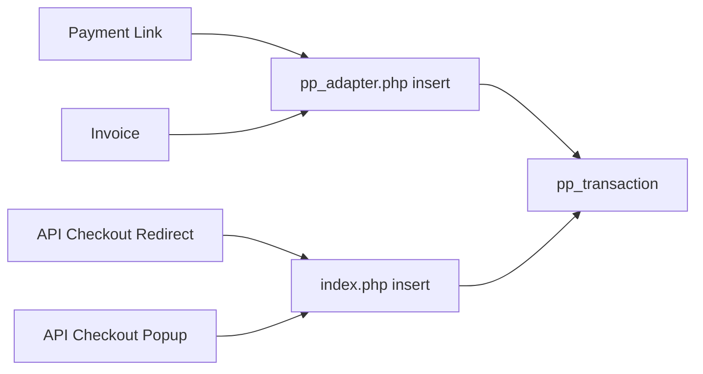
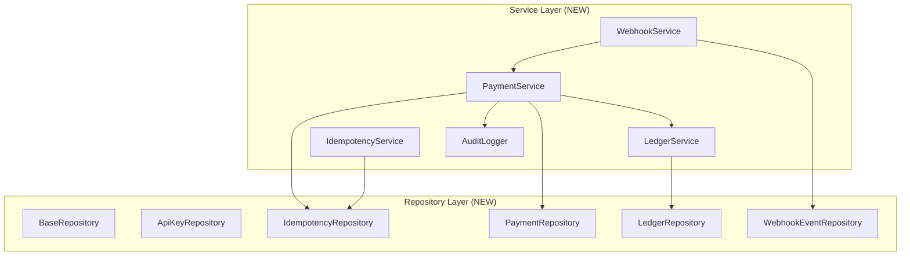
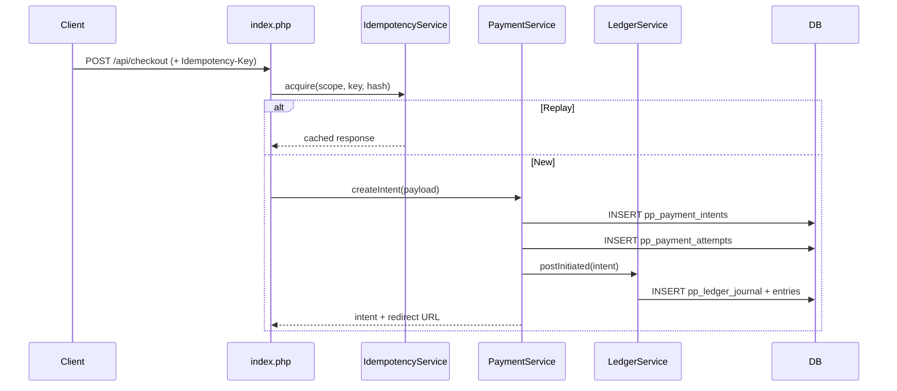

# Own Pay — Master Reference Document

> **A community-driven fork of [OwnPay](https://github.com/OwnPay/OwnPay).**
> We deeply appreciate the original creators and contributors for their foundational work.
> To maintain the open-source spirit and comply with the original licensing,
> **Own Pay** is distributed under the **GNU Affero General Public License v3.0 (AGPL-3.0)**.

---

## Table of Contents

1. [Project Identity](#1-project-identity)
2. [Licensing & Attribution](#2-licensing--attribution)
3. [Architecture Overview](#3-architecture-overview)
4. [Current Database Schema](#4-current-database-schema)
5. [Security Audit Summary](#5-security-audit-summary)
6. [Business Logic Gap Analysis](#6-business-logic-gap-analysis)
7. [Payment Flow — Current State & Fixes Applied](#7-payment-flow--current-state--fixes-applied)
8. [Fintech Target Architecture](#8-fintech-target-architecture)
9. [Implementation Roadmap](#9-implementation-roadmap)
10. [Gateway Inventory](#10-gateway-inventory)
11. [Codebase vs Docs — Gap Matrix](#11-codebase-vs-docs--gap-matrix)
12. [Verification & Release Governance](#12-verification--release-governance)

---

## 1. Project Identity

| Field | Value |
|---|---|
| **Project Name** | Own Pay |
| **Upstream** | [OwnPay](https://github.com/OwnPay/OwnPay) by QubePlug |
| **Type** | Enterprise-grade Fintech Payment Gateway Automation System |
| **License** | AGPL-3.0 |
| **Tech Stack** | PHP 8.1–8.3 · MySQL/MariaDB · Monolithic MVC · Plugin Architecture |
| **Deployment** | Self-hosted (Apache/Nginx + PHP-FPM) |

---

## 2. Licensing & Attribution

- **License file:** [LICENSE](file:///c:/laragon/www/ownpay/LICENSE) — GNU AGPL v3.0
- **Upstream acknowledgment:** All original code by QubePlug/OwnPay contributors
- **Fork obligation:** Source code must be made available for any network-accessible deployment (AGPL §13)
- **Trademark note:** "OwnPay" trademarks belong to QubePlug — this fork operates under "Own Pay"

> [!IMPORTANT]
> All modifications must carry prominent notices stating fork authorship per AGPL §5(a).

---

## 3. Architecture Overview

### Directory Structure

```
ownpay/
├── index.php                          # 127KB — Main router: routing, API, webhooks, cron
├── pp-404.php                         # Custom 404 page
├── pp-maintenance.php                 # Maintenance mode page
├── pp-requirement.php                 # PHP requirement checker
├── .htaccess                          # Apache rewrite rules
├── assets/
│   ├── css/                           # 41 stylesheets
│   ├── js/                            # 1 JS bundle
│   └── images/                        # Static assets
├── pp-media/                          # Uploaded media (39 items)
├── pp-content/
│   ├── pp-include/
│   │   ├── pp-functions.php           # 138KB — DB helpers, utilities, upload/update
│   │   └── pp-adapter.php             # 616KB — Mega action controller (~10K lines)
│   ├── pp-install/
│   │   ├── db.sql                     # 24KB — Schema DDL (17 tables)
│   │   └── index.php                  # 37KB — Installer
│   ├── pp-admin/
│   │   ├── login.php / forgot.php / 2fa.php
│   │   ├── index.php                  # Admin dashboard shell
│   │   └── pp-root/                   # Admin pages (42 items)
│   └── pp-modules/
│       ├── pp-gateways/               # 46 gateway plugins
│       ├── pp-themes/twenty-six/      # Default theme (7 files)
│       └── pp-addons/                 # Addon module directory
└── docs/                              # 7 audit/planning documents
```

### Key Architectural Facts

| Aspect | Current State | Risk |
|---|---|---|
| Core files | 3 mega-files (127KB + 138KB + 616KB) | High change risk, low testability |
| Routing | Single `index.php` with `if/else` blocks | No middleware, no DI container |
| Business logic | Interleaved in `pp-adapter.php` | Cannot be unit-tested |
| Database layer | Raw SQL helpers with string-concat WHERE | SQL injection surface |
| Template engine | Inline PHP/JS in theme files | XSS surface |
| Plugin system | File-based auto-discovery in `pp-gateways/` | No dependency governance |
| Config/Secrets | Hybrid file + DB (`pp_env` table) | Secret lifecycle unmanaged |

---

## 4. Current Database Schema

The installer [db.sql](file:///c:/laragon/www/ownpay/pp-content/pp-install/db.sql) defines **17 legacy tables**:

| # | Table | Purpose | Key Issues |
|---|---|---|---|
| 1 | `pp_addon` | Addon registry | No FK |
| 2 | `pp_addon_parameter` | Addon key-value config | No FK to `pp_addon` |
| 3 | `pp_admin` | Admin accounts | `varchar(20)` dates, temp password cleartext risk |
| 4 | `pp_api` | API keys (per brand) | **Plaintext key storage**, no unique constraint |
| 5 | `pp_balance_verification` | Device balance snapshots | No FK to `pp_device` |
| 6 | `pp_brands` | Multi-brand config | Sentinel defaults (`'--'`) |
| 7 | `pp_browser_log` | Admin session tracking | 365-day cookie lifetime |
| 8 | `pp_currency` | Exchange rates per brand | No FK |
| 9 | `pp_customer` | Customers | PII unencrypted |
| 10 | `pp_device` | Companion app devices | Token expiry not enforced |
| 11 | `pp_domain` | Whitelisted domains | **Not brand-scoped** |
| 12 | `pp_env` | Environment config store | Secrets in DB without encryption |
| 13 | `pp_faq` | FAQ content | No FK |
| 14 | `pp_gateways` | Gateway registry | No FK |
| 15 | `pp_gateways_parameter` | Gateway config | No FK |
| 16 | `pp_invoice` / `pp_invoice_items` | Invoicing | `customer_info` as JSON text blob |
| 17 | `pp_payment_link` / `pp_payment_link_field` | Payment links | Quantity race condition |
| 18 | `pp_permission` | Staff permissions | No FK |
| 19 | `pp_sms_data` | SMS transaction data | Core transaction matching table |
| 20 | `pp_transaction` | **Core transaction table** | No unique on `ref`, no FK, `varchar` dates |
| 21 | `pp_webhook_log` | Outbound webhook logs | No signature/dedupe |

> [!CAUTION]
> **Zero foreign keys, zero unique constraints on business-critical fields, zero check constraints.**
> All date columns use `varchar(20)` instead of `DATETIME`/`TIMESTAMP`.

---

## 5. Security Audit Summary

Source: [OwnPay_Audit_Report.md](file:///c:/laragon/www/ownpay/docs/OwnPay_Audit_Report.md)

### Risk Distribution

| Severity | Count |
|---|---|
| 🔴 Critical | 4 |
| 🟠 High | 8 |
| 🟡 Medium | 12 |
| 🟢 Low | 4 |
| **Total** | **28** |

### Critical (P0) — Must Fix Before Production

| ID | Issue | OWASP | Location |
|---|---|---|---|
| SEC-01 | **SQL Injection** — string-concat WHERE clauses | A03:2021 | `pp-functions.php:235,315,335` `pp-adapter.php:865+` |
| SEC-02 | **Hardcoded HMAC Secret** + no replay protection | A02:2021 | `pp-adapter.php:426` |
| SEC-03 | **Missing Webhook Signature Verification** | A01:2021 | `index.php:1126-1144` |
| SEC-05 | **Insecure Update Pipeline** — SHA-1 + zip slip | A08:2021 | `pp-adapter.php:7570` `pp-functions.php:1551+` |

### High (P1) — Fix Before Beta

| ID | Issue |
|---|---|
| SEC-04 | TLS verification disabled in outbound cURL calls |
| SEC-06 | Stored/Reflected XSS across payment & admin views |
| SEC-07 | Debug/Error disclosure in production runtime |
| SEC-08 | Session hardening gaps (no `session_regenerate_id`) |
| BIZ-01 | Payment link quantity decrement before validation |
| BIZ-02 | Refund API — no state transition validation |
| BIZ-03 | Domain whitelist not brand-scoped |
| BIZ-05 | No idempotency on payment creation API |

### Medium (P2) & Low (P3)

SEC-09 (companion token), SEC-10 (weak RNG), SEC-11 (upload MIME bypass), SEC-12 (missing CSP/HSTS), BIZ-04 (amount validation), BIZ-06 (no rate limiting), BIZ-07 (temp password exposure), plus architecture/code quality items.

---

## 6. Business Logic Gap Analysis

Source: [Payment_Flow_Fix_Report_BN.md](file:///c:/laragon/www/ownpay/docs/Payment_Flow_Fix_Report_BN.md)

### Fixes Already Applied (per docs)

| Issue | Fix | Status |
|---|---|---|
| A: AJAX payload bug (`response.*` → `data.*`, `serialize` → `FormData`) | JS callback + multipart fix | ✅ Applied in code |
| B: Hardcoded local base URL (`OwnPay-panel/`) | Dynamic `$_SERVER['SCRIPT_NAME']` derivation | ✅ Applied in code |
| C: `sender_type` NOT NULL missing in inserts | Added column to all 5 insert paths + fail guard | ✅ Applied in code |

### Still Open Issues (in codebase)

| Issue | Risk | Fix Needed |
|---|---|---|
| D: Quantity race condition | Business denial via bot abuse | Atomic `WHERE status='active' AND qty>0` |
| E: No CSRF on `action-v2` endpoint | Cross-site payment init | `csrf_token` verification |
| F: Webhook signature missing | Forged status updates | HMAC + timestamp + replay guard |
| G: SQL injection surfaces | Data breach | Parameterized queries everywhere |
| H: XSS in payment-link templates | Script injection | `htmlspecialchars()` on all output |
| I: TLS verify disabled | MITM on gateway calls | `CURLOPT_SSL_VERIFYPEER=true` |
| J: Hardcoded secret key | Signature forging | Move to env/vault |
| K: SHA-1 update integrity | Supply chain attack | SHA-256 + Ed25519 signatures |
| L: Error disclosure | Reconnaissance | `display_errors=0` |

---

## 7. Payment Flow — Current State & Fixes Applied

### Payment Initialization Paths



### Fixed Causality Chain (404 Bug)

```
Form submit → backend init call → pp_transaction INSERT (sender_type missing) → INSERT FAIL
→ UI redirect attempted anyway → /payment/{ref} → ref not in DB → 404
```

**Fix:** Added `sender_type` to all 5 insert paths + explicit failure JSON response.

---

## 8. Fintech Target Architecture

Sources: [Fintech_Target_Schema_v1](file:///c:/laragon/www/ownpay/docs/Fintech_Target_Schema_v1_and_SQL_1101_Fix_BN.md) · [Schema_Changes_Code_Impact](file:///c:/laragon/www/ownpay/docs/Fintech_Schema_Changes_Code_Impact_Guide_BN.md)

### 8.1 Target Tables (10 new)

| Table | Purpose |
|---|---|
| `pp_idempotency_keys` | Request replay prevention |
| `pp_payment_intents` | Payment initiation layer |
| `pp_payment_attempts` | Gateway interaction timeline |
| `pp_ledger_journal` | Double-entry journal headers |
| `pp_ledger_entries` | Immutable debit/credit rows |
| `pp_webhook_events` | Inbound event dedupe + signature |
| `pp_audit_logs` | Who/what/when change trail |
| `pp_reconciliation_runs` | Reconciliation batch headers |
| `pp_reconciliation_items` | Per-item reconciliation |
| `pp_api_keys` | Hashed API key registry |

### 8.2 Target Service Architecture



### 8.3 Payment Flow (Target)



### 8.4 State Machine

```
initiated → pending → completed → refunded
                   ↘ canceled
```

> Only `completed → refunded` is allowed. All other reverse transitions are blocked.

---

## 9. Implementation Roadmap

Source: [Cutover_Migration_Task_List](file:///c:/laragon/www/ownpay/docs/Fintech_Cutover_Migration_Task_List_and_Patch_Plan_BN.md)

### Phase 1: Foundation & Security Hardening (P0)

| # | Task | Priority |
|---|---|---|
| 1.1 | SQL injection fix — parameterized all query paths | 🔴 Critical |
| 1.2 | Move hardcoded secrets to env/vault | 🔴 Critical |
| 1.3 | Webhook signature verification | 🔴 Critical |
| 1.4 | Update pipeline: SHA-256 + zip slip guard | 🔴 Critical |
| 1.5 | XSS remediation (output encoding + CSP) | 🟠 High |
| 1.6 | TLS verify enabled on all cURL paths | 🟠 High |
| 1.7 | Session hardening + cookie security | 🟠 High |
| 1.8 | Error disclosure suppression | 🟠 High |

### Phase 2: Schema Stability

| # | Task |
|---|---|
| 2.1 | Fix `TEXT...DEFAULT` DDL patterns for clean imports |
| 2.2 | Add `DATETIME` columns alongside `varchar` dates (dual-write) |
| 2.3 | Add unique constraints on `ref`, `api_key`, critical identifiers |

### Phase 3: Schema Integrity

| # | Task |
|---|---|
| 3.1 | Create the 10 fintech target tables |
| 3.2 | Add FK constraints with data backfill |
| 3.3 | Idempotency table + request hash enforcement |
| 3.4 | Webhook dedupe unique constraint |

### Phase 4: Service Architecture

| # | Task |
|---|---|
| 4.1 | Introduce `BaseRepository` + table-specific repositories |
| 4.2 | Introduce `PaymentService` with `pp_initiate_payment()` |
| 4.3 | Introduce `IdempotencyService` |
| 4.4 | Introduce `LedgerService` (double-entry) |
| 4.5 | Introduce `WebhookService` (signature + dedupe) |
| 4.6 | Introduce `AuditLogger` |

### Phase 5: Payment Flow Cutover

| # | Task |
|---|---|
| 5.1 | Route all payment init through `PaymentService` |
| 5.2 | Remove legacy direct `INSERT` transaction paths |
| 5.3 | Add fintech schema readiness guard |

### Phase 6: API Auth Hardening

| # | Task |
|---|---|
| 6.1 | Hash-based API key registry (`pp_api_keys`) |
| 6.2 | One-time raw token display, DB stores hash only |
| 6.3 | Remove legacy plaintext key comparison |

### Phase 7: Transaction State Machine

| # | Task |
|---|---|
| 7.1 | Explicit finite-state transition validator |
| 7.2 | Centralized `pp_sync_fintech_transaction_state()` |
| 7.3 | Bind ledger posting + audit logging to state changes |

### Phase 8: PII & Compliance

| # | Task |
|---|---|
| 8.1 | Structured PII columns (name/email/mobile separate) |
| 8.2 | Field-level encryption for sensitive data |
| 8.3 | Response masking in serializers |
| 8.4 | Log sanitization (no raw PII in webhook payloads) |

### Phase 9: Reconciliation & Monitoring

| # | Task |
|---|---|
| 9.1 | Reconciliation job: ledger vs transaction summary |
| 9.2 | Cron job decomposition (separate reconcile/webhook/currency/update jobs) |
| 9.3 | Mismatch alerting |

### Phase 10: QA & Release Automation

| # | Task |
|---|---|
| 10.1 | PHP lint CI guard |
| 10.2 | SQL DDL pattern regex guard |
| 10.3 | Automated smoke suite (idempotency, webhook dedupe, ledger invariant, rollback) |
| 10.4 | Release checklist + rollback SOP |

---

## 10. Gateway Inventory

**46 payment gateway plugins** in [pp-gateways/](file:///c:/laragon/www/ownpay/pp-content/pp-modules/pp-gateways):

| Category | Gateways |
|---|---|
| **bKash** | agent, api-tokenized, merchant, personal |
| **Nagad** | agent, merchant, merchant-api, personal |
| **Rocket** | agent, merchant, personal |
| **Upay** | agent, merchant, personal |
| **Tap** | agent, merchant, personal |
| **mCash** | agent, merchant, personal |
| **OKWallet** | agent, merchant, personal |
| **CellFin** | merchant, personal |
| **Telecash** | agent, merchant, personal |
| **PathaoPay** | merchant, merchant-api, personal |
| **Global** | Stripe, SSLCommerz, OxaPay, Paystation, Binance, ShurjoPay, aamarPay |
| **Manual** | PayPal, Payoneer, Payeer, Wise, TapTap Send |
| **Other** | iPay (merchant/personal), EPS |

---

## 11. Codebase vs Docs — Gap Matrix

> [!WARNING]
> Several items marked as `[x]` complete in the Cutover Migration Task List **do not exist in the actual codebase**. These were documented as planned/designed but not yet implemented.

| Documented Component | Expected Location | Actually Exists? |
|---|---|---|
| `pp_idempotency_keys` table | `db.sql` | ❌ Not in schema |
| `pp_payment_intents` table | `db.sql` | ❌ Not in schema |
| `pp_payment_attempts` table | `db.sql` | ❌ Not in schema |
| `pp_ledger_journal` table | `db.sql` | ❌ Not in schema |
| `pp_ledger_entries` table | `db.sql` | ❌ Not in schema |
| `pp_webhook_events` table | `db.sql` | ❌ Not in schema |
| `pp_audit_logs` table | `db.sql` | ❌ Not in schema |
| `pp_reconciliation_*` tables | `db.sql` | ❌ Not in schema |
| `pp_api_keys` table | `db.sql` | ❌ Not in schema |
| `PaymentService.php` | `pp-include/services/` | ❌ No `services/` dir |
| `LedgerService.php` | `pp-include/services/` | ❌ No `services/` dir |
| `WebhookService.php` | `pp-include/services/` | ❌ No `services/` dir |
| `IdempotencyService.php` | `pp-include/services/` | ❌ No `services/` dir |
| `*Repository.php` files | `pp-include/repositories/` | ❌ No `repositories/` dir |
| `AuditLogger.php` | `pp-include/audit/` | ❌ No `audit/` dir |
| `pp_initiate_payment()` | `pp-functions.php` or adapter | ❌ Not found |
| `pp_sync_fintech_transaction_state()` | `pp-functions.php` or adapter | ❌ Not found |
| `qa/release_smoke/` | `qa/` directory | ❌ No `qa/` dir |
| SQL 1101 `TEXT...DEFAULT` fix | `db.sql` | ⚠️ Partially — some still have `DEFAULT '--'` |

> [!CAUTION]
> **The entire fintech architecture (services, repositories, ledger, audit, idempotency) exists only as documentation/design — it has not been implemented in the codebase yet.** The current codebase is still the original OwnPay monolith with minor bug fixes applied (Issues A, B, C from the Payment Flow Fix Report).

---

## 12. Verification & Release Governance

Source: [Release_Checklist_and_Rollback_SOP](file:///c:/laragon/www/ownpay/docs/Fintech_Release_Checklist_and_Rollback_SOP_BN.md)

### Go/No-Go Checklist

1. ✅ Installer import success + preflight pass
2. ✅ All 10 fintech tables present
3. ✅ API auth header check pass
4. ✅ Idempotency replay + conflict test pass
5. ✅ Webhook signature verify pass/fail behavior correct
6. ✅ State transition validator pass
7. ✅ Ledger invariant: `sum(debit) == sum(credit)` per journal
8. ✅ Audit trail: key create/delete + state sync events logged

### Rollback Strategy

- **Pre-real-transactions:** DB drop + clean re-import allowed
- **Post-real-transactions:** Hotfix-forward only, no DB reset
- **Exit criteria:** Auth success rate normal, checkout init normal, webhook backlog zero

### Ownership Matrix

| Role | Responsibility |
|---|---|
| Release Commander | Final Go/No-Go approval |
| Backend Owner | API/payment/webhook runtime validation |
| DBA Owner | Schema/preflight/integrity verification |
| Support Owner | Merchant communication + incident updates |

---

## Appendix A: Source Documents Index

| Document | Purpose |
|---|---|
| [OwnPay_Audit_Report.md](file:///c:/laragon/www/ownpay/docs/OwnPay_Audit_Report.md) | Full security + architecture audit (28 findings) |
| [Payment_Flow_Fix_Report_BN.md](file:///c:/laragon/www/ownpay/docs/Payment_Flow_Fix_Report_BN.md) | Payment bug RCA + fix + remaining open issues |
| [Fintech_Target_Schema_v1_and_SQL_1101_Fix_BN.md](file:///c:/laragon/www/ownpay/docs/Fintech_Target_Schema_v1_and_SQL_1101_Fix_BN.md) | Target DB blueprint + SQL 1101 error fix |
| [Fintech_Schema_Changes_Code_Impact_Guide_BN.md](file:///c:/laragon/www/ownpay/docs/Fintech_Schema_Changes_Code_Impact_Guide_BN.md) | Where/why/what/how code must change for schema migration |
| [Fintech_Cutover_Migration_Task_List_and_Patch_Plan_BN.md](file:///c:/laragon/www/ownpay/docs/Fintech_Cutover_Migration_Task_List_and_Patch_Plan_BN.md) | Workstream breakdown + patch execution order |
| [Fintech_Release_Checklist_and_Rollback_SOP_BN.md](file:///c:/laragon/www/ownpay/docs/Fintech_Release_Checklist_and_Rollback_SOP_BN.md) | Production release gate + rollback procedures |
| [PR_Branch_Wise_Title_Description_BN.md](file:///c:/laragon/www/ownpay/docs/PR_Branch_Wise_Title_Description_BN.md) | Git branch PR title/description templates |

---

## Appendix B: Branding Rename Checklist

When forking OwnPay → Own Pay, these items need updating:

| Area | OwnPay Reference | Own Pay Replacement |
|---|---|---|
| `README.md` | OwnPay name, QubePlug links | Own Pay, upstream attribution |
| API header | `MHS-OwnPay-API-KEY` | `MHS-OWNPAY-API-KEY` (or keep for backward compat) |
| DB prefix | `pp_` | Keep `pp_` (or migrate to `ap_`) |
| Installer | OwnPay branding | Own Pay branding |
| Theme | twenty-six OwnPay references | Own Pay branding |
| Webhook headers | `X-PP-Signature`, `X-PP-Timestamp` | `X-AP-Signature`, `X-AP-Timestamp` |
| Documentation URLs | `OwnPay.readme.io`, `OwnPay.com` | Own Pay docs |
| License header | OwnPay copyright notice | Add fork attribution + original credit |

---

*Generated: 2026-03-09 | Own Pay Master Reference v1.0*
