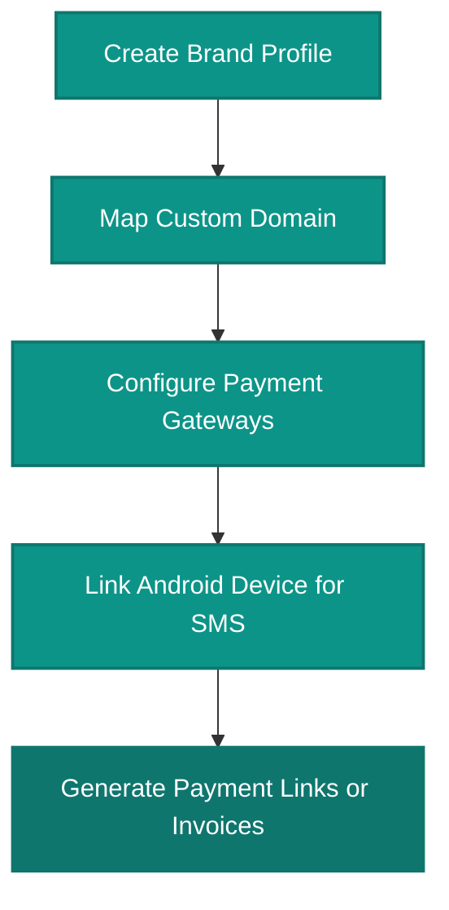

# OwnPay Platform User Guide

Welcome to the **OwnPay Platform User Guide**. This comprehensive documentation is designed to guide system administrators, brand managers, and billing staff through managing and using the OwnPay payment gateway platform.

---

## What is OwnPay?

**OwnPay** is a self-hosted, enterprise-grade payment gateway orchestration platform. It allows a single platform owner to manage multiple white-labeled merchant stores (brands) under one installation, complete with double-entry ledger bookkeeping, developer API hubs, local Android-based SMS verification, and support for both automated and manual payment methods.

### Key Architectural Concepts
1. **Sovereign Single-Owner Model:** One master administrator controls the system. There is no self-registration; brands and staff are invited and created by the administrator.
2. **Multi-Brand Scoping:** Multiple brands (`op_merchants`) can be run simultaneously, completely isolated from each other.
3. **White-Labeling:** Brands can configure custom customer-facing domains, logo assets, CSS styles, and email templates, fully masking the master application domain.
4. **Double-Entry Ledger Bookkeeping:** All payments, fees, and transfers are recorded using double-entry bookkeeping records to guarantee financial integrity and auditing.
5. **Mobile & SMS Gateway:** Connect local Android phones to dynamically parse mobile-banking SMS alerts (e.g. bkash, Nagad) to automate local manual checkouts.

---

## Table of Contents

### 1. [Authentication](./auth/login.md)
* [Login Control & Access](./auth/login.md) — Secure sign-in to the admin terminal.
* [Password Recovery](./auth/forgot-password.md) — Steps for resetting credentials.
* [Two-Factor Authentication (2FA)](./auth/two-factor.md) — Verification gate setups.

### 2. [Dashboard](./dashboard/dashboard.md)
* [Main Dashboard](./dashboard/dashboard.md) — Real-time metrics charts, transaction tracking, and quick links.

### 3. [Payments & Finance](./payments/transactions.md)
* [Transactions](./payments/transactions.md) — Listing, searching, and auditing payment statuses.
* [Invoices](./payments/invoices.md) — Generating billing requests and line-item summaries.
* [Payment Links](./payments/payment-links.md) — Setting up dynamic and fixed payment pages.
* [Ledger Bookkeeping](./payments/ledger.md) — Auditing double-entry accounts and balancing.

### 4. [Gateways & Localization](./gateways/gateways.md)
* [Payment Gateways](./gateways/gateways.md) — Configuring Stripe, PayPal, and manual payment paths.
* [Currencies & Rates](./gateways/currencies.md) — Customizing local coins and exchange metrics.

### 5. [People & Permissions](./people/brands.md)
* [Brands & Stores](./people/brands.md) — Mapping merchant companies and isolating tenant settings.
* [Customers](./people/customers.md) — Auditing billing clients and customer details.
* [Staff Directory](./people/staff.md) — Inviting team members to specific brands.
* [Roles & Permissions](./people/roles.md) — Enforcing Role-Based Access Control (RBAC).

### 6. [Mobile & SMS Automation](./mobile-sms/devices.md)
* [Paired Devices](./mobile-sms/devices.md) — Syncing Android devices to the gateway using JWT tokens.
* [SMS Templates](./mobile-sms/sms-templates.md) — Mapping regex patterns to parse incoming bank alerts.
* [SMS Match Logs](./mobile-sms/sms-logs.md) — Reviewing automatic parsed ledger matches.

### 7. [Reports & Audits](./reports-finance/reports.md)
* [Financial Reports](./reports-finance/reports.md) — Visual charts, settlement reports, and volumes.
* [System Audit Log](./reports-finance/audit-log.md) — Immutable activity tracing for compliance.
* [Balance Verification](./reports-finance/balance-verification.md) — Verifying cash balances against database ledger values.

### 8. [Developer Hub](./developers/developer-hub.md)
* [Developer Hub](./developers/developer-hub.md) — Managing API keys, webhook endpoints, and rate limit rules.

### 9. [Branding & Themes](./appearance/branding-settings.md)
* [Branding Settings](./appearance/branding-settings.md) — Customizing merchant logos and CSS parameters.
* [Landing Page Manager](./appearance/landing-page.md) — Designing public homepage elements.
* [Themes Manager](./appearance/themes.md) — Selecting and managing active visual styles.

### 10. [System Management](./system/settings.md)
* [General Settings](./system/settings.md) — Localization and fallback base URL definitions.
* [Plugins Manager](./system/plugins.md) — Activating modular gateway and addon extensions.
* [Addons](./system/addons.md) — Toggling helper utilities.
* [Custom Domains](./system/domains.md) — Routing custom hostnames for white-label checkouts.
* [System Update](./system/system-update.md) — Checking for core updates and applying database migrations.

### 11. [Account Settings](./account/my-account.md)
* [My Account](./account/my-account.md) — Managing profile data and toggling personal 2FA tokens.

### 12. [Customer Checkout Experience](./public/checkout.md)
* [Public Checkout](./public/checkout.md) — The customer payment experience, manual gateway forms, and transaction status screens.

---

## Quick Start Guide for New Brands

Setting up a new store or brand on OwnPay consists of five core steps:

### 1. Create Your Brand Context
1. Log in to the administrator portal.
2. Navigate to **PEOPLE → Brands** and click **+ Create Brand**.
3. Input the brand details, select the status as `Active`, and save.
4. Go to **APPEARANCE → Branding** to upload the brand's logo, favicon, and primary color hex code.

### 2. Configure a Custom Domain (Optional but Recommended)
1. Go to **SYSTEM → Domains** and click **+ Add Domain**.
2. Input your checkout subdomain (e.g. `pay.mybusiness.com`).
3. Add the TXT ownership record and A routing record to your registrar's DNS zone files.
4. Once propagated, click **Verify DNS** to activate the domain.

### 3. Connect Payment Gateways
1. Navigate to **PAYMENTS → Gateways**.
2. Locate the payment gateways you want to offer (e.g., Stripe, PayPal, or manual channels).
3. Click **Configure**, input your credentials or instruction keys, and toggle the gateway to **Active**.

### 4. Link an Android Device for SMS Automation (For local mobile banking)
1. Install the OwnPay Android APK on your dedicated gateway device.
2. Go to **MOBILE & SMS → Devices** in the admin panel and click **+ Pair Device**.
3. Generate a pairing token, enter it in the app on your mobile device, and sync the status.
4. Configure templates under **SMS Center** to map regex strings matching your bank or wallet's notification alerts.

### 5. Launch Payments
1. Navigate to **PAYMENTS → Payment Links** and click **+ Create Payment Link**.
2. Configure a title, currency, amount, and save.
3. Share the generated public link (`https://pay.mybrand.com/pay/{slug}`) with customers to begin collecting payments immediately.
