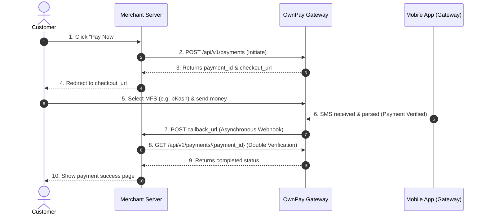

# OwnPay Merchant API Integration Guide

This guide describes how to integrate your e-commerce platform or application with the OwnPay payment gateway.

---

## 1. Authentication
All API requests to OwnPay must contain your brand's Bearer API Key in the `Authorization` header:
```http
Authorization: Bearer your_api_key_here
```

---

## 2. Standard Payment Flow



---

## 3. Step-by-Step API Sequence

### Step 1: Initiate Payment
When a customer clicks checkout, your server POSTs to the initiate endpoint to declare the intent.

- **Request:** `POST /api/v1/payments`
- **Key Payload:**
  ```json
  {
    "amount": "500.00",
    "currency": "BDT",
    "reference": "ORDER-10048",
    "callback_url": "https://my-store.com/webhooks/ownpay",
    "redirect_url": "https://my-store.com/checkout/success",
    "cancel_url": "https://my-store.com/checkout/cancel",
    "customer_name": "John Doe",
    "customer_mail": "john@example.com",
    "customer_phone": "+8801700000000"
  }
  ```
- **Response:**
  ```json
  {
    "success": true,
    "data": {
      "payment_id": "a810b445-564a-4e20-80a5-f1261d7b328a",
      "token": "tok_4821a8f902bd3f46",
      "checkout_url": "https://ownpay.org/checkout/tok_4821a8f902bd3f46",
      "status": "created"
    }
  }
  ```

### Step 2: Redirect Customer
Redirect the customer's browser to the `checkout_url` returned in Step 1. The customer will pay via their selected mobile banking method.

### Step 3: Handle Webhook Notification (Async)
Once payment is parsed and matched via the mobile companion app, OwnPay will asynchronously post a status update payload to your specified `callback_url`.

- **Event Payload:**
  ```json
  {
    "event": "payment.completed",
    "data": {
      "payment_id": "a810b445-564a-4e20-80a5-f1261d7b328a",
      "trx_id": "OP-481029304",
      "amount": "500.00",
      "currency": "BDT",
      "status": "completed"
    }
  }
  ```

### Step 4: Verify Payment Status (Sync Guard)
Before updating your database or shipping the goods, perform a synchronous validation check directly from your backend to safeguard against missed webhooks or fake alerts.

- **Request:** `GET /api/v1/payments/{payment_id}`
- **Response:** Verify that `status` is `"completed"`.
  ```json
  {
    "success": true,
    "data": {
      "trx_id": "OP-481029304",
      "amount": "500.00",
      "currency": "BDT",
      "status": "completed"
    }
  }
  ```

---

## 4. Webhook / IPN Verification

To prevent attackers from sending spoofed payment completion notifications to your server, you **MUST** verify the cryptographic signature sent with each webhook payload.

### Webhook Headers
OwnPay includes the following HTTP headers in every webhook POST request:
- `X-OwnPay-Signature`: Hex-encoded HMAC-SHA256 signature of the raw request payload.
- `X-OwnPay-Timestamp`: UNIX timestamp representing when the webhook was signed.

### Signature Verification Algorithm
1. Retrieve the **raw JSON body** of the request (do not use parsed arrays or objects, as whitespace differences will cause verification to fail).
2. Retrieve the `X-OwnPay-Signature` and `X-OwnPay-Timestamp` headers.
3. Compute the signature using HMAC-SHA256 with your shared **Webhook Secret** (configured in your merchant panel) and the raw JSON request body:
   `computed_signature = HMAC_SHA256(raw_json_body, webhook_secret)`
4. Use a timing-safe string comparison function (like PHP's `hash_equals` or Node's `crypto.timingSafeEqual`) to compare `X-OwnPay-Signature` with `computed_signature`.
5. (Recommended) Verify that `X-OwnPay-Timestamp` is within 5 minutes of your server's current time to prevent replay attacks.

### Verification Example (PHP)
```php
// Retrieve headers
$signature = $_SERVER['HTTP_X_OWNPAY_SIGNATURE'] ?? '';
$timestamp = $_SERVER['HTTP_X_OWNPAY_TIMESTAMP'] ?? '';

// Check replay attack timeframe (5 minutes)
if (abs(time() - (int)$timestamp) > 300) {
    http_response_code(400);
    exit('Webhook timestamp expired.');
}

// Retrieve raw input body
$payload = file_get_contents('php://input');
$webhookSecret = 'your_configured_webhook_secret';

// Compute signature
$computed = hash_hmac('sha256', $payload, $webhookSecret);

// Timing-safe comparison
if (!hash_equals($signature, $computed)) {
    http_response_code(401);
    exit('Invalid signature.');
}

// Signature is valid, process the event
$data = json_decode($payload, true);
if ($data['event'] === 'payment.completed') {
    $paymentId = $data['transaction_id']; // Internal payment reference
    $amount = $data['amount'];
    // Mark order as paid in your system...
}

http_response_code(200);
echo 'OK';
```

---

## 5. Refund Flow (Optional)
To refund a completed transaction, use the refund endpoint.

- **Request:** `POST /api/v1/refunds`
- **Key Payload:**
  ```json
  {
    "trx_id": "OP-481029304",
    "amount": "150.00",
    "reason": "Customer returned items"
  }
  ```
- **Response Status:** `201` Created. `status` returns `"completed"`.