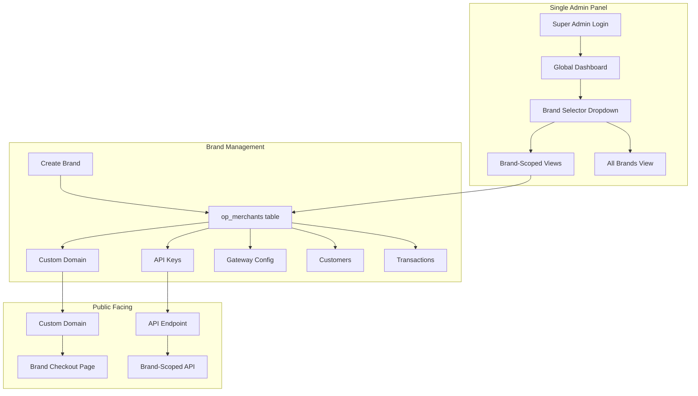

# Business Model Migration: Multi-Tenant SaaS → Single-Owner Multi-Brand

## Background

OwnPay currently implements a **multi-tenant SaaS** model where `op_merchants` are independent organizations, each with their own users (`op_merchant_users`), separate data isolation via `TenantScope`, and scoped `merchant_id` on 25+ tables. The owner wants to convert to a **single-owner, multi-brand/store** model: one super admin controls the entire system and manages multiple Brands (stores), each with their own gateways, domains, customers, and transactions.

## Current Architecture Summary

### Database (72 `merchant_id` references across schema)

| Table | Has `merchant_id` | Purpose |
|-------|:-:|---------|
| `op_merchants` | — | **Tenant** entity (becomes Brand) |
| `op_merchant_users` | ✓ | Users belonging to a tenant |
| `op_roles` | ✓ | Per-tenant role definitions |
| `op_api_keys` | ✓ | Per-tenant API keys |
| `op_domains` | ✓ | Custom domains per tenant |
| `op_gateway_configs` | ✓ | Gateway credentials per tenant |
| `op_manual_gateways` | ✓ | Manual gateway configs per tenant |
| `op_customers` | ✓ | Customer records per tenant |
| `op_payment_intents` | ✓ | Payment intents per tenant |
| `op_transactions` | ✓ | Transactions per tenant |
| `op_idempotency_keys` | ✓ | Idempotency per tenant |
| `op_refunds` | ✓ | Refunds per tenant |
| `op_payment_links` | ✓ | Payment links per tenant |
| `op_invoices` | ✓ | Invoices per tenant |
| `op_webhooks` | ✓ | Webhook endpoints per tenant |
| `op_ledger_accounts` | ✓ | Ledger accounts per tenant |
| `op_ledger_transactions` | ✓ | Ledger txns per tenant |
| `op_settlements` | ✓ | Settlements per tenant |
| `op_disputes` | ✓ | Disputes per tenant |
| `op_fee_rules` | ✓ | Fee rules per tenant |
| `op_audit_logs` | ✓ | Audit logs (nullable) |
| `op_device_pairing_tokens` | ✓ | Device pairing per tenant |
| `op_paired_devices` | ✓ | Paired devices per tenant |
| `op_mobile_notifications` | ✓ | Mobile notifications per tenant |
| `op_sms_templates` | ✓ | SMS templates (nullable) |
| `op_sms_parsed` | ✓ | Parsed SMS per tenant |
| `op_comm_log` | ✓ | Communication log (nullable) |

### PHP Code (~180+ `merchant_id` references)

| Layer | Files | Impact |
|-------|-------|--------|
| **Repository (TenantScope trait)** | `TenantScope.php` + 20+ repos | Central scoping mechanism |
| **Controllers** | 22 Admin controllers | `$req->getAttribute('merchant_id')` everywhere |
| **Middleware** | `DomainMiddleware`, `BearerAuthMiddleware`, `PermissionMiddleware` | Inject/check `merchant_id` |
| **Services** | Auth, Payment, Ledger, Notification, Webhook | Pass `$merchantId` to all operations |
| **Security** | `Authenticator.php` | Stores `auth_merchant_id` in session |

---

## Target Architecture

### Conceptual Shift

| Current (SaaS) | Target (Single-Owner Multi-Brand) |
|----------------|-----------------------------------|
| `op_merchants` = Independent Organizations | `op_merchants` = **Brands/Stores** (rename in UI only) |
| `op_merchant_users` = Tenant Staff | `op_merchant_users` = **System Users** (all controlled by admin) |
| Self-registration by merchants | **No self-registration**. Admin creates brands. |
| Merchant sees only own data | **Admin sees ALL brands**. Brand-scoped views optional. |
| `MerchantController` = Manage tenants | `BrandController` = Manage brands |

### Key Decision: Keep `merchant_id` Column

> [!IMPORTANT]
> **We do NOT rename `merchant_id` to `brand_id` in the database.** The column stays as `merchant_id` everywhere. Only the UI label and controller class names change. This avoids a catastrophic migration touching 25+ tables and 180+ PHP references.

### Architecture Diagram



---

## Proposed Changes — Implementation Status

> [!NOTE]
> ✅ = Complete, ⚠️ = Partial, ❌ = Not started

### Phase 1: Auth & User Model Simplification ✅

#### [MODIFY] `src/Security/Authenticator.php`
- After successful login, check if user `is_superadmin` (new column or role-based).
- Store `$_SESSION['is_superadmin'] = true` for superadmin users.
- Superadmin can access all brands; `auth_merchant_id` becomes the **active brand** context, not a hard restriction.

#### [MODIFY] `src/Service/Auth/AuthSessionService.php` ✅
- ~~Add `switchBrand`, `getActiveBrandId`, `getAllBrands`~~ → **Removed.** These methods duplicated `BrandContext` (SRP violation). `BrandContext` is the single source of truth for brand context.
- Auth service now only handles: `login()`, `logout()`, `currentUser()`, `currentPermissions()`, `isAuthenticated()`, `isSuperadmin()`.

#### [MODIFY] `src/Middleware/PermissionMiddleware.php`
- Superadmin bypass already exists (`$user['is_superadmin']`).
- No change needed structurally. Ensure `is_superadmin` is populated correctly.

---

### Phase 2: Brand Context System ✅

#### [NEW] `src/Service/Brand/BrandContext.php`
Central service that answers: "Which brand is the user currently operating in?"

```
- getActiveBrandId(): ?int
- setActiveBrandId(int $id): void
- isGlobalView(): bool
- getAllBrands(): array
- resolveFromRequest(Request $req): int (falls back to session, then default brand)
```

Resolves brand from:
1. Request attribute (`merchant_id` from DomainMiddleware)
2. Session (`$_SESSION['active_brand_id']`)
3. Default Brand (first/primary brand in DB)

#### [MODIFY] `src/Repository/TenantScope.php`
- Add `forAllTenants()` method that returns unscoped clone (for superadmin global view).
- Existing `forTenant()` stays unchanged.

---

### Phase 3: Controller Refactoring ✅

#### [RENAME] `src/Controller/Admin/MerchantController.php` → `src/Controller/Admin/BrandController.php`
- Rename class to `BrandController`.
- Fix SQL queries (currently references `op_custom_domains` which doesn't exist → use `op_domains`).
- Fix column references (`business_name` → `name`).
- Remove any "merchant registration" flow.
- Add brand create/edit/delete for superadmin only.

#### [MODIFY] `src/Controller/Admin/DashboardController.php`
- If superadmin + no active brand → show **global stats** (SUM across all brands).
- If active brand set → show brand-scoped stats (current behavior).
- Add brand switcher dropdown data to template context.

#### [MODIFY] All Admin Controllers (22 files)
- Replace `$req->getAttribute('merchant_id')` with `$this->brandContext->getActiveBrandId()`.
- This is a mechanical find-and-replace. The `BrandContext` service handles resolution.

---

### Phase 4: UI/Template Changes ✅

#### [MODIFY] `templates/admin/layout/base.twig`
- Add **Brand Selector** dropdown in header/sidebar.
- Show "All Brands" option for superadmin.
- Show current brand name + logo.

#### [MODIFY] `templates/admin/layout/sidebar.twig`
- Replace "Merchants" menu item → "Brands".
- Remove "Staff" menu if not needed (or keep as "Team" under the brand).

#### [RENAME] `templates/admin/merchants/` → `templates/admin/brands/`
- Rename template directory.
- Update all references in `BrandController`.
- Change all UI text from "Merchant" to "Brand/Store".

---

### Phase 5: Route & Config Updates ✅

#### [MODIFY] `config/routes/web.php`
- `/admin/merchants` → `/admin/brands`
- `/admin/merchants/create` → `/admin/brands/create`
- `/admin/merchants/{id}` → `/admin/brands/{id}`
- Controller reference: `Admin\\MerchantController` → `Admin\\BrandController`

#### [MODIFY] `src/Core/RouteConfig.php`
- Update route prefix mapping if any references exist.

#### [MODIFY] `src/Middleware/PermissionMiddleware.php`
- Update permission map: `'/admin/merchants'` → `'/admin/brands'`
- Update permission slugs: `'merchants.view'` → `'brands.view'`

---

### Phase 6: Database Seed Changes ✅

#### [MODIFY] Installer (`src/Controller/Install/InstallerController.php`)
- During installation, create:
  1. One default Brand in `op_merchants` (name from installer form).
  2. One "Owner" role in `op_roles` with all permissions, `is_system = 1`.
  3. One superadmin user in `op_merchant_users` linked to default Brand + Owner role.
- Remove any "merchant self-signup" seed logic.

#### [MODIFY] `database/schema.sql`
- Add `is_superadmin TINYINT(1) NOT NULL DEFAULT 0` column to `op_merchant_users`.
- No other schema changes needed. `merchant_id` stays as-is.

---

### Phase 7: Landing Page & Public Routes ✅

#### [MODIFY] `src/Controller/Page/LandingController.php`
- Remove any merchant-specific copy.
- Show a generic "OwnPay" landing or redirect to `/login`.

#### [MODIFY] `config/routes/web.php`
- Remove any public merchant signup routes (if they exist — currently none found).

---

## What Does NOT Change

| Component | Reason |
|-----------|--------|
| `merchant_id` column name in DB | Renaming 25+ tables + 180+ PHP refs is high-risk, zero-value |
| `op_merchants` table name | Same reason. Only UI label changes. |
| `TenantScope` trait name | Still scopes by "tenant" (brand). Concept valid. |
| `op_domains` structure | Custom domains already linked via `merchant_id` (= brand) |
| `op_api_keys` structure | API keys already per-brand |
| `op_gateway_configs` | Gateway credentials already per-brand |
| All payment/transaction tables | Already scoped correctly |
| Plugin system | No tenant awareness needed |
| Webhook/IPN system | Already scoped |
| SMS/Device pairing | Already scoped |

---

## Risk Assessment

| Risk | Severity | Mitigation |
|------|----------|------------|
| Controllers still reference `getAttribute('merchant_id')` | **Medium** | `BrandContext` service wraps resolution. Mechanical replace. |
| `StaffController` queries `op_users` (wrong table) | **High** | Already broken. Fix to query `op_merchant_users`. |
| `MerchantController` references `op_custom_domains` (doesn't exist) | **High** | Already broken. Fix to use `op_domains`. |
| Template references to "Merchant" in 14+ templates | **Low** | Search-and-replace "Merchant" → "Brand". |
| Session `auth_merchant_id` semantics change | **Medium** | Means "active brand" now, not "only brand you can see". |

---

## Finalized Decisions

> [!NOTE]
> **Q1: Staff Model → (B) Superadmin + Staff with Roles**
> Superadmin invites team members. Each staff member gets role-based permissions via `op_roles` + `op_role_permissions`. Staff can be scoped to specific brands or have cross-brand access.

> [!NOTE]
> **Q2: Resource Sharing → (A+B) Admin Decides**
> By default, each brand has own gateways, customers, invoices. But superadmin can choose to share specific resources (e.g., a gateway config) across brands. This requires a `shared` flag or a brand-assignment system for shareable entities like gateways.

> [!NOTE]
> **Q3: Global Dashboard → (C) Both with Toggle**
> "All Brands" view shows aggregated global totals AND per-brand breakdown. A toggle switches between summary and detailed views.

---

## Verification Plan

### Automated Tests
1. Run `php -l` lint on all modified files.
2. Test login flow via browser: admin@example.com / admin12345.
3. Verify brand creation, brand switching, and brand-scoped data.
4. Verify API keys generate per-brand and authenticate correctly.
5. Verify custom domain resolution still maps to correct brand.

### Manual Verification
1. Create 2+ brands via admin panel.
2. Add different gateways to each brand.
3. Verify checkout pages show correct brand's gateways.
4. Switch between brands in dashboard and confirm data isolation.
5. Verify "All Brands" global view shows aggregated stats.

---

## Current State (2026-06) — All-Brands Platform Scope & Refinements

The migration above shipped. Since then the model was hardened so that "All Brands" is a concrete,
owned scope rather than just an unfiltered view. The authoritative reference is
[ARCHITECTURE.md](../../../ARCHITECTURE.md) §4.11; summary:

- **Platform-owner row.** A reserved `op_merchants` row with `is_platform = 1` (slug `__platform__`,
  migration `013_add_platform_owner.sql`) owns All-Brands-level data/config. It is excluded from the
  brand switcher and is never selectable. Resolve via `BrandContext::getPlatformId()` (id varies per DB
  — never hard-code).
- **Write routing.** `BrandContext::getWriteMerchantId()` returns the platform id in the All-Brands view,
  else the active brand id. All-Brands-created operational data (e.g. admin API keys) is owned by the
  platform row and is therefore visible only to All Brands; brand-created data is visible to that brand
  and to All Brands.
- **Config cascade.** `SettingsRepository::getScoped()` resolves brand override → All-Brands default →
  code default. The All-Brands settings are the fallback every brand inherits until it overrides.
- **Staff cross-brand access** is gated by the `brands.access_all` permission (migration
  `014_add_access_all_brands_permission.sql`) in addition to `is_superadmin`.
- **Manual gateways** use a platform-template + per-brand-account model (ARCHITECTURE.md §4.10): All
  Brands defines the type/default; each brand sets its own receiving account; checkout routes to the
  brand's account with the platform template as fallback.
- **Per-brand notifications.** Transactional admin emails (payment / refund) send through
  `EmailNotificationService` with a per-brand sender + on/off prefs (settings group `general`); see
  ARCHITECTURE.md §4.9.
- **Resolves Q2 (resource sharing):** shared/global resources are modelled as platform-owned rows that
  brands inherit (gateway configs and settings via the NULL/`getScoped` global fallback; manual-gateway
  templates via the platform row), rather than a separate `shared` flag.

> [!NOTE]
> `op_settlements` referenced in the original tables list has since been **decommissioned** (settlement
> payouts were removed); see ARCHITECTURE.md §6.4.
