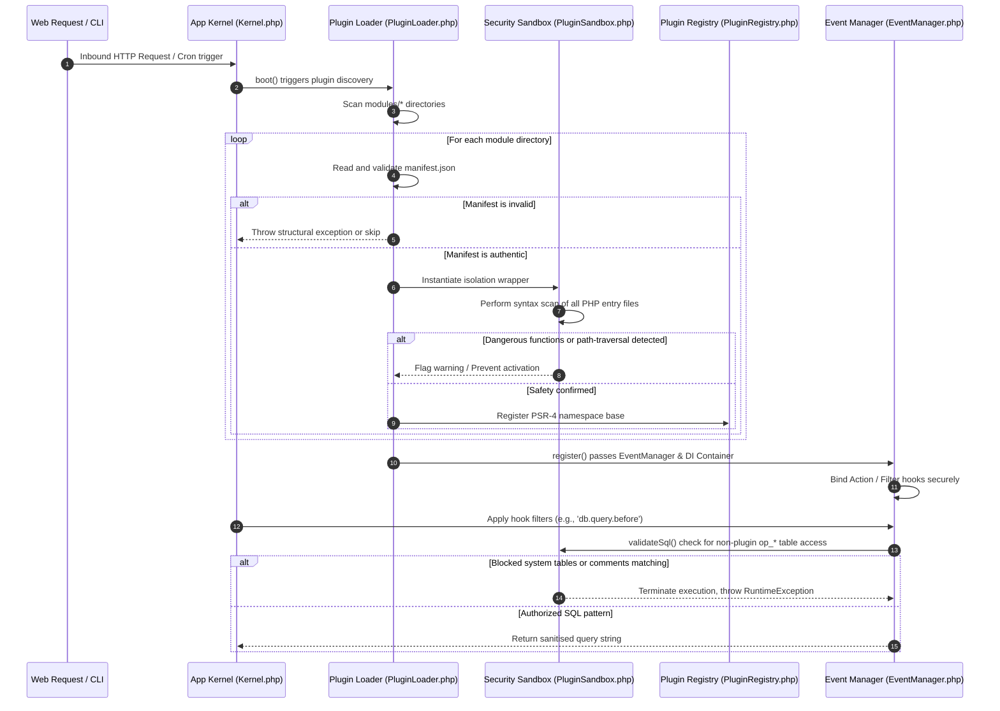

# OwnPay — Premium Plugin Developer & Architect Guide
## The Definitive Manual for Gateway Adapters, Addons, and Custom Visual Themes

---

> **MANDATORY SYSTEM PARADIGM & SYSTEM ARCHITECTURE AUDIT INSTRUCTIONS**
> 
> You are operating within the highly secure, single-owner, multi-brand (multi-tenant context) payment ecosystem of OwnPay.
> All plugins (Gateways, Addons, and Themes) are loaded, sandboxed, and executed in strict conformance with PSR-4 namespaces, PSR-11 containers, double-entry ledger bookkeeping guidelines, white-label domain routing middleware pipelines, and ISO-27001 / PCI-DSS static system hardening regulations.

---

## 1. Introduction: The Sovereign Architecture

OwnPay differs fundamentally from standard multi-tenant SaaS systems. It uses the **Sovereign Single-Owner, Multi-Brand Model**. A single administrative entity owns the host gateway cluster globally, and controls multiple brands/stores (stored inside the `op_merchants` table and resolved dynamically under the `merchant_id` tenant identifier). 

Instead of self-registering independent users, the master administrator invites merchants, assigns staff members, routes white-labeled custom domains, and establishes global payment routes. The plugin subsystem is built on decoupled, event-driven foundations, allowing developers to inject custom gateways, background crons, admin views, and templates safely without modifying the core system.

### Visual Architecture: Sandboxed Boot & Filter Execution Lifecycle

The following diagram illustrates how the core boot engine discovers, sandboxes, and registers a plugin, and pipes database queries through the secure query analyzer:



### Namespace Conventions & Autoloading

Plugins use PSR-4 autoloading. The `namespace` declared in `manifest.json` is mapped **verbatim** to the plugin's root directory by the autoloader `PluginLoader` registers, so a plugin can ship as many classes as it likes across subdirectories:

* **Physical path**: `modules/gateways/bkash-api/`
* **Declared namespace**: `"namespace": "OwnPay\\Modules\\Gateways\\BkashApi"`
* **Entrypoint**: `Plugin.php` → class `OwnPay\Modules\Gateways\BkashApi\Plugin`
* **A shipped class** `OwnPay\Modules\Gateways\BkashApi\Client\Api` → `modules/gateways/bkash-api/Client/Api.php`

If `namespace` is omitted, the loader falls back to the convention `OwnPay\Plugins\{PascalSlug}`. Autoload resolution is realpath-contained to the plugin directory, so a class name can never load a file outside it. `include`/`require` are also permitted, but PSR-4 autoloading is the recommended way to load shipped classes.

---

## 2. The Blueprint Registry: `manifest.json` Matrix

Every module is defined by a `manifest.json` metadata descriptor situated at its root folder. The `PluginManifest` parser inspects this registry to resolve capabilities, lifecycle states, required dependencies, background cron loops, and admin dashboard widgets.

### Comprehensive Properties Schema

| Property Name | Data Type | Required? | Default / Fallback | Security Scope |
| :--- | :--- | :--- | :--- | :--- |
| `name` | `string` | **Yes** | *None (Fails validation)* | Rendered in administrative screens as the display name. |
| `slug` | `string` | **Yes** | *None (Fails validation)* | URL-safe name matching directory name and webhook endpoint. |
| `version` | `string` | **Yes** | `"0.0.0"` | Used for semantic version constraint resolution. |
| `type` | `string` | **Yes** | *None (Fails validation)* | Must strictly match `'gateway'`, `'addon'`, or `'theme'`. |
| `description` | `string` | No | `""` | Informational text describing module functionality. |
| `author` | `string` | No | `""` | Displays developer credit details in control panels. |
| `author_url` | `string` | No | `""` | Destination hyperlink pointing to author site. |
| `license` | `string` | No | `""` | Software licensing identifier (e.g. `'MIT'`, `'Proprietary'`). |
| `entrypoint` | `string` | No | `"Plugin.php"` | Entrypoint class filename. Must be plain file (no paths). |
| `entry` | `string` | No | *Alternative to entrypoint* | Backward compatibility fallback mapping. |
| `namespace` | `string` | **Yes** | *Auto-derived from slug* | Base PHP namespace mapped PSR-4 under `OwnPayPlugin\`. |
| `min_php` | `string` | No | `"8.2"` | Checked using `version_compare` during load sequence. |
| `min_app` | `string` | No | `"0.1.0"` | Minimum OwnPay version constraint. |
| `capabilities` | `string[]` | No | `[]` | Explicit array of capability strings mapping `Capability` enums. |
| `dependencies` | `string[]` | No | `[]` | Slugs of other modules that must be activated beforehand. |
| `hooks` | `object` | No | `{"actions":[], "filters":[]}` | Structural mappings of static hooks and filter callbacks. |
| `admin_menu` | `object` | No | `[]` | Visual menu mappings injected into the admin navigation. |
| `cron` | `object[]` | No | `[]` | Array of scheduled automated background jobs. |
| `migrations` | `string[]` | No | `[]` | Chronological list of SQL / Class migrations to execute. |
| `icon` | `string` | No | `""` | Image file path relative to plugin root (e.g., `'assets/icon.svg'`). |
| `color` | `string` | No | `"#0D9488"` | Aesthetic accent hex code rendering dashboard brand panels. |
| `csp` | `object` | No | `[]` | Content Security Policy whitelist directive arrays (`script_src`, `style_src`, `frame_src`, `connect_src`) to whitelist external domains. |

---

### Detailed Property Descriptions & Best Practices

#### `name`
* **What it is**: The human-readable name of your plugin.
* **What it does**: Represents the extension across the administration portals, selection checkboxes, and invoice layouts.
* **Why it is needed**: Enables quick visual identification.
* **Can be skipped?**: **No.**
* **Best Practices**: Keep it clear and concise (e.g. `"bKash Merchant Checkout"` rather than `"bkash_v2_final_prod_api"`).
* **Common Mistakes**: Using special symbols, HTML tags, or trailing spaces.

#### `slug`
* **What it is**: A unique, lower-case, hyphenated URL-friendly string identifier.
* **What it does**: Determines the directory name, dynamic webhook routing endpoint (`/webhook/{slug}`), and primary key inside system databases.
* **Why it is needed**: Acts as the central tenant key mapping transactions and configs.
* **Can be skipped?**: **No.**
* **Best Practices**: Must match the regex `/^[a-z0-9]([a-z0-9-]*[a-z0-9])?$/` and align exactly with the folder name.
* **Common Mistakes**: Capitalization, underscores, or symbol insertions like `@` or `+`. This will trigger immediate validation errors in `PluginManifest::validate()`.

#### `version`
* **What it is**: The current release version of the extension.
* **What it does**: Informs updates and migration scripts.
* **Why it is needed**: Governs system updates and database schema upgrades.
* **Can be skipped?**: **No.**
* **Best Practices**: Adhere to Semantic Versioning (e.g., `1.0.4` or `2.1.0`).
* **Common Mistakes**: Using single digits (`1`) or suffixes like `"v1.0.0"`.

#### `type`
* **What it is**: Categorization tag defining architectural integration.
* **What it does**: Directs the `PluginLoader` to group the module in `/addons/`, `/gateways/`, or `/themes/`.
* **Why it is needed**: Determines capabilities, routing privileges, and view loading structures.
* **Can be skipped?**: **No.**
* **Best Practices**: Must strictly match one of: `'gateway'`, `'addon'`, or `'theme'`.
* **Common Mistakes**: Spelling mistakes (e.g., `"gateways"` with an 's' or `"Theme"` with a capital 'T').

#### `entrypoint`
* **What it is**: The filename containing your primary entrypoint class.
* **What it does**: Loader boots this file to instantiate the plugin.
* **Why it is needed**: Acts as the entrypoint for all event bindings.
* **Can be skipped?**: Yes, defaults to `"Plugin.php"`.
* **Best Practices**: Keep the class in a file named `Plugin.php` or matching your main gateway name.
* **Common Mistakes**: Passing nested file structures (`"src/Adapters/StripePlugin.php"`). The entrypoint must be a plain filename at your plugin's root directory to prevent directory traversal attacks.

#### `namespace`
* **What it is**: The PSR-4 autoloading root namespace declared for your class files.
* **What it does**: Maps PHP classes in the plugin directory under `OwnPayPlugin\<Namespace>\`.
* **Why it is needed**: Prevents namespace collisions and ensures modern PSR-4 standards.
* **Can be skipped?**: Yes, if omitted, the loader auto-derives the namespace from the StudlyCaps representation of the `slug`.
* **Best Practices**: Expose clean namespaces using double backslashes (e.g., `"namespace": "BkashCheckout"` resolves to `OwnPayPlugin\BkashCheckout`).
* **Common Mistakes**: Putting a leading backslash or mixing path separators (`/`).

#### `min_php` & `min_app`
* **What they are**: Minimum versions of PHP and the OwnPay core required to activate the plugin.
* **What they do**: The loader blocks activation if runtime version bounds are unsatisfied.
* **Why they are needed**: Prevents fatal runtime errors and type mismatches on outdated platforms.
* **Can be skipped?**: Yes. Default PHP is `"8.2"`, default App version is `"0.1.0"`.
* **Best Practices**: Define actual requirements if you use new language features (e.g. PHP 8.3 features).
* **Common Mistakes**: Writing operators inside strings (use `"8.3"` instead of `">= 8.3"` since the core logic already runs `>=` verification automatically).

#### `capabilities`
* **What it is**: An array of architectural capability tags requested by the plugin.
* **What it does**: Grants the sandbox environment permissions to run network curls, query databases, render visual menus, and schedule background automation loops.
* **Why it is needed**: Enforces the principle of least privilege, blocking malware and insecure scripts.
* **Can be skipped?**: Yes, but the plugin will remain in a restricted execution state with no capabilities.
* **Best Practices**: Map values directly matching the `OwnPay\Plugin\Capability` backed enum (e.g. `["gateway", "db_read", "http_outbound", "hooks"]`).
* **Common Mistakes**: Including arbitrary strings not declared inside `Capability.php`.

#### `cron`
* **What it is**: Multi-dimensional array outlining automated cron tasks.
* **What it does**: Instructs the system automation engine to run scheduled executions of designated classes.
* **Why it is needed**: Essential for automated settlement checks, disputes checking, and logging rotation tasks.
* **Can be skipped?**: Yes.
* **Best Practices**: Define standard crontab formats for scheduling:
  ```json
  "cron": [
      {
          "name": "bkash_reconciliation",
          "schedule": "*/15 * * * *",
          "class": "OwnPayPlugin\\BkashApi\\ReconciliationJob"
      }
  ]
  ```
* **Common Mistakes**: Passing invalid cron expressions (must be exactly 5-field crontabs) or class paths that do not exist.

#### `migrations`
* **What it is**: Chronological list of database schema migrations.
* **What it does**: Executed during plugin install/upgrade phases.
* **Why it is needed**: Allows plugins to manage their own custom tables (e.g., `op_plugin_bkash_logs`).
* **Can be skipped?**: Yes.
* **Best Practices**: Keep migration names unique and structured (e.g., `["2026_05_28_create_bkash_ledger_table.sql"]`).
* **Common Mistakes**: Running raw `CREATE TABLE` scripts inside `register()`. Always place table creations inside dedicated migration files to support rollback and deinstallation routines.

#### `icon`
* **What it is**: Branding logo graphic relative path.
* **What it does**: Injected into administrative checkouts and payment processing selection menus.
* **Why it is needed**: Provides a cohesive white-label presentation.
* **Can be skipped?**: Yes, defaults to a generic visual placeholder.
* **Best Practices**: Provide clean SVG vectors or high-resolution PNGs located in an `assets/` subfolder (e.g., `"assets/icon.svg"`).
* **Common Mistakes**: Referencing external web links or using absolute OS paths.

#### `csp`
* **What it is**: Content Security Policy directives array.
* **What it does**: Merged dynamically by the core `SecurityHeadersMiddleware` during browser checkout rendering.
* **Why it is needed**: Prevents browser console blocking and security violations during redirects or backchannel API loading.
* **Can be skipped?**: Yes.
* **Best Practices**: Define structured directive arrays containing explicitly whitelisted API domains:
  ```json
  "csp": {
      "script_src": ["https://*.stripe.com"],
      "connect_src": ["https://api.stripe.com"],
      "frame_src": ["https://*.stripe.com"]
  }
  ```
* **Common Mistakes**: Passing full page paths instead of base domains, or using wildcard `"*"` which compromises visual security.

#### `dependencies`
* **What it is**: Array listing dependent plugin slugs.
* **What it does**: Tells the `PluginLoader` which extensions must be active for this plugin to load.
* **Why it is needed**: Prevents fatal runtime errors if your addon requires helper plugins.
* **Can be skipped?**: Yes.
* **Best Practices**: Use lowercase alphanumeric hyphenated slugs.
* **Common Mistakes**: Listing system PHP extensions here (use composer or requirements instead).

#### `hooks`
* **What it is**: Action and Filter hooks mapping config object.
* **What it does**: Automatically registers static listener hooks without needing PHP code inside the `register()` method.
* **Why it is needed**: Provides clean, declarative event mapping.
* **Can be skipped?**: Yes.
* **Best Practices**: Ensure callbacks reference valid fully qualified class methods.
* **Common Mistakes**: Declaring non-static class methods or paths with typos.

#### `admin_menu`
* **What it is**: Custom menu injection layout mapping.
* **What it does**: Safely inserts dynamic dashboard sidebar links for your addon.
* **Why it is needed**: Allows addons to expose their own admin interfaces.
* **Can be skipped?**: Yes.
* **Best Practices**: Define clean layouts with `title`, `icon`, and `route` keys.
* **Common Mistakes**: Mixing route styles or bypassing RBAC authorization.

#### `color`
* **What it is**: Visual accent hex code.
* **What it does**: Styles visual brand cards in the developer dashboard.
* **Why it is needed**: Keeps admin UIs visually cohesive.
* **Can be skipped?**: Yes, defaults to teal (`#0D9488`).
* **Best Practices**: Use high-contrast modern hex values.
* **Common Mistakes**: Leaving out the leading `#` symbol.

#### `license`
* **What it is**: Software licensing type.
* **What it does**: Informs users of redistribution and compilation terms.
* **Why it is needed**: Crucial for legal governance.
* **Can be skipped?**: Yes.
* **Best Practices**: Use standard SPDX identifiers (e.g. `'MIT'`, `'GPL-3.0'`).
* **Common Mistakes**: Writing long paragraphs instead of identifier tags.

#### `description`
* **What it is**: Brief summary of module functionality.
* **What it does**: Rendered as descriptive summary text inside settings cards.
* **Why it is needed**: Essential for merchant orientation.
* **Can be skipped?**: Yes.
* **Best Practices**: Keep it under 150 characters, clear and informative.
* **Common Mistakes**: Pasting generic text templates or leaving it blank.

#### `author` & `author_url`
* **What they are**: Developer name and homepage links.
* **What they do**: Exposes credit details in administrative screens.
* **Why they are needed**: Essential to map support paths.
* **Can be skipped?**: Yes.
* **Best Practices**: Provide authentic, active contact links.
* **Common Mistakes**: Writing invalid URLs or missing the `https://` prefix.

---


## 3. Core Interfaces Reference

OwnPay enforces a strict type system. To ensure perfect compatibility, all extensions implement structured interfaces.

### `OwnPay\Plugin\PluginInterface`

Every extension (Addons, Gateways, and Themes) must implement `PluginInterface` to tie into the core container and request administrative fields.

```php
namespace OwnPay\Plugin;

use OwnPay\Container;
use OwnPay\Event\EventManager;

interface PluginInterface
{
    /**
     * Retrieves static metadata describing the plugin.
     * Must return an array matching the exact structure below.
     *
     * @return array{name: string, slug: string, version: string, description: string, author: string, type: string}
     */
    public static function metadata(): array;

    /**
     * Declares the system capabilities exposed by the plugin.
     * Grantees get explicit execution privileges in the sandbox.
     *
     * @return \OwnPay\Plugin\Capability[]
     */
    public function capabilities(): array;

    /**
     * Registers hooks, filters, and action listeners.
     * Invoked during early system boot on every HTTP request.
     * Do NOT run DB queries or heavy computation inside this method.
     *
     * @param \OwnPay\Event\EventManager $events Central system event manager.
     * @param \OwnPay\Container $container The dependency injection container.
     */
    public function register(EventManager $events, Container $container): void;

    /**
     * Boots the plugin after all active plugins have registered their hooks.
     * Safe for inter-plugin dependency checks, service calls, and DOM injections.
     *
     * @param \OwnPay\Container $container The dependency injection container.
     */
    public function boot(Container $container): void;

    /**
     * Handles graceful teardown operations during plugin deactivation.
     * Clear active routes, caches, and temp hooks here. Do NOT delete user data tables!
     *
     * @param \OwnPay\Container $container The dependency injection container.
     */
    public function deactivate(Container $container): void;

    /**
     * Handles destructive cleanup operations when a plugin is permanently deleted.
     * Must completely purge all tables, settings, and files to leave a zero-trace state.
     *
     * @param \OwnPay\Container $container The dependency injection container.
     */
    public function uninstall(Container $container): void;

    /**
     * Defines configuration fields automatically rendered in the Admin Dashboard.
     * Stored in system tables and passed decrypted during transaction runs.
     *
     * @return array<int, array{name: string, label: string, type: string, required: bool, default?: mixed, options?: array<string, string>}>
     */
    public function fields(): array;
}
```

#### Execution Contexts & Common Pitfalls
* **`register()` vs `boot()`**: A common mistake is placing database lookups inside `register()`. Because `register()` is executed on *every single request* during container assembly, placing expensive DB transactions, CURL queries, or dynamic file reads inside `register()` will degrade system latency. Keep `register()` restricted exclusively to calling `$events->addAction()` and `$events->addFilter()`.
* **`deactivate()` vs `uninstall()`**: Never drop SQL tables inside `deactivate()`. Merchants frequently toggle plugins off temporarily to debug custom domains or perform routing adjustments. Deleting data during deactivation can lead to data loss. Reserve destructive operations strictly for `uninstall()`.

---

### `EventManager` Integration & Methods Reference

The `EventManager` is the central nervous system of OwnPay. Plugins subscribe to system lifecycle hooks, checkout filters, and IPN actions using this central event manager.

#### Complete Method Signature & Rationale

1. **`register(EventManager $events, Container $container): void`**
   - *What it is*: The mandatory entry method defined inside `PluginInterface`.
   - *What it does*: Bootstraps hook registrations during system startup.
   - *Why it is needed*: Acts as the entrypoint hook binder.
   - *Can be skipped?*: No.

2. **`addAction(string $hook, callable $callback, int $priority = 10, string $owner = 'core'): void`**
   - *What it is*: Subscribes a listener to an Action hook (fire-and-forget event).
   - *What it does*: Chains callbacks that trigger sequentially when the event fires.
   - *Why it is needed*: Enables executing post-payment tasks, alerts, or cron tasks.

3. **`doAction(string $hook, mixed ...$args): void`**
   - *What it is*: Dispatches an Action hook, executing all bound callbacks sequentially.
   - *What it does*: Pipes arguments to listeners wrapped in individual try-catch blocks to prevent hook crashes from bringing down the main thread.
   - *Why it is needed*: Standard action dispatch.

4. **`addFilter(string $hook, callable $callback, int $priority = 10, string $owner = 'core'): void`**
   - *What it is*: Subscribes a callback to a Filter hook (pipeline mutation).
   - *What it does*: Passes a value sequentially through registered filters where each callback modifies and returns it.
   - *Why it is needed*: Essential to modify checkout options, calculate fees, or customize layouts.

5. **`applyFilter(string $hook, mixed $value, mixed ...$args): mixed`**
   - *What it is*: Pipes a value through registered filter callbacks.
   - *What it does*: Executes mutations sequentially, returning the final mutated value.
   - *Why it is needed*: Essential for layout and parameter transformations.

6. **`removeAction(string $hook, callable $callback): bool`**
   - *What it is*: Unregisters a specific callback from an action hook.
   - *What it does*: Removes the callback from the list, returning true if successfully removed.
   - *Why it is needed*: Useful to disable hooks dynamically.

7. **`removeFilter(string $hook, callable $callback): bool`**
   - *What it is*: Unregisters a specific callback from a filter hook.
   - *What it does*: Removes the filter callback from the chain.
   - *Why it is needed*: Useful to unbind custom mutations.

8. **`hasAction(string $hook): bool`** & **`hasFilter(string $hook): bool`**
   - *What they are*: Check if any listeners are bound to a specific hook name.
   - *What they do*: Returns true if one or more listeners are actively registered.
   - *Why they are needed*: Allows progressive hook resolution.

9. **`getFireCount(string $hook): int`**
   - *What it is*: Analytics execution tracker.
   - *What it does*: Returns the total number of times a hook has been fired during the current thread execution.
   - *Why it is needed*: Vital for profiling and recursion prevention.

---

#### `EventManager` Code Blueprint: Wrong vs. Right Way

> [!CAUTION]
> **Wrong Way (Insecure & Slow Event Handling)**
> * Why it is wrong: The callback executes heavy API lookups and direct table insertions directly within the `register()` method on *every request*, significantly degrading system response times. Additionally, the filter callback fails to return the mutated value, breaking the payment options chain, and throws an unhandled exception that crashes the host checkout flow.
> 
> ```php
> <?php
> namespace OwnPayPlugin\InsecureAddon;
> 
> use OwnPay\Plugin\PluginInterface;
> use OwnPay\Event\EventManager;
> use OwnPay\Container;
> 
> class Plugin implements PluginInterface
> {
>     // WRONG: Running heavy execution tasks inside register() is forbidden
>     public function register(EventManager $events, Container $container): void
>     {
>         // Slow: DB queries executed on EVERY request
>         $db = db(); 
>         $db->query("INSERT INTO op_plugin_insecure_logs (msg) VALUES ('register called')");
> 
>         // WRONG: Registering filter callbacks that don't return the value
>         $events->addFilter('checkout.gateways', function(array $gateways) {
>             $gateways[] = ['slug' => 'badway', 'name' => 'Bad Way'];
>             // Fails: missing "return $gateways;" which brick-halts checkout options
>         });
> 
>         // WRONG: Throwing unhandled exceptions that crash the pipeline
>         $events->addAction('payment.transaction.completed', function(array $txn) {
>             throw new \Exception("System crash"); // Bricks the payment completion step!
>         });
>     }
>     // ... (metadata, capabilities, boot, deactivate, uninstall, fields fields omitted)
> }
> ```

> [!TIP]
> **Right Way (Production-Ready Event Handling)**
> * Why it is correct: The `register()` method remains lightweight, containing only hook declarations. The actual calculations are deferred to dedicated, self-contained methods. Filters securely return mutated values, and action hooks encapsulate their logic in try-catch bounds (captured automatically by EventManager) to prevent core disruption.
> 
> ```php
> <?php
> declare(strict_types=1);
> 
> namespace OwnPay\Modules\Addons\SecureAddon;
> 
> use OwnPay\Plugin\PluginInterface;
> use OwnPay\Plugin\Capability;
> use OwnPay\Event\EventManager;
> use OwnPay\Container;
> 
> final class Plugin implements PluginInterface
> {
>     private ?Container $container = null;
> 
>     public static function metadata(): array
>     {
>         return [
>             'name'        => 'Secure Addon Guide',
            'slug'        => 'secure-addon',
            'version'     => '1.0.0',
            'description' => 'Secure event handling guide blueprint.',
            'author'      => 'OwnPay Core',
            'type'        => 'addon',
        ];
    }
    
    public function capabilities(): array
    {
        return [Capability::HOOKS];
    }
    
    /**
     * Correct: register() only binds event definitions quickly.
     */
    public function register(EventManager $events, Container $container): void
    {
        $events->addFilter('checkout.gateways', [$this, 'injectGateway'], 10);
        $events->addAction('payment.transaction.completed', [$this, 'logTransactionCompletion'], 10);
    }
    
    public function boot(Container $container): void
    {
        $this->container = $container;
    }
    
    /**
     * Correct: Mutates the value and always returns it.
     */
    public function injectGateway(array $gateways): array
    {
        $gateways[] = [
            'slug'       => 'secure-mfs',
            'name'       => 'Secure MFS Gateway',
            'type'       => 'api',
            'currencies' => ['BDT'],
        ];
        return $gateways; // MANDATORY: Returns the modified array!
    }
    
    /**
     * Correct: Safe action listener.
     */
    public function logTransactionCompletion(array $transaction): void
    {
        // Safe execution logic. Any throwables inside actions are caught
        // automatically by the EventManager to prevent core crashes.
    }
    
    public function deactivate(Container $container): void {}
    public function uninstall(Container $container): void {}
    public function fields(): array { return []; }
}
```

---


### `OwnPay\Gateway\GatewayAdapterInterface`

Every payment gateway adapter plugin must implement `GatewayAdapterInterface` alongside `PluginInterface` to process checkouts, webhooks, and refunds.

```php
namespace OwnPay\Gateway;

interface GatewayAdapterInterface
{
    /**
     * Returns the unique slug identifying the gateway adapter (e.g. 'stripe').
     */
    public function slug(): string;

    /**
     * Initiates a payment process with the payment provider.
     *
     * @param array{amount: string, currency: string, trx_id: string, redirect_url: string, cancel_url: string, metadata?: array<string, mixed>} $params Core transaction parameters.
     * @param array<string, mixed> $credentials Decrypted, merchant-configured gateway settings.
     * @return array{redirect_url?: string, form_html?: string, session_id?: string} payment response containing checkout target.
     */
    public function initiate(array $params, array $credentials): array;

    /**
     * Verifies the authenticity and status of a payment callback or return redirect.
     *
     * @param array<string, mixed> $callbackData Payload received from the payment provider.
     * @param array<string, mixed> $credentials Decrypted gateway credentials.
     * @return array{success: bool, gateway_trx_id?: string, amount?: string, status?: string}
     */
    public function verify(array $callbackData, array $credentials): array;

    /**
     * Validates the integrity of an incoming webhook payload using signatures.
     * Must protect against spoofing, replay attacks, and transaction forgery.
     *
     * @param string $rawBody The raw HTTP request payload.
     * @param array<string, string> $headers Inbound HTTP request headers.
     * @param array<string, mixed> $credentials Decrypted gateway credentials.
     * @return bool True if authentic; false otherwise.
     */
    public function verifyWebhook(string $rawBody, array $headers, array $credentials): bool;

    /**
     * Processes a refund request against the transaction at the payment gateway.
     *
     * @param string $gatewayTrxId The processor's transaction identifier.
     * @param string $amount The numeric amount to refund.
     * @param array<string, mixed> $credentials Decrypted gateway credentials.
     * @return array{success: bool, refund_id?: string, error?: string}
     */
    public function refund(string $gatewayTrxId, string $amount, array $credentials): array;

    /**
     * Checks whether the gateway adapter supports a specific capability or feature.
     *
     * @param string $feature Name of the capability (e.g., 'refund', 'subscription').
     */
    public function supports(string $feature): bool;

    /**
     * Returns a list of currency codes supported natively by the gateway.
     * An empty array indicates that the gateway is currency-agnostic or relies on dynamic rates.
     *
     * @return string[] Array of supported ISO 4217 currency codes (e.g. ['BDT', 'USD']).
     */
    public function supportedCurrencies(): array;
}
```

---

### `OwnPay\Gateway\GatewayDefaults` Trait

To avoid boilerplate code, gateway adapters can import the `GatewayDefaults` trait. This provides:
1. **Fallback implementations**: Default methods for features your gateway does not support (e.g., `refund()`, `verify()`), allowing you to progressively override only the specific capabilities your payment provider offers.
2. **Strict Type Casting Helpers**: Utility functions to safely cast mixed values, crucial for running green under PHP `strict_types=1`.

```php
use OwnPay\Gateway\GatewayDefaults;

final class CustomGateway implements PluginInterface, GatewayAdapterInterface
{
    use GatewayDefaults; // Injects standard type casts and fallback methods

    // The trait provides:
    // getString(mixed $value, string $default = ''): string
    // getInt(mixed $value, int $default = 0): int
    // getFloat(mixed $value, float $default = 0.0): float
    // getBool(mixed $value, bool $default = false): bool
    // getArray(mixed $array, string|int ...$keys): array
}
```

---

## 4. Security, Compliance & Static Hardening

> [!IMPORTANT]
> **Trust model (read first).** Plugin upload is restricted to the platform owner (`PluginController::upload` → `requireGlobalView`), so installed plugins run with **full application trust**, exactly like WordPress: through the PSR-11 container a plugin can reach any core service (`Database`, `RefundService`, …). The load-time scan is therefore a **footgun guard, not a sandbox** — it blocks only dynamic code evaluation and direct OS-command execution. Ordinary PHP — reflection, callbacks (`array_map`, `call_user_func`, `preg_replace_callback`), buffering (`ob_start`), file I/O, dynamic calls, and `include`/`require` — is permitted. The "blocking" described in the filesystem and SQL sections below is **convention and defense-in-depth, not hard isolation**; the real boundary is owner-only upload, so only install plugins you trust.

OwnPay performs a lightweight load-time scan (`PluginLoader::loadPlugin` + `PluginSandbox::isDangerousFunction`) flagging the highest-risk primitives, and ships helpers (`PluginSandbox::validateSql()`, `validateFilePath()`, `storagePath()`) plugins may use to stay within brand/tenant boundaries.

### Recommended Filesystem Scope
By convention, keep plugin reads/writes within:
1. Your plugin's installation root (`modules/<type>/<slug>/`).
2. Your dedicated storage partition (`modules/<type>/<slug>/storage/`), auto-created `0755` via `$sandbox->storagePath()`.

> [!WARNING]
> Under the full-trust model these scopes are conventions, not enforced limits — a plugin has the filesystem access of the PHP process. Call `PluginSandbox::validateFilePath($path)` to self-enforce containment, never read core files (`config/`, `.env`), and only install plugins you trust.

#### Plugin File I/O

`file_put_contents`, `fwrite`, `unlink`, `rename`, and the PHP stream routines (`fopen`/`fread`/`fclose`) are all permitted. As a hygiene convention, target your plugin's `/storage` subdirectory (`$sandbox->storagePath()`) and optionally assert containment with `PluginSandbox::validateFilePath()`.

> [!CAUTION]
> **Wrong Way (Insecure or Blocked File Access)**
> * Why it is blocked: (1) Using `file_put_contents` is directly banned by the compiler, leading to compilation rejection. (2) Accessing parent paths or `/tmp` breaches sandbox boundaries and triggers path-traversal alarms.
> 
> ```php
> <?php
> namespace OwnPayPlugin\InsecureFilesystem;
> 
> class Logger
> {
>     public function logData(string $data): void
>     {
>         // WRONG: file_put_contents is blacklisted! Trigger system rejection.
>         file_put_contents(__DIR__ . '/log.txt', $data);
> 
>         // WRONG: Traversal path. Blocked instantly by validateFilePath()!
>         $file = fopen('/tmp/insecure_data.json', 'w');
>         fwrite($file, $data);
>         fclose($file);
>     }
> }
> ```

> [!TIP]
> **Right Way (Sandboxed Stream Processing)**
> * Why it is correct: Resolves the physical path of the sandboxed `/storage` directory dynamically. Leverages allowed stream routines (`fopen`/`fwrite`/`fclose`) safely, ensuring files remain fully isolated.
> 
> ```php
> <?php
> declare(strict_types=1);
> 
> namespace OwnPay\Modules\Addons\SecureFilesystem;
> 
> use OwnPay\Plugin\PluginSandbox;
> 
> final class Logger
> {
>     private string $storageDir;
> 
>     public function __construct(string $pluginDir, array $capabilities)
>     {
>         // Retrieve storage path dynamically from sandbox boundaries
>         $sandbox = new PluginSandbox($pluginDir, $capabilities);
>         $this->storageDir = $sandbox->storagePath(); // Returns absolute path to modules/.../storage/
>     }
> 
>     public function logData(string $filename, string $content): bool
>     {
>         $safePath = $this->storageDir . DIRECTORY_SEPARATOR . basename($filename);
> 
>         // Open secure stream inside sandboxed boundary
>         $handle = @fopen($safePath, 'ab'); // Append mode
>         if ($handle === false) {
>             return false;
>         }
> 
>         fwrite($handle, $content . PHP_EOL);
>         fclose($handle);
>         return true;
>     }
> 
>     public function readData(string $filename): string
>     {
>         $safePath = $this->storageDir . DIRECTORY_SEPARATOR . basename($filename);
>         if (!file_exists($safePath)) {
>             return '';
>         }
> 
>         $handle = @fopen($safePath, 'rb');
>         if ($handle === false) {
>             return '';
>         }
> 
>         $content = (string) fread($handle, (int)filesize($safePath));
>         fclose($handle);
>         return $content;
>     }
> }
> ```

### SQL Parsing & Table Scoping Constraints
To enforce PCI-DSS compliance and prevent data exfiltration, the `PluginSandbox::validateSql()` engine scans all dynamic SQL statements:

1. **Table Prefix Restrictions**: Plugins are strictly **forbidden** from querying tables starting with the system prefix `op_` (e.g. `op_merchants`, `op_transactions`, `op_ledger_accounts`).
2. **Exceptions**: The only allowed table namespace pattern is **`op_plugin_*`** (e.g., custom plugin logs or tables).
3. **Table Structure Operations**: Any query executing structural modifications (`ALTER`, `DROP`, `TRUNCATE`, `CREATE DATABASE`, `GRANT`, `REVOKE`) will be blocked.
4. **Data Exfiltration Controls**: Queries using `LOAD_FILE`, `INTO OUTFILE`, or `INTO DUMPFILE` are restricted.

> [!TIP]
> **How do plugins query data?** Instead of writing direct SQL queries, plugins must leverage the central service repositories (e.g., `TransactionService`, `PaymentService`, `EnvironmentService`) injected via the PSR-11 Container, ensuring actions are authorized, logged, and isolated by the active `merchant_id`.

#### Brand-Scoped Database Access: Query Scopes & Services

Direct access to system core tables is strictly forbidden. The system security parser checks query statements and rejects any code carrying strings that map to system schemas like `op_transactions` or `op_merchants`. 

To process and query system statistics or checkout values, plugins must retrieve core repository services dynamically from the PSR-11 Container, and clone them under the active brand tenant context using `forTenant($merchantId)`.

> [!CAUTION]
> **Wrong Way (Direct SQL Queries / Cross-Tenant SQL Vulnerability)**
> * Why it is wrong: (1) Running raw database connections bypasses container controls and causes instant syntax scanning rejection inside `PluginSandbox::validateSql()`. (2) Accessing records globally without checking `merchant_id` triggers cross-tenant data leaks and compliance violations.
> 
> ```php
> <?php
> namespace OwnPayPlugin\InsecureDatabase;
> 
> class PaymentVerifier
> {
>     public function getTxn(int $id): array
>     {
>         // WRONG: Direct SQL query to op_* tables is completely blocked!
>         $db = db(); 
>         $res = $db->query("SELECT * FROM op_transactions WHERE id = " . $id);
>         return $res->fetch();
>     }
> }
> ```

> [!TIP]
> **Right Way (PSR-11 Scoped Container Retrieval)**
> * Why it is correct: Resolves the official core service class (`TransactionService`) from the central PSR-11 Container. Clones the repository under the active `merchant_id` context via `forTenant()`, ensuring perfect tenant isolation and full ledger integrity.
> 
> ```php
> <?php
> declare(strict_types=1);
> 
> namespace OwnPay\Modules\Gateways\SecureDatabase;
> 
> use OwnPay\Container;
> use OwnPay\Service\Payment\TransactionService;
> 
> final class PaymentVerifier
> {
>     private Container $container;
> 
>     public function __construct(Container $container)
>     {
>         $this->container = $container;
>     }
> 
>     public function verifyTransaction(int $transactionId, int $merchantId): ?array
>     {
>         // Resolve the core TransactionService from PSR-11 Container
>         /** @var \OwnPay\Service\Payment\TransactionService $trxService */
>         $trxService = $this->container->get(TransactionService::class);
> 
>         // MANDATORY: Clone the service to isolate operations to the target brand tenant
>         $scopedTrx = $trxService->forTenant($merchantId);
> 
>         // Secure: Queries are confined exclusively within the active merchant_id bounds
>         return $scopedTrx->findScoped($transactionId);
>     }
> }
> ```

### The Blocked-Primitive Index

Under the full-trust model the load-time scanner blocks only a minimal footgun list — direct OS-command execution and dynamic code evaluation. A plugin file containing any of these is refused activation:

* **OS / process execution**: `exec`, `shell_exec`, `system`, `passthru`, `popen`, `proc_open`, `proc_nice`, `pcntl_exec`, `dl`
* **Dynamic code**: `eval`, `assert`, `create_function`

Everything else is permitted. In particular, the following — blocked in earlier releases — are now allowed: `file_put_contents`, `fwrite`, `unlink`, `rename`, `chmod`; `call_user_func`/`call_user_func_array`, `array_map`, `array_filter`, `usort`, `preg_replace_callback`; `ob_start`, `register_shutdown_function`, `set_error_handler`; the reflection classes (`ReflectionClass`, …); `include`/`require`; variable functions (`$fn()`); and dynamic instantiation (`new $class`). The guard is bypassable by construction (e.g. `call_user_func` with a `'system'` string) and is not relied upon for isolation — the boundary is owner-only upload.

---

## 5. Dynamic Webhooks & White-Label Custom Domains

To prevent routes pollution, OwnPay implements an event-driven **Dynamic Webhook Routing** architecture.

```text
 Inbound IPN Request
 (POST /webhook/phonepe)
          │
          ▼
 DomainMiddleware ─────────────────────────► Resolves active merchant_id & domain constraints
          │
          ▼
 WebhookController ────────────────────────► Captures Raw Body & HTTP Headers
          │
          ▼
 EventManager::doAction() ──────────────────► Fires 'webhook.incoming.phonepe'
          │
          ▼
 PhonePeGateway::handleWebhook() ──────────► Executes verifyWebhook() & updates transaction
```

### The `WebhookPayload` Value Object
The dynamic webhook callback passes a `WebhookPayload` value object containing:

```php
namespace OwnPay\Model;

final class WebhookPayload
{
    public readonly string $gateway;     // Slug identifier of target gateway (e.g. 'phonepe')
    public readonly int $merchantId;     // Resolved merchant owner ID
    public readonly string $rawBody;     // Immutable raw HTTP body payload
    public readonly string $ip;          // Remote sender IP address (for whitelist validations)

    public function json(): array;       // Helper: decodes JSON request payload to array
    public function formData(): array;   // Helper: decodes URL-encoded parameters to array
    public function header(string $name): ?string; // Case-insensitive HTTP header retriever
}
```

### `DomainUrlService` Resolution Priorities
When constructing callback URLs, return redirection parameters, or invoice links, developers must **never** reference `$_ENV['APP_URL']` directly. Hardcoding domains compromises white-label isolation.

URLs must be resolved dynamically by invoking `DomainUrlService::buildUrl()`. It determines target pathways following this precise priority order:

1. **`GATEWAY_CALLBACK_URL` Env Override**: The highest priority, useful to define secure tunnels during local staging audits (e.g., `ngrok` routing).
2. **Primary Custom Domain**: The active domain mapped within the `op_domains` table matching the brand.
3. **Master `APP_URL`**: Defined within environment variables, serving as the fallback host.
4. **Active Request Host**: The dynamic Host resolved from the HTTP request context.
5. **Fallback Default**: `https://localhost`.

---

### Content Security Policy (CSP): Rationale, Browser Blocking & Configuration

Modern buyer web browsers implement strict **Content Security Policy (CSP)** controls to prevent Cross-Site Scripting (XSS) and data exfiltration. In a high-security payment gateway cluster, **defining correct CSP directives inside `manifest.json` is critically important**.

#### Rationale: Will the plugin work without CSP?
* **Backend Perspective**: Yes. If you omit CSP configuration from the manifest, the PHP backend code (e.g. `initiate()`, `verifyWebhook()`) will load and execute perfectly on the server side.
* **Frontend Perspective**: **No, it will break completely.** When the buyer lands on the checkout page, their web browser parses system headers. If the payment gateway loads third-party scripts (e.g. `https://js.stripe.com/v3/`), renders checkout iframe elements (e.g. GCash or Alipay screens), or makes AJAX fetch calls (e.g. to a bKash backend) and those host domains are **not whitelisted** in the CSP, **the browser will immediately block the operations**. The console will generate security violations, blocking script execution, preventing payment forms from loading, and bricking the payment flow.

To prevent checkout blocks, OwnPay's `SecurityHeadersMiddleware` dynamically scans active gateway manifests, reads the nested `"csp"` block, and merges directives (like `script-src`, `connect-src`, etc.) directly into system headers.

> [!CAUTION]
> **Wrong Way (Missing CSP / Browser Blocking)**
> * Why it is wrong: (1) Lacks a `"csp"` block entirely, which results in the buyer's browser blocking Stripe's checkout script. (2) Uses insecure wildcard wildcards `"https://*"` which violates static system security audit rules and exposes visual vulnerabilities.
> 
> ```json
> {
>     "name": "Stripe Gateway",
>     "slug": "stripe",
>     "version": "1.0.0",
>     "type": "gateway",
>     "entrypoint": "StripeGateway.php",
>     "namespace": "OwnPay\\Modules\\Gateways\\Stripe",
>     "capabilities": ["gateway"],
>     
>     // WRONG: Missing "csp" directives completely!
>     // When Stripe's checkout.js attempts to load or make fetch calls to api.stripe.com,
>     // the browser blocks it immediately, rendering checkout useless.
> 
>     // WRONG: Alternatively using wildcards is flagged and rejected by auditer:
>     "csp": {
>         "script_src": ["https://*"] 
>     }
> }
> ```

> [!TIP]
> **Right Way (Production-Grade CSP Definition)**
> * Why it is correct: Declares a structured `"csp"` block whitelisting only the specific, secure API and asset domains required by the payment provider, enabling browser execution under high-security guidelines.
> 
> ```json
> {
>     "name": "Stripe Secure Gateway",
>     "slug": "stripe",
>     "version": "1.0.0",
>     "type": "gateway",
>     "entrypoint": "StripeGateway.php",
>     "namespace": "OwnPay\\Modules\\Gateways\\Stripe",
>     "capabilities": [
>         "gateway",
>         "http_outbound"
>     ],
>     "icon": "icon.svg",
>     "color": "#6366F1",
>     
>     // RIGHT: Exposes complete whitelisted domains grouped by directive
>     "csp": {
>         "script_src": [
>             "https://js.stripe.com",
>             "https://*.stripe.com"
>         ],
>         "style_src": [
>             "https://js.stripe.com"
>         ],
>         "frame_src": [
>             "https://js.stripe.com",
>             "https://*.stripe.com"
>         ],
>         "connect_src": [
>             "https://api.stripe.com",
>             "https://*.stripe.com"
>         ]
>     }
> }
> ```

---

### Double-Entry Ledger Bookkeeping Integrations

Every financial transaction within OwnPay must adhere to strict **double-entry bookkeeping** guidelines, recorded across three primary tables: `op_ledger_accounts` (account mappings), `op_ledger_transactions` (journal entries), and `op_ledger_entries` (individual balanced debits and credits). 

#### 1. Rationale: Core Financial Integrity & Balancing
To ensure auditing compliance:
* **Journal Balance Constraint**: Every committed ledger transaction must balance exactly. The sum of all debits (DR) must equal the sum of all credits (CR). If a transaction does not balance, the core database engine rolls back the entire operations block.
* **Account Directionality (GAAP Compliance)**:
  - **Asset** and **Expense** Accounts: A Debit (DR) increases the balance (+), while a Credit (CR) decreases the balance (-).
  - **Liability**, **Equity**, and **Revenue** Accounts: A Credit (CR) increases the balance (+), while a Debit (DR) decreases the balance (-).
* **Brand/Merchant Isolation**: Accounts must be partitioned cleanly by `merchant_id` to prevent cross-brand financial leakage. Initialize or locate accounts dynamically by invoking `LedgerRepository::findOrCreateAccount($name, $type, $currency, $merchantId)`.
* **Concurrency & Race Condition Defenses**: Financial bookings must execute within a secure database transaction block (`db()->beginTransaction()`). Developers must implement **explicit row locks** (`SELECT ... FOR UPDATE` or application-level transaction locks) to prevent double-posting or race condition anomalies during parallel webhooks.

---

#### 2. Side-by-Side Blueprint: Wrong vs. Right Ledger Bookings

> [!CAUTION]
> **Wrong Way (Unbalanced Entries or Lack of Tenant / DB Locks)**
> * Why it is wrong: (1) The entries do not balance, triggering a database compilation error. (2) It queries accounts globally without isolating them by `merchant_id`, exposing cross-brand leakage. (3) Bypasses transaction blocks and row locks, leading to race condition double-postings.
> 
> ```php
> <?php
> namespace OwnPayPlugin\InsecureLedger;
> 
> class Bookkeeper
> {
>     public function bookFee(int $txnId, string $amount): void
>     {
>         $db = db();
>         
>         // WRONG: Accessing accounts globally without brand isolation
>         $receivable = $db->query("SELECT id FROM op_ledger_accounts WHERE type = 'RECEIVABLE'")->fetch();
>         $payable = $db->query("SELECT id FROM op_ledger_accounts WHERE type = 'PAYABLE'")->fetch();
>         
>         // WRONG: Posting entries directly without a transaction block or locks!
>         // WRONG: These entries do NOT balance (DR 10.00 vs CR 5.00), which bricks balancing compliance!
>         $db->query("INSERT INTO op_ledger_entries (account_id, type, amount) VALUES ({$receivable['id']}, 'DR', '10.00')");
>         $db->query("INSERT INTO op_ledger_entries (account_id, type, amount) VALUES ({$payable['id']}, 'CR', '5.00')");
>     }
> }
> ```

> [!TIP]
> **Right Way (Balanced, Tenant-Scoped, Transacted Bookings)**
> * Why it is correct: Wraps all ledger entries in a strict transaction block, applies explicit row locks on the involved accounts, ensures debits and credits balance, and limits all accounts resolution to the active `merchant_id`.
> 
> ```php
> <?php
> declare(strict_types=1);
> 
> namespace OwnPay\Modules\Addons\SecureLedger;
> 
> use OwnPay\Container;
> use OwnPay\Service\Payment\LedgerService;
> use OwnPay\Repository\Payment\LedgerRepository;
> 
> final class Bookkeeper
> {
>     private Container $container;
> 
>     public function __construct(Container $container)
>     {
>         $this->container = $container;
>     }
> 
>     public function bookPaymentSuccess(int $merchantId, string $currency, string $amount): bool
>     {
>         $db = db();
> 
>         // 1. Begin strict database transaction
>         $db->beginTransaction();
> 
>         try {
>             // Resolve ledger repositories via PSR-11 container
>             /** @var \OwnPay\Repository\Payment\LedgerRepository $ledgerRepo */
>             $ledgerRepo = $this->container->get(LedgerRepository::class);
>             
>             // MANDATORY: Clone the repository to isolate operations strictly to the brand tenant
>             $scopedRepo = $ledgerRepo->forTenant($merchantId);
> 
>             // 2. Fetch and apply explicit row locks to prevent race conditions during updates
>             $assetAccount = $scopedRepo->findOrCreateAccountLocked('MERCHANT_RECEIVABLE', 'ASSET', $currency, $merchantId);
>             $liabilityAccount = $scopedRepo->findOrCreateAccountLocked('MERCHANT_PAYABLE', 'LIABILITY', $currency, $merchantId);
> 
>             if (!$assetAccount || !$liabilityAccount) {
>                 throw new \RuntimeException("Failed to resolve brand accounts securely.");
>             }
> 
>             /** @var \OwnPay\Service\Payment\LedgerService $ledgerService */
>             $ledgerService = $this->container->get(LedgerService::class);
>             $scopedService = $ledgerService->forTenant($merchantId);
> 
>             // 3. Post a balanced journal transaction: DR Asset (+), CR Liability (+)
>             $scopedService->postJournalTransaction([
>                 'currency'     => $currency,
>                 'description'  => 'Payment successfully captured via SecurePay Gateway',
>                 'entries'      => [
>                     [
>                         'account_id' => $assetAccount['id'],
>                         'type'       => 'DR', // Debit increases Asset balance
>                         'amount'     => $amount
>                     ],
>                     [
>                         'account_id' => $liabilityAccount['id'],
>                         'type'       => 'CR', // Credit increases Liability balance
>                         'amount'     => $amount // EXACT MATCH: DR = CR (balances perfectly)
>                     ]
>                 ]
>             ]);
> 
>             $db->commit();
>             return true;
>         } catch (\Throwable $e) {
>             $db->rollBack(); // Safe rollback
>             return false;
>         }
>     }
> }
> ```

---


## 6. Scaffolding CLI & Branding Logo Resolution

### Module Generator: `cli/create-module.php`
To speed up development and guarantee compliance with strict typing (`declare(strict_types=1);`), PSR-4 namespaces, and security restrictions, OwnPay ships with an interactive command-line scaffolder.

#### Running the Scaffolder
```bash
php cli/create-module.php
```

#### Scaffolding Features
1. **Interactive Capability Toggles**: Select custom capabilities matching enum targets, which are mapped in the generated `manifest.json`.
2. **Theme Scaffolding Modes**:
   - **Twig Templates**: Scaffold layout frameworks in pure Twig format.
   - **PHP Templates**: Auto-generates Twig-to-PHP bridge wrappers, allowing themes to be built with native PHP files (e.g. `checkout.php`) and customnamespaced PHP renderers.

### Branding Logo Resolution
To maintain white-labeling, plugins must define an icon inside their manifest (e.g., `"icon": "assets/icon.svg"`). 

1. **Resolution Hook**: During admin dashboard loading, the core system invokes `PluginManager::resolveIconPath()`.
2. **Dynamic Cache Copy**: The system parses the manifest, reads the sandboxed asset, and copies it to:
   `/public/assets/img/gateways/{slug}.{ext}`
   This enables the browser to load logos without exposing sandboxed directory structures.

---

## 7. Complete Production Blueprints

The following complete, production-ready, and strictly typed blueprints show how to implement OwnPay plugins.

### Blueprint A: High-Security Automated Payment Gateway

This complete blueprint shows a PhonePe-style payment gateway adapter utilizing strict types, timing-safe HMAC webhooks, and the `GatewayDefaults` helper trait.

#### 1. File: `modules/gateways/securepay/manifest.json`
```json
{
    "name": "SecurePay Automated Gateway",
    "slug": "securepay",
    "version": "1.0.0",
    "description": "High-security backchannel credit card gateway with HMAC timing-safe IPN validations.",
    "author": "OwnPay Core",
    "type": "gateway",
    "entrypoint": "Plugin.php",
    "namespace": "OwnPay\\Modules\\Gateways\\SecurePay",
    "min_php": "8.2",
    "min_app": "0.1.0",
    "capabilities": [
        "gateway",
        "http_outbound",
        "hooks"
    ],
    "icon": "assets/icon.svg",
    "color": "#0F172A"
}
```

#### 2. File: `modules/gateways/securepay/Plugin.php`
```php
<?php
declare(strict_types=1);

namespace OwnPay\Modules\Gateways\SecurePay;

use OwnPay\Plugin\PluginInterface;
use OwnPay\Plugin\Capability;
use OwnPay\Container;
use OwnPay\Event\EventManager;
use OwnPay\Gateway\GatewayAdapterInterface;
use OwnPay\Gateway\GatewayDefaults;
use OwnPay\Model\WebhookPayload;
use OwnPay\Service\Payment\TransactionService;

/**
 * SecurePay Payment Gateway Extension.
 *
 * Fully compliant with PCI-DSS requirements, timing-safe HMAC webhook checking,
 * and secure PSR-11 dependency injection bindings.
 */
final class Plugin implements PluginInterface, GatewayAdapterInterface
{
    use GatewayDefaults;

    private ?Container $container = null;

    /**
     * Static metadata descriptor.
     */
    public static function metadata(): array
    {
        return [
            'name'        => 'SecurePay Automated Gateway',
            'slug'        => 'securepay',
            'version'     => '1.0.0',
            'description' => 'High-security backchannel credit card gateway with HMAC timing-safe IPN validations.',
            'author'      => 'OwnPay Core',
            'type'        => 'gateway',
        ];
    }

    /**
     * Declares capabilities requested by this plugin.
     */
    public function capabilities(): array
    {
        return [
            Capability::GATEWAY,
            Capability::HTTP_OUTBOUND,
            Capability::HOOKS,
        ];
    }

    /**
     * Register action hooks and filter listeners.
     */
    public function register(EventManager $events, Container $container): void
    {
        // Bind the dynamic inbound webhook hook
        $events->addAction('webhook.incoming.securepay', [$this, 'handleWebhook']);
    }

    /**
     * Boot the plugin and capture the container.
     */
    public function boot(Container $container): void
    {
        $this->container = $container;
    }

    /**
     * Graceful deactivation cleanup.
     */
    public function deactivate(Container $container): void
    {
        // No destructive operations here
    }

    /**
     * Destructive uninstallation routine.
     */
    public function uninstall(Container $container): void
    {
        // Purge configuration schemas and custom plugin tables if created
    }

    /**
     * Expose configuration credentials schema for Admin UI.
     */
    public function fields(): array
    {
        return [
            [
                'name'     => 'merchant_id',
                'label'    => 'SecurePay Merchant Identifier',
                'type'     => 'text',
                'required' => true,
            ],
            [
                'name'     => 'api_key',
                'label'    => 'REST Api Credentials Key',
                'type'     => 'password',
                'required' => true,
            ],
            [
                'name'     => 'webhook_secret',
                'label'    => 'HMAC Webhook Signing Secret',
                'type'     => 'password',
                'required' => true,
            ],
            [
                'name'     => 'mode',
                'label'    => 'Sandbox Simulation Mode',
                'type'     => 'select',
                'required' => true,
                'options'  => [
                    'sandbox' => 'Sandbox Simulation UAT',
                    'live'    => 'Production Live Environment',
                ],
            ],
        ];
    }

    /**
     * Adapter: Returns the gateway identifier slug.
     */
    public function slug(): string
    {
        return 'securepay';
    }

    /**
     * Adapter: Returns natively accepted currencies.
     */
    public function supportedCurrencies(): array
    {
        return ['USD', 'EUR', 'GBP'];
    }

    /**
     * Adapter: Initiates API connection to SecurePay.
     */
    public function initiate(array $params, array $credentials): array
    {
        $merchantId = $this->getString($credentials['merchant_id'] ?? null);
        $apiKey = $this->getString($credentials['api_key'] ?? null);
        $mode = $this->getString($credentials['mode'] ?? 'sandbox');

        $endpoint = $mode === 'live' 
            ? 'https://api.securepay.com/v1/checkout' 
            : 'https://sandbox.securepay.com/v1/checkout';

        // Pack parameters in compliance with standards
        $payload = [
            'merchant_id'  => $merchantId,
            'amount'       => $params['amount'],
            'currency'     => $params['currency'],
            'reference'    => $params['trx_id'],
            'redirect_url' => $params['redirect_url'],
            'cancel_url'   => $params['cancel_url'],
        ];

        // Perform safe outbound server curl connection
        $ch = curl_init($endpoint);
        if ($ch === false) {
            return ['form_html' => '<div class="alert alert-danger">Initialization failure.</div>'];
        }

        curl_setopt_array($ch, [
            CURLOPT_RETURNTRANSFER => true,
            CURLOPT_POST           => true,
            CURLOPT_POSTFIELDS     => json_encode($payload),
            CURLOPT_TIMEOUT        => 10,
            CURLOPT_HTTPHEADER     => [
                'Content-Type: application/json',
                'Authorization: Bearer ' . $apiKey,
            ],
        ]);

        $response = curl_exec($ch);
        $httpCode = curl_getinfo($ch, CURLINFO_HTTP_CODE);
        curl_close($ch);

        if ($httpCode !== 200 || !$response) {
            return ['form_html' => '<div class="alert alert-danger">Gateway communication error.</div>'];
        }

        $data = json_decode((string)$response, true);
        if (!is_array($data) || empty($data['payment_url'])) {
            return ['form_html' => '<div class="alert alert-danger">Invalid payload received from processor.</div>'];
        }

        return [
            'redirect_url' => $this->getString($data['payment_url']),
        ];
    }

    /**
     * Adapter: Backchannel synchronous verification loop.
     */
    public function verify(array $callbackData, array $credentials): array
    {
        $apiKey = $this->getString($credentials['api_key'] ?? null);
        $mode = $this->getString($credentials['mode'] ?? 'sandbox');
        $trxId = $this->getString($callbackData['reference'] ?? null);

        if (!$trxId) {
            return ['success' => false];
        }

        $endpoint = $mode === 'live' 
            ? 'https://api.securepay.com/v1/verify/' . $trxId 
            : 'https://sandbox.securepay.com/v1/verify/' . $trxId;

        $ch = curl_init($endpoint);
        if ($ch === false) {
            return ['success' => false];
        }

        curl_setopt_array($ch, [
            CURLOPT_RETURNTRANSFER => true,
            CURLOPT_TIMEOUT        => 10,
            CURLOPT_HTTPHEADER     => [
                'Authorization: Bearer ' . $apiKey,
            ],
        ]);

        $response = curl_exec($ch);
        curl_close($ch);

        $data = json_decode((string)$response, true);
        if (is_array($data) && ($data['status'] ?? '') === 'PAID') {
            return [
                'success'        => true,
                'gateway_trx_id' => $this->getString($data['gateway_trx_id'] ?? null),
                'amount'         => $this->getString($data['amount'] ?? null),
                'status'         => 'completed',
            ];
        }

        return ['success' => false];
    }

    /**
     * Adapter: Verifies incoming webhook authenticity.
     */
    public function verifyWebhook(string $rawBody, array $headers, array $credentials): bool
    {
        $signingSecret = $this->getString($credentials['webhook_secret'] ?? null);
        if ($signingSecret === '') {
            return false;
        }

        $signatureHeader = '';
        foreach ($headers as $key => $val) {
            if (strtolower($key) === 'x-securepay-signature') {
                $signatureHeader = $val;
                break;
            }
        }

        if ($signatureHeader === '') {
            return false;
        }

        // Calculate expected HMAC hash signature
        $expected = hash_hmac('sha256', $rawBody, $signingSecret);

        // Enforce timing-safe hash comparison to block side-channel threats
        return hash_equals($expected, $signatureHeader);
    }

    /**
     * Webhook Handler Callback triggered by Event Manager.
     */
    public function handleWebhook(WebhookPayload $payload): void
    {
        if ($this->container === null) {
            return;
        }

        // Retrieve the resolved merchant's credentials
        /** @var \OwnPay\Service\Payment\PaymentService $paymentService */
        $paymentService = $this->container->get(\OwnPay\Service\Payment\PaymentService::class);
        $credentials = $paymentService->getDecryptedCredentials($payload->merchantId, 'securepay');

        // Execute secure webhook verification
        $headers = [];
        if (function_exists('getallheaders')) {
            $headers = getallheaders();
        }

        if (!$this->verifyWebhook($payload->rawBody, $headers, $credentials)) {
            // Unauthenticated spoof block
            return;
        }

        $data = $payload->json();
        $reference = $this->getString($data['reference'] ?? null);
        $status = $this->getString($data['status'] ?? null);

        if ($reference && $status === 'PAID') {
            /** @var \OwnPay\Service\Payment\TransactionService $trxService */
            $trxService = $this->container->get(TransactionService::class);
            $scopedTrx = $trxService->forTenant($payload->merchantId);

            $trx = $scopedTrx->findScoped((int)$reference);
            if ($trx && ($trx['status'] ?? '') === 'pending') {
                $scopedTrx->markCompleted((int)$reference, $this->getString($data['gateway_trx_id'] ?? 'SP_WEBHOOK'));
            }
        }
    }

    /**
     * Adapter: Feature check.
     */
    public function supports(string $feature): bool
    {
        return $feature === 'refund';
    }

    /**
     * Adapter: Executes a payment refund API call.
     */
    public function refund(string $gatewayTrxId, string $amount, array $credentials): array
    {
        $apiKey = $this->getString($credentials['api_key'] ?? null);
        $mode = $this->getString($credentials['mode'] ?? 'sandbox');

        $endpoint = $mode === 'live' 
            ? 'https://api.securepay.com/v1/refund' 
            : 'https://sandbox.securepay.com/v1/refund';

        $payload = [
            'gateway_trx_id' => $gatewayTrxId,
            'amount'         => $amount,
        ];

        $ch = curl_init($endpoint);
        if ($ch === false) {
            return ['success' => false, 'error' => 'cURL init failed'];
        }

        curl_setopt_array($ch, [
            CURLOPT_RETURNTRANSFER => true,
            CURLOPT_POST           => true,
            CURLOPT_POSTFIELDS     => json_encode($payload),
            CURLOPT_TIMEOUT        => 10,
            CURLOPT_HTTPHEADER     => [
                'Content-Type: application/json',
                'Authorization: Bearer ' . $apiKey,
            ],
        ]);

        $response = curl_exec($ch);
        curl_close($ch);

        $data = json_decode((string)$response, true);
        if (is_array($data) && ($data['refund_status'] ?? '') === 'REFUNDED') {
            return [
                'success'   => true,
                'refund_id' => $this->getString($data['refund_id'] ?? 'REF_SP_DUMMY'),
            ];
        }

        $errorMsg = is_array($data) ? ($data['error_message'] ?? 'Refund rejected') : 'Processor connectivity loss';
        return [
            'success' => false,
            'error'   => $this->getString($errorMsg),
        ];
    }
}
```

---

### Blueprint B: Premium Admin Analytics Reporting Addon

This blueprint shows an Addon plugin that registers admin navigation menus, loads dynamic stats, uses the PSR-11 container to access transactional APIs, and handles custom display layouts.

#### 1. File: `modules/addons/reporting/manifest.json`
```json
{
    "name": "Admin Analytics & Reporting Addon",
    "slug": "reporting",
    "version": "1.0.0",
    "description": "Exposes premium analytics widgets, dynamic transactional charts, and settlement reports within the Admin Dashboard.",
    "author": "OwnPay Core",
    "type": "addon",
    "entrypoint": "Plugin.php",
    "namespace": "OwnPay\\Modules\\Addons\\Reporting",
    "min_php": "8.2",
    "min_app": "0.1.0",
    "capabilities": [
        "addon",
        "db_read",
        "dashboard",
        "hooks"
    ],
    "admin_menu": {
        "title": "Business Intelligence",
        "icon": "chart-pie",
        "route": "/admin/addon/reporting"
    },
    "color": "#6366F1"
}
```

#### 2. File: `modules/addons/reporting/Plugin.php`
```php
<?php
declare(strict_types=1);

namespace OwnPay\Modules\Addons\Reporting;

use OwnPay\Plugin\PluginInterface;
use OwnPay\Plugin\Capability;
use OwnPay\Container;
use OwnPay\Event\EventManager;
use OwnPay\Service\System\InputSanitizer;

/**
 * Premium Admin Analytics Reporting Extension.
 *
 * Implements admin widgets rendering and transaction data processing
 * securely isolated under the active brand tenant context.
 */
final class Plugin implements PluginInterface
{
    private ?Container $container = null;

    /**
     * Static metadata descriptor.
     */
    public static function metadata(): array
    {
        return [
            'name'        => 'Admin Analytics & Reporting Addon',
            'slug'        => 'reporting',
            'version'     => '1.0.0',
            'description' => 'Exposes premium analytics widgets, dynamic transactional charts, and settlement reports within the Admin Dashboard.',
            'author'      => 'OwnPay Core',
            'type'        => 'addon',
        ];
    }

    /**
     * Declares capabilities requested by this addon.
     */
    public function capabilities(): array
    {
        return [
            Capability::ADDON,
            Capability::DB_READ,
            Capability::DASHBOARD,
            Capability::HOOKS,
        ];
    }

    /**
     * Register action hooks and filter listeners.
     */
    public function register(EventManager $events, Container $container): void
    {
        // Inject statistics into the primary administrator dashboard
        $events->addFilter('admin.dashboard.stats', [$this, 'injectDashboardStats']);

        // Register custom routing listener for rendering the reports screen
        $events->addAction('admin.page.reporting', [$this, 'renderReportingPage']);
    }

    /**
     * Boot the plugin.
     */
    public function boot(Container $container): void
    {
        $this->container = $container;
    }

    /**
     * Graceful deactivation cleanup.
     */
    public function deactivate(Container $container): void
    {
        // Graceful cleanups
    }

    /**
     * Destructive uninstallation routine.
     */
    public function uninstall(Container $container): void
    {
        // Drop reporting log tables if any custom schemas were created
    }

    /**
     * UI Settings fields configuration.
     */
    public function fields(): array
    {
        return [
            [
                'name'     => 'refresh_interval',
                'label'    => 'Stats Cache Lifetime (seconds)',
                'type'     => 'number',
                'required' => true,
                'default'  => 300,
            ]
        ];
    }

    /**
     * Injects analytics metrics block into dashboard stats dataset.
     *
     * @param array<string, mixed> $stats Merged statistics array payload.
     * @return array<string, mixed> Filtered statistics array output.
     */
    public function injectDashboardStats(array $stats): array
    {
        if ($this->container === null) {
            return $stats;
        }

        // Resolves the current active brand tenant context safely
        /** @var \OwnPay\Service\Brand\BrandContext $brandContext */
        $brandContext = $this->container->get(\OwnPay\Service\Brand\BrandContext::class);
        $merchantId = $brandContext->getActiveBrandId();

        // Calculate transaction metrics scoping securely under the resolved merchantId
        /** @var \OwnPay\Service\Payment\TransactionService $trxService */
        $trxService = $this->container->get(\OwnPay\Service\Payment\TransactionService::class);
        $scopedTrx = $trxService->forTenant($merchantId);

        $totalTransactions = $scopedTrx->countScoped('', []);
        $successTransactions = $scopedTrx->countScoped('status = ?', ['completed']);

        $conversionRate = 0.0;
        if ($totalTransactions > 0) {
            $conversionRate = round(($successTransactions / $totalTransactions) * 100, 2);
        }

        // Merge metrics safely
        $stats['conversion_funnel'] = [
            'label' => 'Payment Funnel Conversion',
            'value' => $conversionRate . '%',
            'icon'  => 'chart-bar-grow',
        ];

        return $stats;
    }

    /**
     * Action hook callback to render the custom reports control screen.
     */
    public function renderReportingPage(): void
    {
        if ($this->container === null) {
            return;
        }

        /** @var \OwnPay\Service\System\InputSanitizer $sanitizer */
        $sanitizer = $this->container->get(InputSanitizer::class);

        // Sanitize incoming HTTP query values cleanly using allowlisted arrays
        $filterType = $sanitizer->array($_GET, [
            'range' => 'string'
        ]);

        $range = $filterType['range'] ?? '30_days';

        // Render visual statistics dashboard in HTML layout
        echo '<div class="op-card op-card-glassmorphism op-p-6">';
        echo '  <h1 class="op-text-2xl op-font-bold op-text-teal-500">Business Intelligence Reports</h1>';
        echo '  <p class="op-text-slate-400 op-mb-4">Real-time settlement ratios and funnel conversions. Interval: ' . htmlspecialchars($range) . '</p>';
        echo '  <div class="op-grid op-grid-cols-3 op-gap-4">';
        echo '    <div class="op-p-4 op-bg-slate-800 op-rounded-lg"><span class="op-block op-text-slate-500 op-text-sm">Funnel Health</span><h3 class="op-text-xl op-font-bold">Healthy</h3></div>';
        echo '    <div class="op-p-4 op-bg-slate-800 op-rounded-lg"><span class="op-block op-text-slate-500 op-text-sm">Ledger Audit Checks</span><h3 class="op-text-xl op-font-bold op-text-green-500">Balanced</h3></div>';
        echo '    <div class="op-p-4 op-bg-slate-800 op-rounded-lg"><span class="op-block op-text-slate-500 op-text-sm">Compliance Level</span><h3 class="op-text-xl op-font-bold">PCI-DSS Compliant</h3></div>';
        echo '  </div>';
        echo '</div>';
    }
}
```

---

## 8. Developer Best Practices: Do's and Don'ts

To prevent security breaches, double-entry balance failures, or validation suspensions, adhere strictly to the following core guidelines:

### The "Must-Have" Invariants (Do's)
* **PHP strict_types**: Every PHP file must begin with `declare(strict_types=1);` as the first statement, preceded by nothing (no whitespace, no UTF-8 BOM).
* **Decrypted Credentials Access**: Always fetch credentials dynamically using `$paymentService->getDecryptedCredentials()`. Credentials must never be logged or written to persistent files.
* **Timing-Safe HMAC Check**: Implement `hash_equals()` to verify signatures, protecting against side-channel analysis.
* **`DomainUrlService` URLs**: Construct customer-facing callback, cancel, and webhook URLs dynamically by calling `DomainUrlService::buildUrl()`.

### The Forbidden Invariants (Don'ts)
* **No Raw SQL Concatenation**: Avoid string interpolation inside SQL queries under any circumstance. Always bind inputs using prepared statements.
* **No `eval()` or OS commands**: Never write `exec`, `shell_exec`, `passthru`, or `eval`. These functions will fail sandbox checks and prevent plugin load.
* **No direct `op_` table queries**: Do not run SQL queries referencing core systems like `op_transactions` or `op_merchants`. Retrieve metrics securely using scoped repositories or core services.
* **No hardcoded domain configs**: Do not hardcode domain strings like `"ownpay.test"`. Always resolve hosts dynamically to maintain white-label capabilities.
* **No raw database creations inside boot**: Do not run `CREATE TABLE` queries within `register()` or `boot()`. Place all structural database declarations in migration SQL files declared in `manifest.json`.

---

## 9. Troubleshooting & Diagnostics

During development or plugin installation, you may encounter system errors. Below is a diagnostic guide for common plugin-system errors:

### 1. Error: `Plugin sandbox violation: dangerous function detected`
* **What it means**: The `PluginSandbox` compiler detected a blacklisted PHP function (e.g., `array_map()`, `eval()`, `ReflectionClass`) inside one of your PHP files.
* **How to fix**: Refactor the code to eliminate the dangerous function. For example, replace `array_map()` with a standard `foreach` loop. Avoid using reflection or buffer captures.

### 2. Error: `Database query modified by plugin blocked: direct access to core tables...`
* **What it means**: Your plugin attempted to run a SQL query that referenced a core system table (like `op_transactions`) or executed structural adjustments (like `ALTER TABLE`).
* **How to fix**: Utilize core services (such as `TransactionService` or `PaymentService`) resolved from the PSR-11 container instead of querying the database directly. If you need a custom table, ensure it is prefixed with `op_plugin_`.

### 3. Error: `Manifest validation failed: Invalid slug format`
* **What it means**: The `slug` declared in `manifest.json` does not comply with the strict regex pattern `/^[a-z0-9]([a-z0-9-]*[a-z0-9])?$/`.
* **How to fix**: Change your slug to be lowercase, alphanumeric, and separated by hyphens (e.g. `"my-stripe-gateway"`). Ensure the plugin's folder name matches this slug exactly.

### 4. Error: `Webhook signature mismatch or transaction forgery`
* **What it means**: An incoming webhook request failed HMAC or signature checks inside your `verifyWebhook()` routine.
* **How to fix**: Ensure that the raw body parameter is passed into `hash_hmac` without sanitization, and that the verification secret is correctly retrieved via the decrypted credentials array. Verify the casing of the header key (headers should be mapped in a case-insensitive manner).
